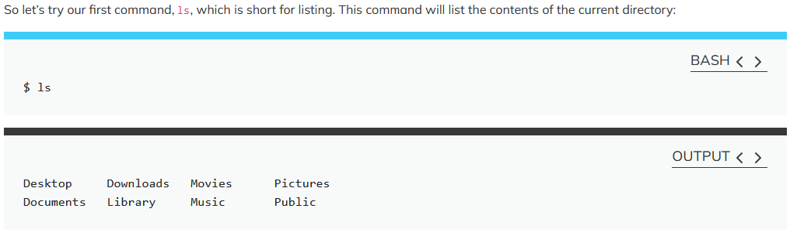
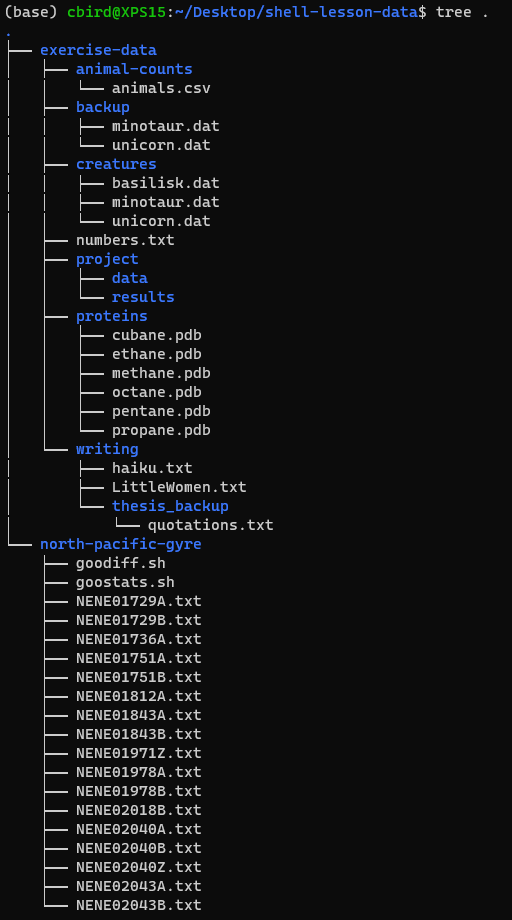

# Assignment 0 

## Reading for Discussion Next lecture

[Wickham 2014 Tidy Data.pdf](../literature/Wickham_2014_Tidy_Data.pdf)

---

## Computer Preparation

You should have already prepared your computer during Lecture 0.  If you did then you can skip over this section to "Description of Assignment".  

<details><summary>Windows, Mac, Linux</summary>
<p>

Complete the tasks listed in the [How to Set Up Your Computer for Computational Biology](https://github.com/tamucc-comp-bio/how_to/blob/main/howto_setup_computer.md), up to, but not including R and RStudio.

If you are having difficulty, use Launch if your account is activated.

If the above are not working, then try [installing GitBash](https://carpentries.github.io/workshop-template/install_instructions/#shell).
    
</p>
</details>

<details><summary>ChromeOS, iOS, Android</summary>
<p>
 
Complete the tasks listed in the [Accessing Launch Instructions](https://hprc.tamu.edu/kb/User-Guides/Launch/Access/#no-ssh-login).

Your account will probably not be activated in time, so you should immediately contact Dr. Bird to request the use of one of his Linux servers.

 </p>
</details>

---

## Download Data for Assignment (Do Not Follow The Download Instructions on Software Carpentry)

You will need to **download the data file for the lesson**.  Copy and paste the following code block into your terminal. _If you are having trouble copying and pasting in Ubuntu on windows, make sure that you are using the [Windows Terminal App](https://docs.microsoft.com/en-us/windows/terminal/install) to run Ubuntu.  You were asked to install the terminal app in the [Week 00 Lecture In Class Exercises](../lectures/lecture00.md). With terminal, copying and pasting should work as you're accustomed to.  For those with Macs, there should be no issues with copying and pasting._

```bash
wget https://swcarpentry.github.io/shell-novice/data/shell-lesson-data.zip
unzip shell-lesson-data.zip
mkdir Desktop
mv shell-lesson-data Desktop
```

In the code above, `wget` is a command to download files with a https web address and `https://swcarpentry.github.io/shell-novice/data/shell-lesson-data.zip` is the web address of the data file.  Notice that it is zipped.  You can use the `unzip` command to unzip it.  Once you have executed the commands above, the data will be in your present directory in the directory named `shell-lesson-data`. The last two lines will make your directory have the same structure as assumed in the lesson.  Those with macs might see an error after `mkdir Desktop`.  That's ok, it just means that the desktop dir was already there. Those with Ubuntu on windows, the `Desktop` dir will be created.  Then for everybody `mv` will move the `shell-lesson-data` dir inside of the `Desktop` dir

---

## Description of Assignment

We have a steep learning curve to traverse, so we are going to "flip" the classroom next week. Flipping the classroom means that you work on the material to be covered before we address it in lecture.  Then we can spend time in lecture going over the most challenging topics, as identified by you. Then we will continue together in lecture through new material that builds upon this assignment.

Your assignment is to work through [Software Carpentry's The Unix Shell](https://swcarpentry.github.io/shell-novice/) from Introducing the Shell through Working with files and directories.

---

## Do the Assignment

Your assignment is to work through [Software Carpentry's The Unix Shell](https://swcarpentry.github.io/shell-novice/01-intro.html) from Introducing the Shell through Working with files and directories. (click the link)

Read through the lesson. Everytime there's a code block (has a blue line across top), copy and paste the command in the code block into your terminal. It will also show you the expected output in the block with the black line across the top (don't type this in, only the commands under the blue lines).  Also, don't type the $



Refer to the helpful information below while you work through the Software Carpentry Lessons.

---

## Resources to Help You

I highly recommend that you print out the [Linux Cheat Sheet](../resources/CheatSheetLinux_8-12-2016.pdf) which I created for myself and my students when I was learning `bash`.  It's unique because it translates english into `bash`.

---

## Hints and Addiitions to The Unix Shell Lesson

### 1. [Introducing the Shell](https://swcarpentry.github.io/shell-novice/01-intro/index.html)

Nothing to note

### 2. [Navigating Files and Directories](https://swcarpentry.github.io/shell-novice/02-filedir/index.html)

* use `ctrl+l` keystroke to clear the terminal (those with macs, try `command+l`).  that's a lower case `L`
* my favorite `ls` flags, aka options
  * `ls -ltrh` list all file details (`l`) with human readable file sizes (`h`) in reverse (`r`) chronological order (`t`)
  * `ls -lh`  list all file details (`l`) with human readable file sizes (`h`)
  * `ls -lhd */` list all file details (`l`) with human readable file sizes (`h`), but only directories (`d`) not files
  * I've never used the `-F` flag, frankly you don't need it
* those with Ubuntu running in windows won't have a `Desktop` dir unless you follow the data download instructions above. 
* realize that you will have your own home directory with your username.  It won't be named `nelle`

### 3. [Working With Files and Directories](https://swcarpentry.github.io/shell-novice/03-create/index.html)

* realize that the orange boxes don't always pertain to the directory structure in your lesson data.  For example, the 2nd one (Moving Files to a new folder) does not refer to our directory structure, but rather a hypothetical directory structure on Jamie's computer.  Who's Jamie?  idk

---

## Self Check on Assignment 0

If you did everything correctly, then the directory structure of your `shell-lesson-data` directory should look like that below.

You probably need to install `tree` as follows:

```
#mac 
brew install tree

#ubuntu
sudo apt install tree
```

Then you can create your assignment directory tree with the following command and argument:
```bash
tree ~/Desktop/shell-lesson-data
```



---

## [Submit Assignment](https://forms.office.com/r/s93wiun80L) 

[Upload](https://forms.office.com/r/s93wiun80L) a screenshot of your  `shell-lesson-data` directory, like the example above.


