# Week01 UNIX

> [!IMPORTANT]
> [Assignment 0](../assignments/assignment_0.md) is due at the beginning of this lecture

> [!NOTE]
> The [Lecture Stream]() will be updated following lecture

> [!NOTE]
> I have converted the [Lecture 01 Slides](Week01_files/Lecture01_WelcomeToTheMatrix.pdf) to a more screen-splitting friendly format below.

<hr style="height: 3px; border: none; background-color: black;">

## Computer Preparation

> [!IMPORTANT]
> Make sure your computer is ready for today's lecture

<details><summary>Windows, Mac, Linux</summary>
<p>

- [ ] Step 0. Open Terminal

  > Search for the terminal app and open it.  For Windows, make sure you are using Ubuntu.

  > You should have already prepared your computer during Lecture 0.  If you did not then:  

  > * Complete the tasks listed in the [How to Set Up Your Computer for Computational Biology](https://github.com/tamucc-comp-bio/how_to/blob/main/howto_setup_computer.md), up to, but not including R and RStudio.
  >    * If you are having difficulty installing ubuntu, use Launch if your account is activated.

- [ ] Step 1. Update Your apps

  > It's always a good idea to keep your apps in your terminal up to date. 
  
  > For Ubuntu (Linux), enter the following commands to load the newest versions of your apps
  
  ```bash
  sudo apt update
  sudo apt upgrade
  ```
  
  > For Mac (Homebrew), enter the following commands to load the newest versions of your apps
  
  ```bash
  brew update
  brew upgrade
  ```

- [ ] Step 2. Confirm you have cloned the CSB (Computing Skills For Biologists) Repo into your home dir

  > In your terminal, enter the following commands:

    ```bash
    # make sure you're in your home dir
    cd ~

    # list the directories and files in the CSB dir to confirm it's in your home dir
    ls CSB
    ```

  > You should see the following output because we cloned the CSB Repo to your home dir in [Lecture 0](https://github.com/tamucc-comp-bio/classroom_repo_2024/blob/master/lectures/lecture00.md).  

    ```bash
    LICENSE  README.md  data_wrangling  git  good_code  latex  python  r  regex  scientific  sql  unix
    ```

  > If you see the output above, you're done! Goto the next section.

- [ ] Step 3. If you didn't have the CSB Repo, clone it now

  > If you **do not** see the output above, then clone the CSB repo by entering the following commands:

    ```bash
        git clone https://github.com/CSB-book/CSB.git
    ``` 

  > You should see the following output:

    ```bash
    Cloning into 'CSB'...
    remote: Enumerating objects: 1005, done.
    remote: Total 1005 (delta 0), reused 0 (delta 0), pack-reused 1005 (from 1)
    Receiving objects: 100% (1005/1005), 26.68 MiB | 7.74 MiB/s, done.
    Resolving deltas: 100% (389/389), done.
    ```

  > Goto Step 2 above.

<hr style="height: 0.1px; border: none; background-color: black;">

</p>
</details>

<details><summary>ChromeOS, iOS, Android</summary>
<p>

 - [ ] Step 0. [Log Into Launch HPC](https://portal-launch.hprc.tamu.edu/)

    > Use the following [link](https://portal-launch.hprc.tamu.edu/) to log in 

    > You should have already created your account during Lecture 0.  If you did not then:  
    > * Complete the tasks listed in the [Accessing Launch Instructions](https://hprc.tamu.edu/kb/User-Guides/Launch/Access/#no-ssh-login)

 - [ ] Step 1. Open Terminal

    > Select `launch Shell Access`

 </p>
</details>

---

## Text Book Vs. Lecture Slides

<details><summary>click to expand</summary>
<p>

* The [**Lecture_01 Slides**](Week01_files/Lecture01_WelcomeToTheMatrix.pdf) closely follow the book but there is some additional information that is not provided in the book (and vice versa). In the lecture slides, the `code blocks` are represented by green text on a black background, mimicking the terminal.

</p>
</details>

---

## Lecture: Unix, Linux, & the Command Line Interface (CLI)

> [!TIP]
> You can refresh your webpage to collapse expanded sections if you get "lost" 

<details><summary>Introduction</summary>
<p>

### [Linux](https://en.wikipedia.org/wiki/Linux) is a Free & Open Source Version of the [UNIX](https://en.wikipedia.org/wiki/Unix) Operating System

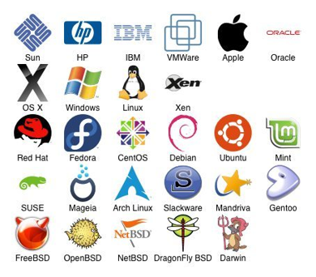

* An [operating system](https://en.wikipedia.org/wiki/Operating_system) is the primary interface between you and the computer

* [Open source](https://en.wikipedia.org/wiki/Open_source) is a decentralized development model where all aspects of a project are viewable and generally free to use

* Linux is free

  * [Supercomputers](https://en.wikipedia.org/wiki/Supercomputer) typically use it

  * Useful text manipulation tools

---

### CLI and GUI are the 2 Primary Methods of Interfacing with Computers

#### 1. Graphical User Interface ([GUI](https://en.wikipedia.org/wiki/Graphical_user_interface))

  A mouse or your finger is used to interface with images on a screen.

  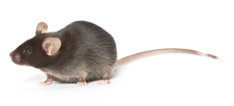

  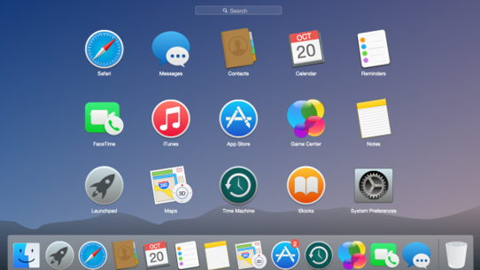


#### 2. Command-line Interface ([CLI](https://en.wikipedia.org/wiki/Command-line_interface))

  A keyboard is used to type commands into the computer and computer gives feedback on the screen.

  

  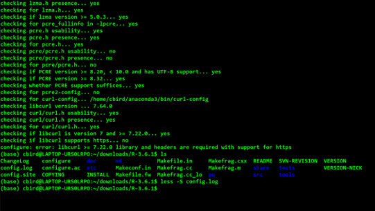

---

### Why use [CLI](https://en.wikipedia.org/wiki/Command-line_interface) Linux?


* Free

* Automation

* Flexibility

* Powerful

* Designed for developers

* Supercomputers use it

* Many software tools for biologists

* Large body of support online

---

### The [UNIX Philosophy](https://en.wikipedia.org/wiki/Unix_philosophy)


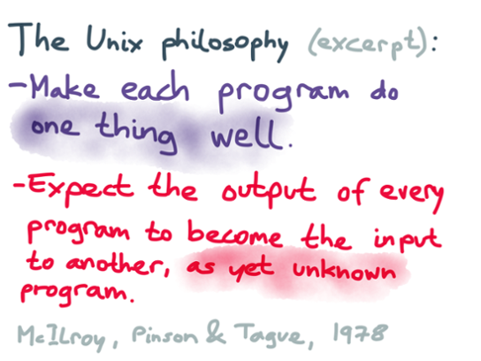


* One program ([command](https://en.wikipedia.org/wiki/List_of_Unix_commands)) does one thing

* All programs accept input as a [text stream](https://en.wikipedia.org/wiki/Standard_streams) and output a modified text stream

* Programs can be linked together into serial [pipelines](https://en.wikipedia.org/wiki/Pipeline_(Unix)) to apply complex modifications to the text stream without saving to disk

---

### Documentation of Linux [CLI](https://en.wikipedia.org/wiki/Command-line_interface) Pipelines Facilitate Scientific Reproducibility and Long-Term Efficiency

Comparison of [GUI](https://en.wikipedia.org/wiki/Graphical_user_interface) and [CLI](https://en.wikipedia.org/wiki/Command-line_interface) for manipulating data

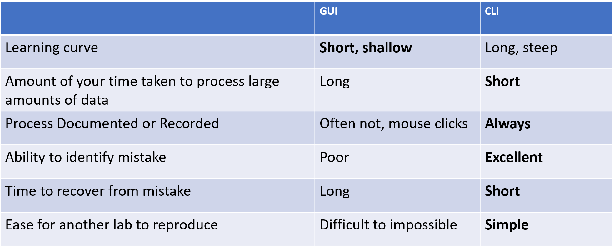

---


</p>
</details>

<details><summary>Getting Started with Unix</summary>
<p>

### Open A Terminal Window

Windows:  Search Windows Terminal and Open

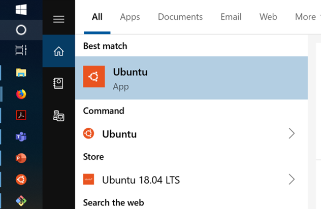

<details><summary>Adjusting Windows Terminal Settings</summary>
<p>

Windows: Make Ubuntu the default terminal app

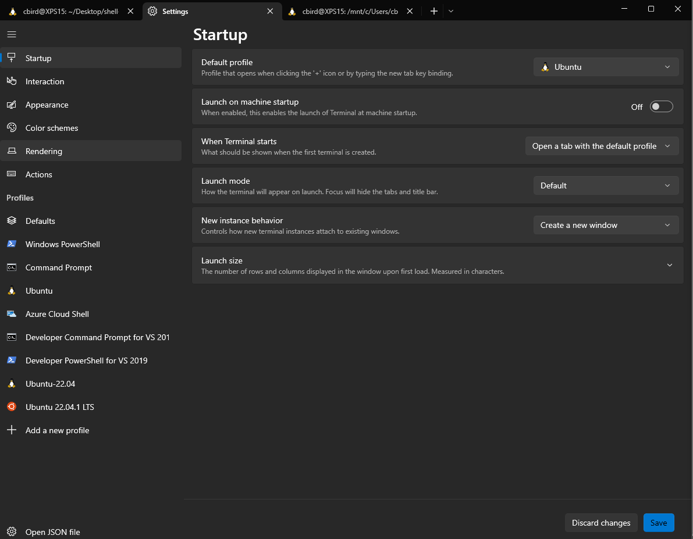

Windows: Ubuntu settings can be adjusted, such as startup dir

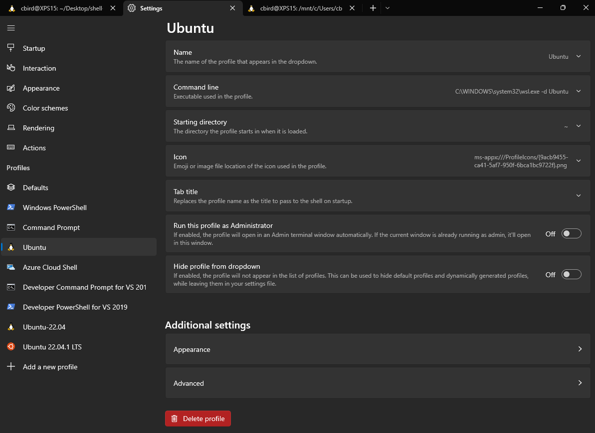

</p>
</details>

MacOS: Search Terminal and Open

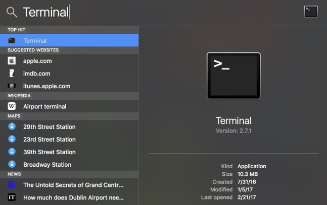

---

### The [Directory Structure](https://en.wikipedia.org/wiki/Directory_structure) is the Organization of Files and Folders (aka Directories) In Your Computer

WIN10 File Explorer

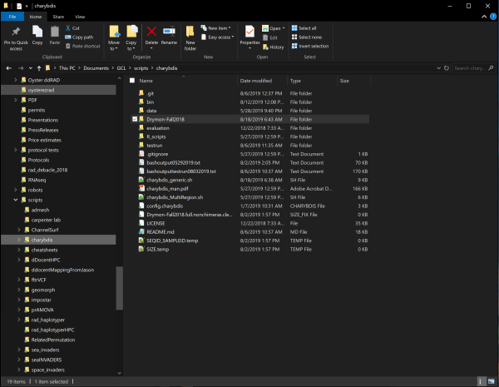

Ubuntu Terminal

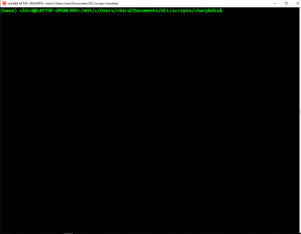

> [!IMPORTANT]
> The CLI forces you to start memorizing where your files are and what they are named. This causes 95% of the difficulties in learning CLI, so start memorizing your directory structure.  It is also a good idea to be deliberate and organized when creating new directories and files.

> [!TIP]
> We will use [code blocks](https://en.wikipedia.org/wiki/Block_(programming)) to let you know when and what to type into your CLI. Here, please enter the commands `pwd` and then `ls` into your terminal.

```bash
pwd
ls
```

> `pwd` lists the present working directory, `ls` lists the contents of the present working directory

> :light_bulb:[!TIP]
> clear the screen with `ctrl + L` keystroke

---

### Unix/Linux Command Line Terminology

The [path](https://en.wikipedia.org/wiki/Path_(computing)) is the address of a file or directory in the directory structure

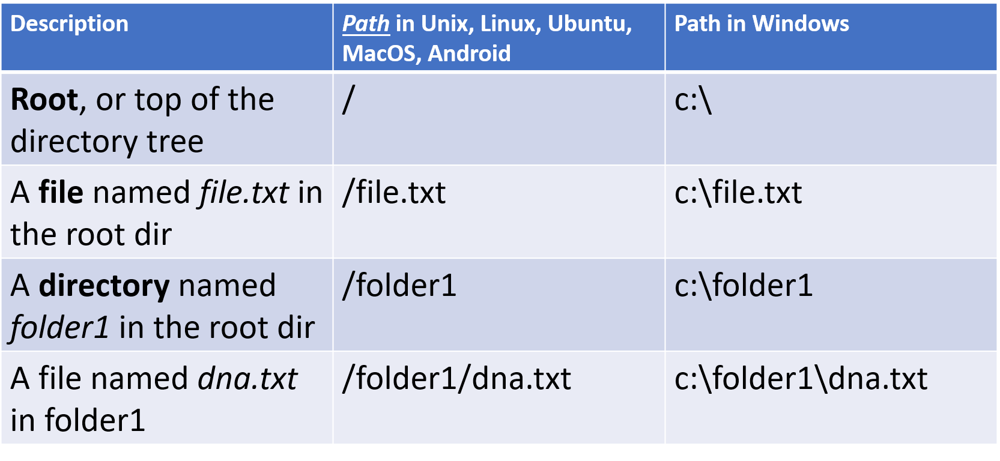

---

### Some Notable Directories (do not modify files here)

`/bin` contains several basic commands

`/dev` Contains the files connecting to devices such as the keyboard, mouse, and screen

`/etc`Contains configuration files

`/tmp` Contains temporary files

Try using `ls` to view these directories

```bash
ls /bin
ls /dev
ls /etc
ls /tmp
```

---

### Your Home Directory

`/home/<username>` is the directory where you are expected to create and maintain your directories and files.

  * Note that `<username>` is a place holder for your username on your computer
  
  * Starting directory upon login

  * Specific to user

  * Place for personal files, dirs, programs, downloads etc

`$HOME` is a [variable](https://en.wikipedia.org/wiki/Variable_(computer_science)) that contains the path to your home directory

  * A variable stores information

  * Always preceded by a `$` after it is created

  * `$HOME` is an environmental variable created by the operating system and `bash`
  
  * a shortcut for `$HOME` is the `~` character located at the upper left of your keyboard
  
  * the `echo` command can be used to show the contents of a variable, such as `$HOME`

```bash
echo $HOME
pwd
ls
ls $HOME
ls ~
```

---

### The Directory Tree

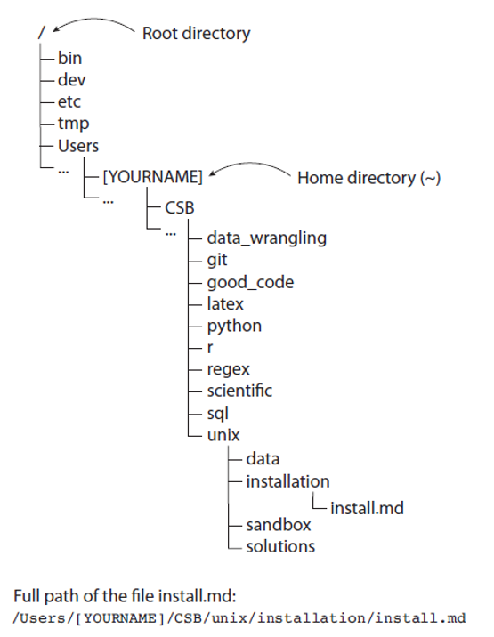

The directory tree is a map of the directories and files on your computers hard drives and/or solid state drives

If you have Ubuntu or a Mac with `homebrew` or some other linux package manger, you can install `tree` to view portions of your directory tree in "tree" format.

```bash
# this is a comment, as indicated by the # at the beginning of the line.  Do not type it into your terminal

# change directories 


# Ubuntu Only
sudo apt install tree

# Mac with homebrew only
brew install tree
```

We just installed the `tree` command (or app) from the internet to your computer.  If you were not able to do this because you did not install `homebrew` on your mac, it is ok. `tree` is not a critical command

```bash
# this will only work if you have tree installed, it is just an example so do not worry if you do not have it
cd ~
tree 
tree -L 1 
tree -L 2 
man tree
```

The `man` command is nearly universal in displaying the manual for "commands" such as `tree`. Use the `q` keystroke to exit the manual for tree.

```bash
# check your directory structure for assignment_0
tree ~/Desktop/shell-lesson-data
```

It should look like this:

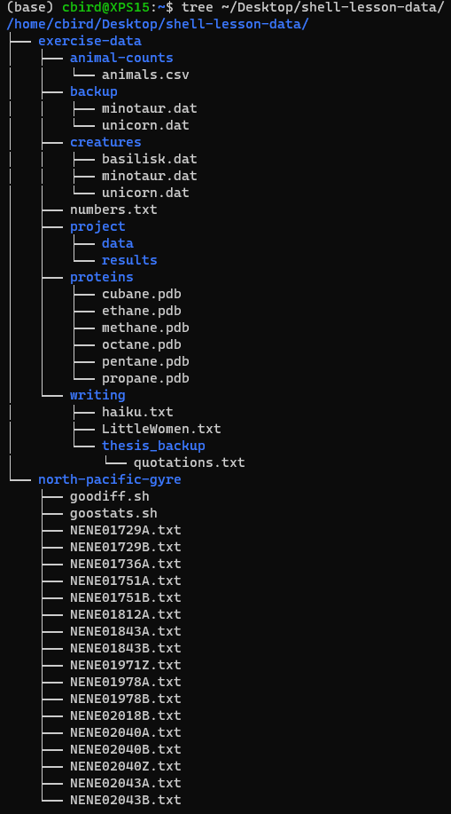


---
<!--  
### The `CSB/unix` [Repository](https://en.wikipedia.org/wiki/Repository_(version_control))

Our primary text book, [Computing Skills for Biologists](https://computingskillsforbiologists.com/), provides a rich assortment of resources for you.  Most of these resources are contained in a GitHub repository that you have cloned into your home directory.  This is the `CSB` directory. 

The `CSB` directory is organized by topic, with subdirectories dedicated to different chapters.  The directory for chapter 1 is `CSB/unix`.

`CSB/unix/data` Contains data for examples and exercises

`CSB/unix/installation` Contains instructions for installing software for this chapter

`CSB/unix/sandbox` Dir where we work and experiment

`CSB/unix/solutions` Solutions in code (`bash`) pseudocode (plain English) for your consultation when you get stuck with an exercise

```bash
# I am adding the 'cd ~' command to make sure you are in your home dir before running the 'ls' commands
cd ~
ls CSB/unix/
ls CSB/unix/data
ls CSB/unix/installation
ls CSB/unix/sandbox
ls CSB/unix/solutions
```

---

-->

</p>
</details>

<details><summary>The Shell</summary>
<p>

### The [Shell](https://en.wikipedia.org/wiki/Shell_(computing))

* The shell is software that controls the [operating system kernel](https://en.wikipedia.org/wiki/Kernel_(operating_system)) and is accessed through a terminal window

* The shell we are using in Ubuntu and MacOS is called `bash`, or Born Again Shell

* `bash` is a [shell scripting](https://en.wikipedia.org/wiki/Shell_script) computer language

* The commands we have been using are `bash` commands which allow us to control the operating system

The image below shows the [command prompt](https://en.wikipedia.org/wiki/Command-line_interface#Command_prompt) on my computer. Below the picture, we decode some of the information for you.


`$` Indicates the terminal is ready  to accept commands

`~` Indicates where I am, the home dir

`LAPTOP-URSOLRPO` is the name of my laptop (very creative, am I right?!)

`cbird` is my user name

The rest is not important right now, but if you are dying to know, the `(base)` is there because I have [anaconda](https://www.anaconda.com/) running to manage [python](https://en.wikipedia.org/wiki/Python_(programming_language)). If I turn off anaconda, then the `(base)` will go away.

---

### Bash Keyboard Shortcuts

*`↑`*   Scroll through previous commands

*`Tab`* autocomplete command, dir, or file name. if you hit tab and nothing happens there are either multiple matches or 0 matches

*`Tab,Tab`*  show matches

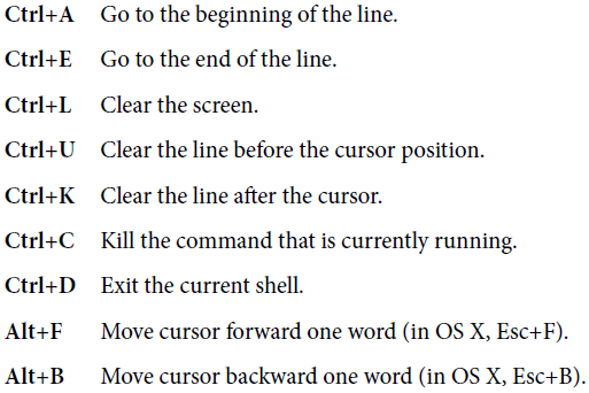

Go ahead and try some of these in your terminal. 

Note that I have created a [Linux Cheat Sheet](resources/CheatSheetLinux_2022-09-02.pdf) to help you with common `bash` commands and keyboard shortcuts.  I encourage you to print this out on a single sheet of paper, both sides, for your reference.

---

### `bash` Command Syntax

```bash
# be sure to type the following commands into your terminal, but not this message
cal
cal 2020
cal -j
cal -j 2020
```

_Note: `ctrl + c` will stop a command if it is taking too long to complete_

* Bash _*commands*_ like `cal` are programs that follow the UNIX philosophy.

* [_*Arguments*_](https://en.wikipedia.org/wiki/Command-line_interface#Arguments) like `2020` can be accepted by some commands, order can matter and some commands require particular arguments. For example, `cp` or copy requires at least which file to copy and where to copy it, in that order

* `-j` is an [_*option*_](https://en.wikipedia.org/wiki/Command-line_interface#Command-line_option), in this case it means Julian calendar

  * if an option is preceded by a single `-`, it is customary for that option to be represented by a single letter.  If an option is preceded by two dashes `--julian` it is typically a word.  In this case, `cal` has been updated and all word options have been removed, so `--julian` is no longer recognized.  Realize that it is up to the developer ( the person who writes the software ) to enforce formats, so you will find commands that do not follow convention as you get into more "boutique" commands and apps - especially those written by biologists.

---

### Getting Help with `bash`

#### 1. Use a Large Language Model (LLM) such as [OpenAI's GPT 3.5 or 4](https://chat.openai.com/) 

Example command prompt: `How do I <english description of what you want to do> with bash?`

Do not be afraid to modify and try different english descriptions if you do not succeed in the first prompt.  You do need to tell the LLM you are using bash.

#### 2. Use an internet search with your favorite search engine if you know what you want to do, but do not know the command

Example search terms: `bash <english description of what you want to do>`

Do not be afraid to modify and try different english descriptions if you do not succeed in the first search

#### 3. Use the `man` command if you know the command but are not sure of the options and arguments

```bash
man cal
```  

_scroll with arrow keys and `q` will get you out of the manual_

All manuals in unix/linux follow the same format:

`NAME`
` <name and brief descrip>`
 
`SYNOPSIS`
` <examples of how to run>`
 
`DESCRIPTION`
` <detailed description>`
` <list of arguments/options>`

---

### Changing and Viewing Directories (`cd` `pwd` `ls`)

```
# move up to parent directory
cd ..

# show path to present working directory
pwd

# move to root dir
cd /
pwd

# go back to previous dir
cd -
pwd

# go to the home dir
cd ~
pwd

# show present working dir contents
ls

# show dir contents with more details
ls -l

# show dir contents with more details, sorted by *t*ime in *r*everse order with *h*uman readable file sizes.
ls -ltrh
```

_Note:  single letter options can typically be combined together, `-l –t –r -h`  =  `-ltrh`_


The command `ls -ltrh` outputs a lot of information to the screen.  It can be overwhelming at first, but it is just basic information about your files and directories in the `pwd`

In the following image, dirs are highlighted, files are not

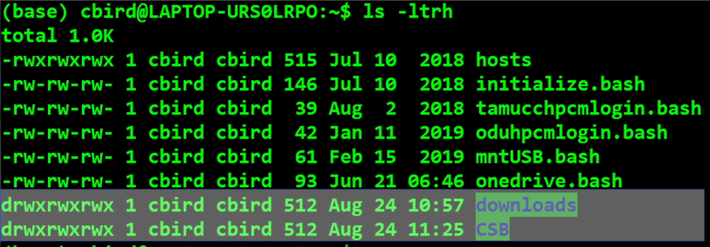

In the following image, the highlighted columns of information are as follows:

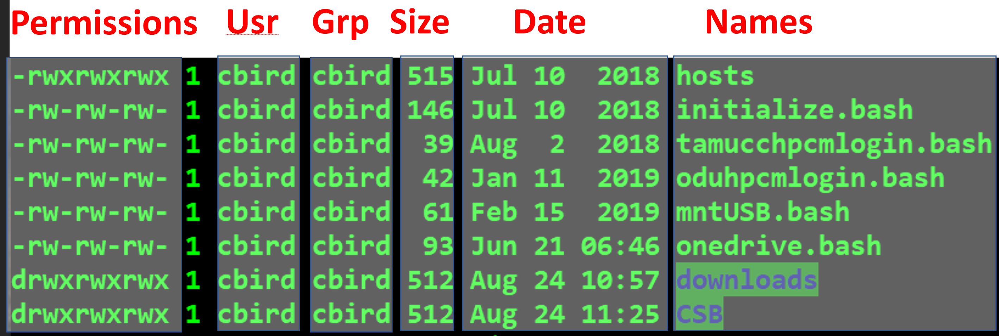

And the permissions can be further broken down.  The first column indicates whether it is a file or a directory. The 2nd to 4th columns are the User permissions.  Each user belongs to a group, which has its own set of permissions. Last, there are permissions for all users regardless of affiliation (global)

* `r` read permissions gives one the ability to view the contents of a file

* `w` write permissions gives one the ability to modify a file

* `x` execute permissions gives one the ability to run a file if it is written in computer code


---

### [Paths](https://en.wikipedia.org/wiki/Path_(computing))

A [_*path*_](https://en.wikipedia.org/wiki/Path_(computing)) is the address of file or directory

An _*[absolute path](https://en.wikipedia.org/wiki/Path_(computing)#Absolute_and_relative_paths)*_ is complete and starts with root `/` or a variable that starts with root.  For example, the following return the same result regardless of pwd

```bash
# absolute paths, make sure you replace <username> with your user name
ls /home/<username>/CSB
ls ~/CSB
ls $HOME/CSB
```

_*[Relative paths](https://en.wikipedia.org/wiki/Path_(computing)#Absolute_and_relative_paths)*_ start from the present working directory

```bash
# These relative paths only work if you are in the right dir
ls ./CSB
ls CSB
ls ../
```

  * `.` Means present directory
  * `..` means  parent directory

It is best not to used spaces in dir and file names, but you can wrap file names with spaces in quotes or precede each space with a ` \ ` see pg 21 of CSB text for dealing w/ spaces


---

</p>
</details>


<details><summary>Mind Expander 01.01</summary>
<p>

### [Mind Expander 01.01](https://forms.office.com/Pages/ResponsePage.aspx?id=8frLNKZngUepylFOslULZlFZdbyVx8RLiPt1GobhHnlUM1FFUUZLT01LR0ZGODU2WVNSV1c0NEpWMi4u)

</p>
</details>


<details><summary>Commands to Remember</summary>
<p>

---


### Set Up Data to Experiment With

From here forward, we will adopt a standardized code block syntax.  The `$` represents the command prompt and you are expected to copy and paste the commands that follow it, but _*do not start any command with the `$`*_.  The `#` is a comment to explain to you what is happening next

```bash
# goto your home dir
$ cd ~

# make a directory called comp_bio with a dir called lecture_01 inside of it and move into lecture_01
$ mkdir -p ~/comp_bio/lecture_01
$ cd ~/comp_bio/lecture_01

# download the software carpentry data set for the Unix Shell lesson and unzip it and delete the zipped file
$ wget https://swcarpentry.github.io/shell-novice/data/shell-lesson-data.zip
$ unzip shell-lesson-data.zip
$ rm shell-lesson-data.zip
```

--- 

### Copy files or directories with `cp <from path> <to path>`

```
# you should be in ~/comp_bio/lecture_01
$ cd ~/comp_bio/lecture_01
$ pwd

# view the contents of the present dir
$ ls

# copy `haiku.txt` to the present working directory (pwd).  The path of the pwd is represented by a "."
$ cp shell-lesson-data/exercise-data/writing/haiku.txt .

# copy `haiku.txt` to the present directory and rename the copy to be `Haiku.txt`
$ cp shell-lesson-data/exercise-data/writing/haiku.txt ./Haiku.txt
$ ls

# view tree of shell-lesson-data, 
$ tree shell-lesson-data

#then copy the whole `exercise-data` dir to the north-pacific-gyre dir, then view dir tree again
$ cp -rf shell-lesson-data/exercise-data/ ./shell-lesson-data/north-pacific-gyre/
$ tree shell-lesson-data

```

_Note:  the `-r` argument for `cp` means [recursive](https://en.wikipedia.org/wiki/Recursion_(computer_science)) and `-f` means force_

---

### Move or rename files and directories with `mv <from path> <to path>`

```bash
# you should be in ~/comp_bio/lecture_01
$ cd ~/comp_bio/lecture_01
$ pwd

# move Haiku.txt to the `writing` dir inside the copy of the `exercise-data` dir in the `north-pacific-gyre` dir to the data directory
$ mv Haiku.txt shell-lesson-data/north-pacific-gyre/exercise-data/writing/

# rename the file you just moved to be `HAIKU.txt` rather than `Haiku.txt`
$ mv shell-lesson-data/north-pacific-gyre/exercise-data/writing/Haiku.txt shell-lesson-data/north-pacific-gyre/exercise-data/writing/HAIKU.txt

# check your work
$ tree .

```

_Note:  `bash` gives no positive feedback, only negative if something is wrong.  I will do my best to make up for the callousness of `bash`_


---

### Create file with `touch <new file path>`

```bash
# let's move to shell-lesson-data
$ cd ~/comp_bio/lecture_01/shell-lesson-data/exercise-data
$ pwd

# inspect the current contents of the directory
$ ls -l

# create a new file (you can list multiple files)
$ touch new_file.txt

# inspect the contents of the directory again
$ ls -l

# if you touch the file a second time, the time of last access will change
$ touch new_file.txt
$ ls -l

# create a new file in the `shell-lesson-data` dir (the parent dir of the present dir), then view the 
# the path to the directory that your present working directory is within is represented by ".."
$ touch ../another_new_file.txt
$ ls ..

```

_Note:  `bash` gives no positive feedback, only negative if something is wrong.  I will do my best to make up for the callousness of `bash`_

---

### Remove file(s) or dir(s) with `rm <path>` 
### Make dirs with `mkdir <name>`

```bash
# make sure you are still in the original exercise-data dir 
$ cd ~/comp_bio/lecture_01/shell-lesson-data/exercise-data
$ pwd

# delete new_file.txt, the –i requests confirmation, enter `y` to confirm the deletion
$ rm -i new_file.txt

# delete another_new_file.txt, there is no "undo" option
$ rm ../another_new_file.txt

# make dir `d1` in present dir, `d2` in `d1`, and `d3` in `d2`; if you have tree try it
$ mkdir -p d1/d2/d3
$ tree d1
d1
└── d2
    └── d3

# remove the `d1`,`d2`,& `d3` dirs recursively with a "one-liner"
$ rm -rf d1

# remove the copy of the `exercise-data` dir in `north-pacific-gyre`
$ rm -rf ../north-pacific-gyre/exercise-data/
```

_be careful with `rm`, you could delete your "whole computer", and there is no undo_

---

### View large files with `less -S <file path>`

```bash
# make sure you are still in the original exercise-data dir 
$ cd ~/comp_bio/lecture_01/shell-lesson-data/exercise-data

# look at the `NENE01751B.txt` file in `north-pacific-gyre`, try duckduckgo search on “bash less commands”
$ less ../north-pacific-gyre/NENE01751B.txt

# type /10 inside of less to search; u=up, d=down, G=end, g=begin, q=exit

```

---

### Print and concatenate files `cat <file path>`

```bash
# concatenate files and/or print to screen
$ cat numbers.txt ../north-pacific-gyre/goodiff.sh proteins/cubane.pdb
```

---

### Print and sort files `sort <file path>`

```bash

# print the sorted lines of a file
$ sort ../north-pacific-gyre/NENE01751B.txt
```

---

### Connect multiple commands together into at pipeline

We can use a pipe `|` to direct the text stream from `sort` to `less` or from `cat` to `sort` to `less`.  

Remember the [Unix Philosophy](https://en.wikipedia.org/wiki/Unix_philosophy), where each program does one thing, and all programs have a common file format.  The common format is a text file and this enables piping text from one command to the next in a pipeline.

```bash
# first view, then sort a comma delimited file numerically by column 3 in reverse order and view in less
$ cat animal-counts/animals.csv
$ sort -nrk3,3 -t "," animal-counts/animals.csv | less
$ cat animal-counts/animals.csv | sort -nrk3,3 -t "," | less

```

---

### Count words, lines, etc with `wc <file path>`

```bash
# count lines, words, and characters
$ wc writing/LittleWomen.txt

# count lines only
$ wc -l ../north-pacific-gyre/NENE01751B.txt

```

### Determine file type `file <filename>`

Just because a file ends with a particular extension, doesn't mean that the file itself follows the format that matches that extension.  This is an example of why it's important to impart structure on your code.  You should use the correct file extension even though you don't have to so that both you and everybody else can better understand your files and code.

The most common use of the `file` command in biology is to determine if files ending in `.gz` are actually zipped.

```bash
# determine file type, ASCII is a type of human-readable text file
$ file proteins/cubane.pdb
proteins/cubane.pdb: ASCII text

```

_Do not forget to use the `Tab` key to autocomplete directory names and prevent spelling mistakes_

---

### Retrieve beginning of file with `head –n <number of lines> <file path>` and end of file `tail –n <number of lines> <file path>`

```bash
# display first two lines of a file
$ head -n 2 creatures/unicorn.dat

# display last two lines of file
$ tail -n 2 creatures/unicorn.dat

# display from line 2 onward
# (i.e., removing the header of the file)
$ tail -n +2 creatures/unicorn.dat

# display all but the last line
$ head -n -1 creatures/unicorn.dat
```

_Do not forget to use `Tab` key to autocomplete file names and prevent spelling mistakes_

---

</p>
</details>


<details><summary>Mind Expander 01.02</summary>
<p>

### [Mind Expander 01.02](https://forms.office.com/r/M9XnBAtiUw)

</p>
</details>

---

## Homework

* [Assignment_1](../assignments/assignment_1.md)

* [Graduate Student Course Project Ideas](https://forms.office.com/Pages/ResponsePage.aspx?id=8frLNKZngUepylFOslULZlFZdbyVx8RLiPt1GobhHnlUOUo2UVRUMVgwTUlQMlpUQzUzOTIzME9LNi4u)

---

