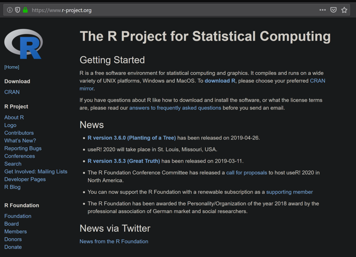

# Week05 R Boot Camp I: Statistical Computing Ch 8

###  Exam 1 is due by beginning of class

### [Lecture Stream](https://tamucc.webex.com/recordingservice/sites/tamucc/recording/playback/26ce51da1d52456b883c976dd1986dfe)

## Computer Preparation

You are expected to start each lecture with your terminal window open and ready to go.

<details><summary>Ubuntu on Windows</summary>
<p>

  * If the Windows Terminal or Ubuntu app are not installed, then follow [these instructions](https://github.com/cbirdlab/wlsUBUNTU_settings/blob/master/README.md)

  * Open an Ubuntu window in Windows Terminal.  _We will not use `gitbash` unless you can't get Ubuntu running._ After logging in, You are in your home directory.

  * It's always a good idea to keep your apps in `Ubuntu` up to date. _The first time you do this, it could take a long time to finish. After that, if you do this when you log in, it should go quickly._
    ```bash
    sudo apt update
    sudo apt upgrade
    ```

</p>
</details>

<details><summary>MacOS</summary>
<p>

  * Open a terminal window

  * If you haven't already, install [homebrew](https://brew.sh/).  You will be able to use homebrew to install linux software, such as `tree`, which is used in the slide show.


</p>
</details>


<details><summary>If it's not already there, clone the CSB repository to your home dir</summary>
<p>

We will use the [open source files that accompany the CSB text book](https://github.com/tamucc-comp-bio-2022/CSB) in lectures and assignments.

If the `CSB` directory does not exist in your home directory (check with `ls`), then run the following code to clone the [`CSB` repository](https://github.com/tamucc-comp-bio-2022/CSB) into your home directory:

1. Open a terminal window
	* For Win laptops, use `Windows Terminal` to open Ubunutu.  
	* For Mac laptops, open your `Terminal`.

2. Run the code line by line in the code block below
```bash
# check that you're in home dir, you should be there when you log in
pwd

# if you are not in your home dir, then move there
cd ~

# if pwd does not return `/home/yourusername` then let Dr. Bird know
pwd

# clone the CSB repository to your home dir
git clone git@github.com:tamucc-comp-bio-2022/CSB.git
```

The repository is named CSB, and it contains all of the example files and directories necessary to conduct the exercises in the text book.

</p>
</details>


___


## [I. Lecture Slides](Week05new_files/Introduction%20to%20R%201.pptx)

I converted the lecture slides into this markdown document so you will not use them during class, but you can refer to them later as necessary.

---

## II. Lecture Activities

We will not use `R Studio` today.  I want you to use the terminal to run R for now.  I will introduce `R Studio` in a future lecture.

___

<details><summary>What is [`R`](https://cran.revolutionanalytics.com/)?</summary>
<p>

[`R`](https://cran.revolutionanalytics.com/) is a powerful statistical computing language



* Free
* Open source
* Popular among biologists
* Almost any analysis is available for free
* Easy to use
* Flexible
* Command line interface
* Linux, Win, Mac

___
</p>
</details>


<details><summary>Checking to see if you have R</summary>
<p>

Note that there are differences here if you have a Mac or Windows computer.

To check if you have `R`, goto your terminal window and enter the following command:

```
$ R
```

If you see this (or similar), then R is installed and you can proceed.  You should a version at least as new as that listed below.

```
$ R

R version 4.2.1 (2022-06-23) -- "Funny-Looking Kid"
Copyright (C) 2022 The R Foundation for Statistical Computing
Platform: x86_64-pc-linux-gnu (64-bit)

R is free software and comes with ABSOLUTELY NO WARRANTY.
You are welcome to redistribute it under certain conditions.
Type 'license()' or 'licence()' for distribution details.

  Natural language support but running in an English locale

R is a collaborative project with many contributors.
Type 'contributors()' for more information and
'citation()' on how to cite R or R packages in publications.

Type 'demo()' for some demos, 'help()' for on-line help, or
'help.start()' for an HTML browser interface to help.
Type 'q()' to quit R.

>
```

If you see this message (or something similar) then you need to install `R`

```
Command 'R' not found, but can be installed with:
```

___
</p>
</details>

<details><summary>Install R on Ubuntu</summary>
<p>

[Official Instructions](https://cloud.r-project.org/bin/linux/ubuntu/)

1. Start by updating and upgrading your existing Ubuntu commands and apps:

```
# this may take some time to complete if you have not been running these commands regularly
sudo apt update
sudo apt upgrade
```

2. Install the dependencies needed

```
# update indices
sudo apt update -qq

# install two helper packages we need
sudo apt install --no-install-recommends software-properties-common dirmngr

# add the signing key (by Michael Rutter) for these repos
# To verify key, run gpg --show-keys /etc/apt/trusted.gpg.d/cran_ubuntu_key.asc
# Fingerprint: E298A3A825C0D65DFD57CBB651716619E084DAB9
wget -qO- https://cloud.r-project.org/bin/linux/ubuntu/marutter_pubkey.asc | sudo tee -a /etc/apt/trusted.gpg.d/cran_ubuntu_key.asc

# add the R 4.0 repo from CRAN -- adjust 'focal' to 'groovy' or 'bionic' as needed
sudo add-apt-repository "deb https://cloud.r-project.org/bin/linux/ubuntu $(lsb_release -cs)-cran40/"
```

3. Install R v4.XX.  

```
# if R was not on your system before starting this procedure then:
sudo apt install --no-install-recommends r-base
sudo apt-get install r-base-dev

# else if R was on your system, but it was an older version, such as 3.6, then
sudo apt-get install r-base-dev
sudo apt update
sudo apt upgrade
```

4. Verify that you have successfully installed R v 4.XX

```
R --version
```

If the above instructions did not work, you can consult the [full README](https://cloud.r-project.org/bin/linux/ubuntu/fullREADME.html).

---
</p>
</details>

<details><summary>Install R on Win</summary>
<p>

1. Goto the [R download page](https://cran.revolutionanalytics.com/) and select the Win or Mac OS X Download link.

2. Select "install R for the first time"


If you have trouble with this, then consult the [CSB instructions](http://computingskillsforbiologists.com/setup/statistical-computing/)

---
</p>
</details>

<details><summary>Install R on Mac</summary>
<p>

1. Goto the [R download page](https://cran.revolutionanalytics.com/) and select the Win or Mac OS X Download link.

2. [Determine if you have an Intel or Apple cpu.](https://www.howtogeek.com/706226/how-to-check-if-your-mac-is-using-an-intel-or-apple-silicon-processor/)

3. MacOS: Select the R-X.X.X.pkg download link for your OS and computer setup
    * the choice depends on whether you have a M1/2 chip, or intel.


If you have trouble with this, then consult the [CSB instructions](http://computingskillsforbiologists.com/setup/statistical-computing/)

---
</p>
</details>


<details><summary>Running R from terminal</summary>
<p>

To run `R`, just type `R` and hit your enter/return key

```
$ R

R version 3.6.3 (2020-02-29) -- "Holding the Windsock"
Copyright (C) 2020 The R Foundation for Statistical Computing
Platform: x86_64-pc-linux-gnu (64-bit)

R is free software and comes with ABSOLUTELY NO WARRANTY.
You are welcome to redistribute it under certain conditions.
Type 'license()' or 'licence()' for distribution details.

  Natural language support but running in an English locale

R is a collaborative project with many contributors.
Type 'contributors()' for more information and
'citation()' on how to cite R or R packages in publications.

Type 'demo()' for some demos, 'help()' for on-line help, or
'help.start()' for an HTML browser interface to help.
Type 'q()' to quit R.

>
```

That is it, you are in an `R` shell, and `bash` commands will no longer work.  Notice the command prompt is now a `>` instead of a `$` or a `%` depending on your computer.

---
</p>
</details>

<details><summary>Exiting R Shell</summary>
<p>

The keys `ctrl+d` will exit the R shell. You will be prompted to save your session.  If you say yes, all of your work will be saved and available when you open the R shell again.

Now that you see how to enter and exit the R shell, enter the R shell again.

```bash
$ R

>
```

---
</p>
</details>

<details><summary>Arithmetic in R</summary>
<p>

R is built for statistics and so has all of the mathematical operations that you would expect from a calculator, and much more.

To do arithmetic, simply type in the mathematical statement to calculate and hit enter.

```R
> 34+5
> 34 + 5
> 34 - 5
> 34 * 5
> 34 / 5
> 34 %% 5
> 34 %/% 5
>
```

`+`		Addition

`-` 	Subtraction

`*`		Multiplication

`/`		Division

`^`		Exponentiation

`%%`	Modulo (remainder from division)

`%/%`	Integer Division

---
</p>
</details>

<details><summary>Equalities & Logic in R</summary>
<p>

R can compare values and return either `TRUE` if the statement is true or `FALSE`.  

```R
34 == 5
34 != 5
34 >= 5
34 <= 5
34>5 | 34<5
34>5 & 17>3
```

`==`	Equal to

`!=`	Not equal to

`>`	Greater than

`<`	Less than

`>=`	Greater than or equal

`<=` 	Less than or equal

`&`	And

`|`	Or

`!`	Not

---
</p>
</details>

<details><summary>R Variables</summary>
<p>

Variables hold data. There are different types of data that can be stored. Here we start by discussing *_values_*.

* *_Values_* are numbers or strings

* *_Values_* can be assigned to variables using <-

The name of a variable can be almost anything you want, but try to avoid punctuation other than `.` or `_` and do not begin a variable name with a number.

```R
# put the value -1.2345 into a variable named 'x'
> x <- -1.2345

# put the value "Hi" into a variable named 'greeting'
> greeting <- "Hi"

```

Note that numbers should not be quotified, but character strings need to be quotified.

You can view the contents of variables by simply typing their name
```R
> x
[1] -1.2345
> greeting
[1] "Hi"
```

Clear all variables:   

```
rm(list=ls())
```

---
</p>
</details>

<details><summary>R Data Types</summary>
<p>

`integer`		Whole Numbers

`numeric`		Real Numbers

`complex`		Complex Numbers

`logical`		TRUE or FALSE

`character`	String

You can specify a data type for a variable as follows where you replace "DataType" and "NameOfVariable" with the appropriate data type and variable name:

```
# do not type this, it is pseudo code
as.DataType(NameOfVariable)
```

Try it out by creating the following variables

```R
> z <- as.numeric(x^2)
> y <- as.character("Bye")
> q <- as.complex(1+3i)
> r <- 3==4
```

Note that R will automatically choose a data type if you do not specify one.  It usually gets the data type right, but not always.

We can query the data type of a variable using `is.type(variable)`

```R
> is.numeric(x)
> is.complex(x)
> is.character(greeting)
> is.complex(q)
```


---
</p>
</details>

<details><summary>Mathematical Functions in R</summary>
<p>

`abs(x)`			absolute value
`sqrt(x)`			square root
`ceiling(x)`		round up
`floor(x)`			round down
`trunc(x)`			remove decimals
`round(x,digits=n)` 	round x to n digits
`cos(x)`, `sin(x)`, `tan(x)`, etc	trig
`log(x)`			natural log
`exp(x)`			ex
`log10(x)`			base 10 log

```R
# delete all variables
> rm(list=ls())

> x <- -1.234

> abs_x <- abs(x)
> abs_x

> sqrt_abs_x <- sqrt(abs_x)
> sqrt_abs_x

> floor(x)
> floor(abs_x)

> trunc(x)
> trunc(abs_x)

> y <- round(x,2)
> y

> cos_y <- cos(y)
> cos_y

> z <- log(abs(y))
> z

> exp_z <- exp(z)
> exp_z
```

---
</p>
</details>

<details><summary>R Data Structures</summary>
<p>

* Data structures store your data

* Simplest data structure is a single element

* A vector is a collection of elements

 * 1, 2, 3, 4, 5, 6

* Vectors can be specified using `c()` or `seq()` or `rep()`

* Particular values in the vector can be specified by their index `[index_num]`

```R
rm(list=ls())
1:6
x <- c(1:6)
y <- c("a", "B", "c", "D")
y[3]
z <- seq(1, 40, 4)
z
z[3:6]
z[c(2,8,10)]
```

---
</p>
</details>

<details><summary>R Statistical Functions for Vectors</summary>
<p>

A variety of statistical functions are available in R. Here are a few:

`length(x)`	number of elements
`min(x)`		minimum
`max(x)`		maximum
`sum(x)`		sum, +
`prod(x)`		product, *
`median(x)`	central value
`mean(x)`	average
`summary(x)`

```R
length(y)
min(x); max(x)
sum(x); prod(x)
median(z)
mean(z)
var(z)
summary(z)
```

___

### [Mind Expander 8.1](https://forms.office.com/Pages/ResponsePage.aspx?id=8frLNKZngUepylFOslULZlFZdbyVx8RLiPt1GobhHnlUMFpONVRLSkNYUU9VQ1RXVzhGODBPTFM1UC4u)

___

Overview of R Data Structures</summary>
<p>

A [data structure](https://en.wikipedia.org/wiki/Data_structure) is a container for data with a particular format.

* Element		-	a single value or string

* Vector		-	several elements of same data type

* Matrix		-	2-dimensional table of elements of same data type

* Array		-	3-dimensional table of elements of same data type

* Data frame	-	2-dimensional table of elements, different data types

* List		-	several elements or data structures of any type

---
</p>
</details>

R Data Structures: Matrix</summary>
<p>

`matrix(v,r,c,byrow=FALSE)`

create matrix, v=vector of values, r=#rows, c=#cols,

if `byrow=TRUE` then values are filled in by row

Matrix math

* %*%		matrix product

* solve()	matrix inverse

* diag()	diagonal values

* t()		transpose

Matrix functions

* dim()		dimensions, rows cols

* nrow()	# rows

* ncol()	# cols


```R
rm(list=ls())
x <- c(1, 2, 3, 4)
matrix(x, 2, 2)
matrix(x, 2, 2, byrow=TRUE)
A <- matrix(x, 2, 2)
A %*% A
solve(A)
diag(A)
B <- matrix(1,3,2)
B
t(B)
B %*% t(B)
dim(A)
dim(B)
nrow(B)
ncol(B)
```

Matrix elments are indexed by row and col.

* `matrixName[rowNum,colNum]`

Arithmetic functions are typically applied to all elements in matrix

* `sum()`, `mean()`, etc…

```R
Z <- matrix(1:9, 3, 3)
Z     #whole matrix
Z[1,] #vector with first row
Z[,3] #vector with third column
Z[1:2, 2:3] #submatrix
Z[c(1,3), c(1,3)] #submatrix
mean(Z)
```

---
</p>
</details>

R Data Structures: Array</summary>
<p>

`array(v,dim=c(row,col,m))`

* create array, v=vector of values, row=#rows, col=#cols, m=#matrices

Number of elements in `v` should equal `row*col*m`

Most matrix functions work on arrays

* `dim()`; `nrow()`; `ncol()`

Subsetting arrays similar to matrices

* `array[row,col,matrix]`


```R
rm(list=ls())
M <- array(1:24, dim=c(4,3,2))
M
dim(M)
#return first matrix as matrix
M[,,1]  
#return first matrix as array
M[,,1, drop=FALSE]
```

---
</p>
</details>

R Data Structures: List</summary>
<p>

Used to store elements of different types and structures, e.g. vectors, matrices, etc

`list(x=v1, y=v2, …)`

create list, x=name of 1st data structure, v1=value(s), y=name of 2nd data structure, v2=value(s)

Referencing specific values is similar to vectors, matrices, and arrays, but names can be used as well as indices.  

Number of brackets specifies hierarchical level of data

* first set of brackets are top level in hierarchy


```R
rm(list=ls())
list(1,"A",3000)
mylist <- list(Names=c("a","b","c","d"),
               Values=c(3,1,2))
mylist
mylist[[1]]       #first item in list
mylist[["Names"]] #item named "Names"
mylist$Values     #item named "Values"
mylist[[1]][4]    #4th element of 1st item

```

---
</p>
</details>

R String Manipulation</summary>
<p>

There are several tools for manipulating text strings.  Here are a few examples

`strsplit`   divide string into list

`substr`        return part of string

`sub`                substitute charcters

`paste`           join strings into 1

`nchar`           return number of characters

`toupper`  change case

`tolower`  change case


```R
rm(list=ls())
x <- "Sample-36"
strsplit(x,'-')
substr(x, start=8, stop=9)
sub("36", "39", x)
paste(x, "is smaller", sep=" ")
nchar(x)
toupper(x)
tolower(x)
```

---
</p>
</details>

R Data Structures: Data Frame</summary>
<p>

A data frame holds "tidy" data

Like a spreadsheet, each column is a type of categorization or measurement and each row is a different sample.  

Each column can have a different data type.

We can load an example data frame included with R called trees.  

```R
rm(list=ls())
data(trees)   #load example data frame
str(trees)    #structure of data frame
ncol(trees)   #num cols
nrow(trees)   #num rows
head(trees)   #display first few rows
trees$Girth   #get column
trees$Girth[1:5] #get 1st 5 rows of col Girth
trees[1:5,1]    #get 1st 5 rows of 1st col
trees[1:5,]$Girth #get 1st 5 rows of col Girth
colnames(trees) <- tolower(colnames(trees)) # change column names to all lowercase
str(trees)
```

---
</p>
</details>

### [Mind Expander 8.2](https://forms.office.com/Pages/ResponsePage.aspx?id=8frLNKZngUepylFOslULZlFZdbyVx8RLiPt1GobhHnlURDZQWkY5U1VSWU84WDU5Sk1HWE80NjdVVy4u)

___


R Working Directory</summary>
<p>

Before you start reading and writing files, it is important to know where the working directory is

`getwd(“path”)`  shows where you are, like `pwd` in `bash`

`setwd(“path”)`	changes where you are, like `cd` in `bash`

Note, root in windows is `C:/` rather than `/`

```R
rm(list=ls())

# where ever you were in bash when you opened R is where you will be in R
getwd()

# change working directory to CSB/r/sandbox
setwd("~/CSB/r/sandbox")
getwd()

```

---
</p>
</details>


R Reading in Data from File</summary>
<p>

You will typically read in your data from a comma or tab delimited file.  It is read in as a data frame by default

Comma delimited files:

	`read.csv(“MyFile.csv”)`

	`read.csv(“MyFile.csv”, header=TRUE) #csv has col headers`

	`read.csv(“MyFile.csv”, sep=“;”) #separator is semicolon`

	`read.csv(“MyFile.csv”, skip=5)   #skip 1st 5 lines`


Tab delimited files: `read.table()`

See the help pages for both `read.csv` and `read.table` for complete functionality


```R
help(read.csv)
# to exit type 'q'
```

We will read  `H938_Euro_chr6.geno` into a variable called `ch6` in R.

```R
#read in data
#make sure you use the correct path for your computer
ch6 <- read.table("../data/H938_Euro_chr6.geno", header=TRUE)
str(ch6)
dim(ch6)
head(ch6)
tail(ch6)

```

* This file contains 7 columns

 * CHR – chromosome

 * SNP – single nucleotide polym

 * A1 – allelic state 1

 * A2 – allelic state 2

 * nA1A1 - # homozyg A1

 * nA1A2 - # heterozyg

 * nA2A2 - # homozyg A2

 ---
 </p>
 </details>

R Writing Data</summary>
<p>

You will typically write a dataframe to a csv or tab delimited file.

Comma delimited files (this is pseudo code, do not type in):

`write.csv(MyDF, “MyFile.csv”) `

#don’t overwrite

`write.csv(MyDF, “MyFile.csv”, append=TRUE) `

#no header row

`write.csv(MyDF, “MyFile.csv”, col.names=FALSE)`

See documentation for write, write.csv, write.table for full functionality

Here we will save the file we just read into the variable `ch6` as a new comma delimited file named `H938_Euro_chr6.csv`

```R
write.csv(ch6, "H938_Euro_chr6.csv")

# view files in present working directory
list.files()
```

---
</p>
</details>


R Working Directory</summary>
<p>

Before you start reading and writing files, it is important to know where the working directory is

`getwd(“path”)`

 * shows where you are

`setwd(“path”)`

 * changes where you are

Note, root in windows is C:/ rather than /.  

_Pro tip: "tab to autocomplete" works in both the `R` terminal and R Studio, just as in the the `bash` shell._


```R
rm(list=ls())

getwd()

#use your own path below
setwd("C:/Users/cbird/Documents/CloudStation/Teaching/Summer_2019/PhilippinesWorkshop/CSB/r/sandbox")

getwd()
```

---
</p>
</details>


Read in `H938_Euro_chr6.geno`</summary>
<p>

This file contains 7 columns

* CHR – chromosome

* SNP – single nucleotide polym

* A1 – allelic state 1

* A2 – allelic state 2

* nA1A1 - # homozyg A1

* nA1A2 - # heterozyg

* nA2A2 - # homozyg A2

```R
#make sure you use the correct path for your computer
ch6 <- read.table("../data/H938_Euro_chr6.geno",
                  header=TRUE)
dim(ch6)
head(ch6)
tail(ch6)
```

---
</p>
</details>

### [Mind Expander 8.3](https://forms.office.com/Pages/ResponsePage.aspx?id=8frLNKZngUepylFOslULZlFZdbyVx8RLiPt1GobhHnlUQTRGOTA5UDRZMzlPSjEwTUxCVzBIOEdKRi4u)

___


---


## HOMEWORK

Complete the Mind Expanders up through 8.5.  You can use both the CSB text book (remember the Mind Expanders are based in the "intermezzos") and the slides that are linked at the top of this page to gain the context required to complete this assignment.

[Mind Expander 8.4](https://forms.office.com/Pages/ResponsePage.aspx?id=8frLNKZngUepylFOslULZlFZdbyVx8RLiPt1GobhHnlUMlRGTE9aQVQ3QUtBQlBOUEtHN1g3QUVDOS4u)

[Mind Expander 8.5](https://forms.office.com/Pages/ResponsePage.aspx?id=8frLNKZngUepylFOslULZlFZdbyVx8RLiPt1GobhHnlUMlIwMFNWME1IUVJCWktXWkZYSk1RV0pONC4u)

### Install R & RStudio In Windows (not Ubuntu) (If you haven't already)

If you have a Mac, then you have already installed R in lecture, you only need to install R studio

If you are tech saavy, the just use these links (do not pay money)

1. [R](https://cran.revolutionanalytics.com/)

2. [RStudio](https://rstudio.com/products/rstudio/download/?utm_source=downloadrstudio&utm_medium=Site&utm_campaign=home-hero-cta#download)

You could also follow the [CSB textbook instructions](http://computingskillsforbiologists.com/setup/statistical-computing/)
