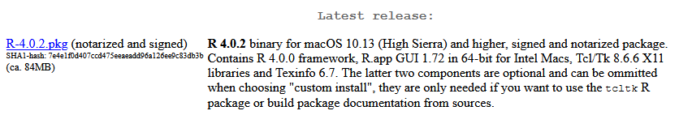

# Week05 R Boot Camp I: Statistical Computing Ch 8

###  Exam 1 is due by beginning of class

## Computer Preparation

You are expected to start each lecture with your terminal window open and ready to go.

<details><summary>Win10</summary>
<p>

  * If the Ubuntu app is not installed, then follow [these instructions](https://github.com/cbirdlab/wlsUBUNTU_settings/blob/master/InstallLinuxOnWindows_Automated.pdf)
  
  * Log into your Ubuntu terminal.  _We will not use `gitbash` unless you can not get Ubuntu running._ After logging in, You are in your home directory. 
  
  * If you are using an Ubuntu terminal that has not been setup (you will know because it will ask you to create a new user name and password) or you notice odd cursor behavior when editing text in the terminal, then run the following code:
  
    ```bash
    git clone https://github.com/cbirdlab/wlsUBUNTU_settings.git
    . ./wlsUBUNTU_settings/updateSettings.bash
    rm -rf wlsUBUNTU_settings
    ```
    
  * If the `CSB` directory does not exist in your home directory (check with `ls`), then run the following code to clone the `CSB` repository into your home directory:
  
    ```bash
    git clone https://github.com/CSB-book/CSB.git
    ```

  * It is always a good idea to keep your apps in `Ubuntu` up to date. _The first time you do this, it could take a long time to finish. After that, if you do this when you log in, it should go quickly._
    ```bash
    sudo apt update
    sudo apt upgrade
    ```

</p>
</details>

<details><summary>MacOS</summary>
<p>
 
  * Open a terminal window
  
  * Consider installing [homebrew](https://brew.sh/).  You will be able to use homebrew to install linux software, such as `tree`, which is used in the slide show.
  
  * If the `CSB` directory does not exist in your home directory (check with `ls`), then run the following code to clone the `CSB` repository into your home directory:
  
    ```bash
    git clone https://github.com/CSB-book/CSB.git
    ```
    
</p>
</details>

---


## [I. Lecture Slides](Week05new_files/Introduction%20to%20R%201.pptx)


---

## II. Lecture Activities 

### Install R & RStudio (If you haven't already)

1. [R](https://cran.revolutionanalytics.com/)

2. [RStudio](https://rstudio.com/products/rstudio/download/?utm_source=downloadrstudio&utm_medium=Site&utm_campaign=home-hero-cta#download)


___

### What is [`R`](https://cran.revolutionanalytics.com/)?

[`R`](https://cran.revolutionanalytics.com/) is a powerful statistical computing language


* Free
* Open source
* Popular among biologists
* Almost any analysis is available for free
* Easy to use
* Flexible
* Command line interface
* Linux, Win, Mac

___

### Installing R 

Note that there are differences here if you have a Mac or Win10 computer.

To check if you have `R`, goto your terminal window and enter the following command:

```
$ R
```

If you see this (or similar), then R is installed and you can proceed. 

```
$ R

R version 3.6.3 (2020-02-29) -- "Holding the Windsock"
Copyright (C) 2020 The R Foundation for Statistical Computing
Platform: x86_64-pc-linux-gnu (64-bit)

R is free software and comes with ABSOLUTELY NO WARRANTY.
You are welcome to redistribute it under certain conditions.
Type 'license()' or 'licence()' for distribution details.

  Natural language support but running in an English locale

R is a collaborative project with many contributors.
Type 'contributors()' for more information and
'citation()' on how to cite R or R packages in publications.

Type 'demo()' for some demos, 'help()' for on-line help, or
'help.start()' for an HTML browser interface to help.
Type 'q()' to quit R.

>
```

If you see this message (or something similar) then you need to install `R`

```
Command 'R' not found, but can be installed with:
```

<details><summary>Install R on Win10-Ubuntu</summary>
<p>

1. Start by updating and upgrading your existing Ubuntu commands and apps:

```
# this may take some time to complete if you have not been running these commands regularly
sudo apt update
sudo apt upgrade
```

2. Install the dependencies need to add a new `apt` repository

```
sudo apt install dirmngr gnupg apt-transport-https ca-certificates software-properties-common
```

3. Check your version of Ubuntu because this will affect what you enter for step 4.

```
lsb_release -a
```

4. Add the CRAN repository to your system sources list.  This assumes you have ubuntu 20.04, 'focal'. If you have another version of ubuntu, then the lines of code need to be altered. 

```
# ubuntu 20.04, focal
sudo apt-key adv --keyserver keyserver.ubuntu.com --recv-keys E298A3A825C0D65DFD57CBB651716619E084DAB9
sudo add-apt-repository 'deb https://cloud.r-project.org/bin/linux/ubuntu focal-cran40/'
```

```
# ubuntu 18.04, bionic
sudo apt-key adv --keyserver keyserver.ubuntu.com --recv-keys E298A3A825C0D65DFD57CBB651716619E084DAB9
sudo add-apt-repository 'deb https://cloud.r-project.org/bin/linux/ubuntu bionic-cran40/'
```

5. Install R v4.XX.  

```
# if R was not on your system before starting this procedure then:
sudo apt install R-base

# else if R was on your system, but it was an older version, such as 3.6, then
sudo apt update
sudo apt upgrade
```

6. Verify that you have successfully installed R v 4.XX

```
R --version
```

If the above instructions did not work, you can consult this [how to](https://linuxize.com/post/how-to-install-r-on-ubuntu-20-04/).


</p>
</details>

<details><summary>Install R on Mac</summary>
<p>

Goto the [R download page](https://cran.revolutionanalytics.com/) and select the Mac OS X Download link. 

Select the R-X.X.X.pkg download link



If you have trouble with this, then consult the [CSB instructions](http://computingskillsforbiologists.com/setup/statistical-computing/)

</p>
</details>


### Running R from terminal

To run `R`, just type `R` and hit your enter/return key

```
$ R

R version 3.6.3 (2020-02-29) -- "Holding the Windsock"
Copyright (C) 2020 The R Foundation for Statistical Computing
Platform: x86_64-pc-linux-gnu (64-bit)

R is free software and comes with ABSOLUTELY NO WARRANTY.
You are welcome to redistribute it under certain conditions.
Type 'license()' or 'licence()' for distribution details.

  Natural language support but running in an English locale

R is a collaborative project with many contributors.
Type 'contributors()' for more information and
'citation()' on how to cite R or R packages in publications.

Type 'demo()' for some demos, 'help()' for on-line help, or
'help.start()' for an HTML browser interface to help.
Type 'q()' to quit R.

>
```

That is it, you are in an `R` shell, and `bash` commands will no longer work.  Notice the command prompt is now a `>` instead of a `$` or a `%` depending on your computer.

___

### Arithmetic in R

R is built for statistics and so has all of the mathematical operations that you would expect from a calculator, and much more.

To do arithmetic, simply type in the mathematical statement to calculate and hit enter.

```
> 34+5
> 34 + 5
> 34 - 5
> 34 * 5
> 34 / 5
> 34 %% 5
> 34 %/% 5
>
```

`+`		Addition

`-` 	Subtraction

`*`		Multiplication

`/`		Division

`^`		Exponentiation

`%%`	Modulo (remainder from division)

`%/%`	Integer Division

___

### Equalities & Logic in R

R can compare values and return either `TRUE` if the statement is true or `FALSE`.  

```
34 == 5
34 != 5
34 >= 5
34 <= 5
34>5 | 34<5
34>5 & 17>3
```

`==`	Equal to

`!=`	Not equal to

`>`	Greater than

`<`	Less than

`>=`	Greater than or equal

`<=` 	Less than or equal

`&`	And

`|`	Or

`!`	Not

___

### R Variables

Variables hold data. There are different types of data that can be stored.

* *_Values_* are numbers or strings

* *_Values_* can be assigned to variables using <-

The name of a variable can be almost anything you want, but try to avoid punctuation other than `.` or `_` and do not begin a variable name with a number.

```
# put the value -1.2345 into a variable named 'x'
> x <- -1.2345

# put the value "Hi" into a variable named 'greeting'
> greeting <- "Hi"

```

Note that numbers should not be quotified, but character strings need to be quotified.

You can view the contents of variables by simply typing their name
```

> x

> greeting
```

Clear all variables:   

```
rm(list=ls())
```

___

###


___

###


___

###


___

###


___

###


___

###


___

###


___

###


___

###


___


## III. Mind Expanders

[Mind Expander 8.1](https://forms.office.com/Pages/ResponsePage.aspx?id=8frLNKZngUepylFOslULZlFZdbyVx8RLiPt1GobhHnlUMFpONVRLSkNYUU9VQ1RXVzhGODBPTFM1UC4u)

[Mind Expander 8.2](https://forms.office.com/Pages/ResponsePage.aspx?id=8frLNKZngUepylFOslULZlFZdbyVx8RLiPt1GobhHnlURDZQWkY5U1VSWU84WDU5Sk1HWE80NjdVVy4u)

[Mind Expander 8.3](https://forms.office.com/Pages/ResponsePage.aspx?id=8frLNKZngUepylFOslULZlFZdbyVx8RLiPt1GobhHnlUQTRGOTA5UDRZMzlPSjEwTUxCVzBIOEdKRi4u)

[Mind Expander 8.4](https://forms.office.com/Pages/ResponsePage.aspx?id=8frLNKZngUepylFOslULZlFZdbyVx8RLiPt1GobhHnlUMlRGTE9aQVQ3QUtBQlBOUEtHN1g3QUVDOS4u)

[Mind Expander 8.5](https://forms.office.com/Pages/ResponsePage.aspx?id=8frLNKZngUepylFOslULZlFZdbyVx8RLiPt1GobhHnlUMlIwMFNWME1IUVJCWktXWkZYSk1RV0pONC4u)

---


## HOMEWORK

TBA

