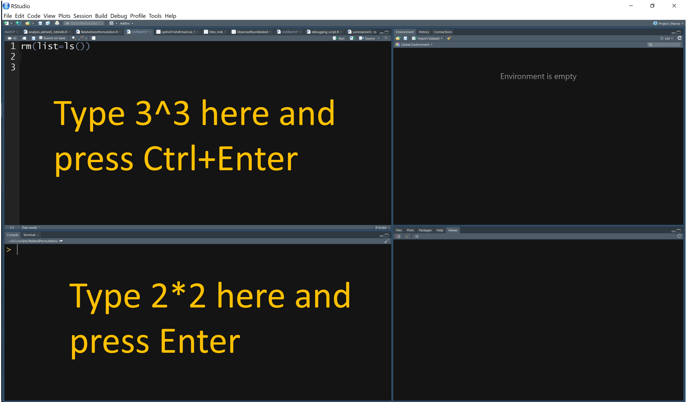
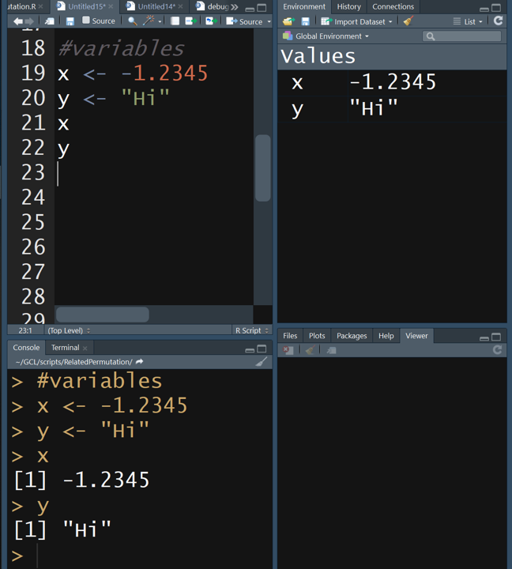

# Week06 R Boot Camp II: Statistical Computing Ch 8

###  Assignment 5 is due by beginning of class (complete Mind Expanders 8.2-8.5)

___

## Computer Preparation

You are expected to start each lecture with your terminal window open and ready to go.

*_Today, we are transitioning to R Studio, so the instructions have changed slightly.  Please make sure your computer is ready._* 

<details><summary>Win10</summary>
<p>

  * If the Ubuntu app is not installed, then follow [these instructions](https://github.com/cbirdlab/wlsUBUNTU_settings/blob/master/InstallLinuxOnWindows_Automated.pdf)
  
  * Log into your Ubuntu terminal.  _We will not use `gitbash` unless you can not get Ubuntu running._ After logging in, You are in your home directory. 
  
  * If you are using an Ubuntu terminal that has not been setup (you will know because it will ask you to create a new user name and password) or you notice odd cursor behavior when editing text in the terminal, then run the following code:
  
    ```bash
    git clone https://github.com/cbirdlab/wlsUBUNTU_settings.git
    . ./wlsUBUNTU_settings/updateSettings.bash
    rm -rf wlsUBUNTU_settings
    ```
    
  * If the `CSB` directory does not exist in your home directory (check with `ls`), then run the following code to clone the `CSB` repository into your home directory:
  
    ```bash
    git clone https://github.com/CSB-book/CSB.git
    ```

  * It is always a good idea to keep your apps in `Ubuntu` up to date. _The first time you do this, it could take a long time to finish. After that, if you do this when you log in, it should go quickly._
    ```bash
    sudo apt update
    sudo apt upgrade
    ```

### NEW INSTRUCTIONS FOR TODAY

#### Install `R` and `R Studio`

If you have a windows computer, you will need to separately install `R` in the windows environment even if you already installed it in Ubuntu.  Go to the following link below, download R for Windows and run the installer as you would for any other windows app.  

*If you installed R a while ago (more than a month ago), you should do it again or else problems will start to crop up*

1. [R Install](https://cran.revolutionanalytics.com/)

Regardless of your operating system, if you have not already installed R studio, you need to do that now.  On windows computers, install R studio in Windows.  

*If you installed R Studio a while ago, you should do it again to upate to the latest version.*

2. [RStudio Install](https://rstudio.com/products/rstudio/download/?utm_source=downloadrstudio&utm_medium=Site&utm_campaign=home-hero-cta#download)


#### Clone CSB Repo to Your Windows Home Dir

Just to make things a little more tricky, if you have windows, you cannot access the `CSB` repo that you cloned to your home directory in ubuntu with R Studio. So, we have to clone the repo again, but this time to your windows home dir (at least what R Studio recognizes as your windows home dir, `Documents`).

Open your ubuntu terminal and navigate to your windows `Documents` directory, then clone the CSB repo to there.

```bash
# make sure you are in ubuntu
cd /mnt/c/Users/YourWinUserName/Documents 
git clone https://github.com/CSB-book/CSB.git
```

</p>
</details>

<details><summary>MacOS</summary>
<p>
 
  * Open a terminal window
  
  * Consider installing [homebrew](https://brew.sh/).  You will be able to use homebrew to install linux software, such as `tree`, which is used in the slide show.
  
  * If the `CSB` directory does not exist in your home directory (check with `ls`), then run the following code to clone the `CSB` repository into your home directory:
  
    ```bash
    git clone https://github.com/CSB-book/CSB.git
    ```

### NEW FOR TODAY

#### Install `R` and `R Studio`

If you have a Mac and you already installed `R` for use in your terminal, you do not need to reinstall it.

*If you installed R a while ago (more than a month ago), you should do it again or else problems will start to crop up*

1. [R Install](https://cran.revolutionanalytics.com/)

Regardless of your operating system, if you have not already installed R studio, you need to do that now. 

*If you installed R Studio a while ago, you should do it again to upate to the latest version.*

2. [RStudio Install](https://rstudio.com/products/rstudio/download/?utm_source=downloadrstudio&utm_medium=Site&utm_campaign=home-hero-cta#download)


</p>
</details>

---


## [I. Lecture Slides](Week05new_files/Introduction%20to%20R%201.pptx)

I converted the lecture slides into this markdown document so you will not use them during class, but you can refer to them later as necessary. 

---

## II. Review Material Covered for Homework

### R Reading in Data from File

You will typically read in your data from a comma or tab delimited file.  It is read in as a data frame by default

Comma delimited files: 

	`read.csv(“MyFile.csv”)` 
	
	`read.csv(“MyFile.csv”, header=TRUE) #csv has col headers`
	
	`read.csv(“MyFile.csv”, sep=“;”) #separator is semicolon`
	
	`read.csv(“MyFile.csv”, skip=5)   #skip 1st 5 lines`
	

Tab delimited files: `read.table()`

See the help pages for both `read.csv` and `read.table` for complete functionality


```R
help(read.csv)
# to exit type 'q'
```

We will read  `H938_Euro_chr6.geno` into a variable called `ch6` in R. 

```R
#read in data
#make sure you use the correct path for your computer
ch6 <- read.table("../data/H938_Euro_chr6.geno", header=TRUE)
str(ch6)
dim(ch6)
head(ch6)
tail(ch6)

```

* This file contains 7 columns

 * CHR – chromosome
 
 * SNP – single nucleotide polym
 
 * A1 – allelic state 1
 
 * A2 – allelic state 2
 
 * nA1A1 - # homozyg A1
 
 * nA1A2 - # heterozyg
 
 * nA2A2 - # homozyg A2

___

### R Writing Data

You will typically write a dataframe to a csv or tab delimited file.

Comma delimited files (this is pseudo code, do not type in):

`write.csv(MyDF, “MyFile.csv”) `

#don’t overwrite

`write.csv(MyDF, “MyFile.csv”, append=TRUE) `	

#no header row

`write.csv(MyDF, “MyFile.csv”, col.names=FALSE)`

See documentation for write, write.csv, write.table for full functionality

Here we will save the file we just read into the variable `ch6` as a new comma delimited file named `H938_Euro_chr6.csv`

```R
write.csv(ch6, "H938_Euro_chr6.csv")

# view files in present working directory
list.files()
```

___


### R Working Directory

Before you start reading and writing files, it is important to know where the working directory is

`getwd(“path”)`

 * shows where you are

`setwd(“path”)`

 * changes where you are

Note, root in windows is C:/ rather than /.  

_Pro tip: "tab to autocomplete" works in both the `R` terminal and R Studio, just as in the the `bash` shell._


```R
rm(list=ls())

getwd()

#use your own path below
setwd("C:/Users/cbird/Documents/CloudStation/Teaching/Summer_2019/PhilippinesWorkshop/CSB/r/sandbox")

getwd()
```

___


### Read in `H938_Euro_chr6.geno`

This file contains 7 columns

* CHR – chromosome

* SNP – single nucleotide polym

* A1 – allelic state 1

* A2 – allelic state 2

* nA1A1 - # homozyg A1

* nA1A2 - # heterozyg

* nA2A2 - # homozyg A2

```R
#make sure you use the correct path for your computer
ch6 <- read.table("../data/H938_Euro_chr6.geno", 
                  header=TRUE)
dim(ch6)
head(ch6)
tail(ch6)
```

___

### [Mind Expander 8.3](https://forms.office.com/Pages/ResponsePage.aspx?id=8frLNKZngUepylFOslULZlFZdbyVx8RLiPt1GobhHnlUQTRGOTA5UDRZMzlPSjEwTUxCVzBIOEdKRi4u)

___


### R Scripts

Scripts are text files that contain the commands you give to R and have many advantages in biological research.  Your text editor (Notepad ++ or BBedit) is used to write scripts and has many functions built in to aid in code writing.  R Studio a special development environment for writing, testing, and running R scripts that we will cover shortly, but not yet.

* Recycling

  * similar analyses can be adapted quickly

* Automation

  * if you make a mistake, it’s easy to fix and redo analysis

* Documentation

  * analyses are precisely recorded for evaluation 

* Share

  * submit with your manuscript, review for errors

___


### Writing Good Code

Use descriptive names with [camelCase](https://en.wikipedia.org/wiki/Camel_case) or words_separated_by underscores

* Files 	– `model_fitting.R`   

* Variables 	– `body_mass`

* Functions 	– `calculate_cv`

Be consistent in use of spaces

```R
# poor formatting
X<-5*7

# good formatting
X <- 5*7
X <- 5 * 7
M <- matrix(25, 5, 5)
Z <- mean(m, na.rm == TRUE)
```

Use indenting to organize hierarchical code

```R
if (b == 5) {
	do(something)
} else {
	do(something_else)
}
```

Document your code so that it is easy to understand what you are trying to accomplish

* After a shebang!, the first line(s) of your R script should describe what the R script does and how to use it

* Provide descriptions of what your blocks of code do in the line(s) preceding the block of code

* Use tabs to align comments

Use empty lines to break up sections of code

Load libraries and set hard-coded variables at the beginning in one location, rather than scattering them throughout the script


###########################################################

Auto formatting in R Studio

The `Code` drop down menu contains functions specific to code formatting

* Code / Reformat Code

* Code  / Reindent Lines 


##########################################################

___


### R `for` and `while` Loops

Allows you to perform repetitive tasks in a few lines of code. A `for` loop has a predetermined number of cycles where as a `while` loop will cycle continuously until a condition is met.  Be careful with `while` loops because they could run infinitely if the condition is never met.

Anatomy of the `for` loop

```R
# pseudo code, do not type in
for(i in list_or_vector){
	Do something with i
}
```

Anatomy of  the `while` loop

```R
# pseudo code, do not type in
while(condition is TRUE){
	Execute commands
	Update condition
}
```

Exit a loop using `break`

```R
if(i >7){break}
```

Try out the code below that demonstrates how `for` and `while` loops work differently by performing the same task.

```R
rm(list=ls())
myvec <- 1:10     #make vector from 1 to 10
for(i in myvec){  #for each value in myvec
  a <- i^2        #square it
  print(a)        #and print the square
}                 #goto next value in myvec

i <- 1            #set i = 1
while(i <= 10){   #while i <= 10 
  a <- i^2        #square i
  print(a)        #print the square
  i <- i + 1      #increase i by 1
}                 #goto while line

```

___


### [Mind Expander 8.4](https://forms.office.com/Pages/ResponsePage.aspx?id=8frLNKZngUepylFOslULZlFZdbyVx8RLiPt1GobhHnlUMlRGTE9aQVQ3QUtBQlBOUEtHN1g3QUVDOS4u)


___


### R `if`-`then` Logic Statements

Run code conditionally, only if something is true or false.

Anatomy of the if statement

```R
# this is pseudocode, do not type in
if(a condition is TRUE){    
	execute these commands
} 
```

```R
# this is pseudocode, do not type in
if(a condition is TRUE){    
	execute these commands
} else {
	execute these other commands
}
```

For multiple conditions, replace 

```R
# this is pseudocode, do not type in
if(a condition is TRUE){    
	execute these commands
} else if(2nd condition is TRUE){
	execute these other commands
}
else {
	execute these other commands
}
```

Try out this code to see how `if`-`then` statements work

```R
#if statements
rm(list=ls())
x <- seq(1,50,3)
y <- sample(x, size=1, replace = TRUE) #randomly sample 1 value from vector x

if(y%%2 == 0){
  print(paste(y, "is even"))
} else {
  print(paste(y, "is odd"))
}

# copy this code and paste it into R terminal a few times.  What is happening?
y <- sample(x, size=1, replace = TRUE) #randomly sample 1 value from vector x
if(y%%2 == 0){
  print(paste(y, "is even"))
} else if(y%%2 != 0) {
  print(paste(y, "is odd"))
}
```

___


### [Mind Expander 8.5](https://forms.office.com/Pages/ResponsePage.aspx?id=8frLNKZngUepylFOslULZlFZdbyVx8RLiPt1GobhHnlUMlIwMFNWME1IUVJCWktXWkZYSk1RV0pONC4u)


---


## III. New Material Not Previously Covered: R Studio

### [R Studio](https://rstudio.com/) is a [GUI](https://en.wikipedia.org/wiki/Graphical_user_interface) Integrated Development Environment ([IDE](https://en.wikipedia.org/wiki/RStudio)) for `R` 

`R Studio` was completely free, but it has become a "dot com" when it was acquired by Microsoft (I think).  It is still free for academic use.  If/When they charge for it, academics will stop using it.  It is still open source and could be forked, just as R was forked from [S](https://en.wikipedia.org/wiki/S_%28programming_language%29).  

Connections: the Chief Engineer of R Studio is [Hadley Wickham](https://en.wikipedia.org/wiki/Hadley_Wickham), who coined and codified "tidy data". He will come up again when we get into "the tidyverse", which essentially replaces almost all basic R functionality with a different philosophy. I think of it as essentially R 2.0. Realize, however, you do NOT need R Studio to use the "tidyverse".


___


### Installing `R Studio`

If you have a Mac and you already installed `R` for use in your terminal, you do not need to reinstall it.

If you have a windows computer, you will need to separately install `R` in the windows environment even if you already installed it in Ubuntu.  Go to the following link, download R for Windows and run the installer as you would for any other windows app.  

*If you installed R a while ago (more than a month ago), you should do it again or else problems will start to crop up*

1. [R Install](https://cran.revolutionanalytics.com/)

Regardless of your operating system, if you have not already installed R studio, you need to do that now.  On windows computers, install R studio in Windows.  

*If you installed R Studio a while ago, you should do it again to upate to the latest version.*

2. [RStudio Install](https://rstudio.com/products/rstudio/download/?utm_source=downloadrstudio&utm_medium=Site&utm_campaign=home-hero-cta#download)


___


### `R Studio` Layout

R Studio is organized, by default, into 4 panels:

* A text editor (upper left)

  * this is where you view and edit your scripts

* The `console`/`terminal` (lower left)

  * this gives you access to the R or bash command line, just as we have been using in our terminal windows
  
    * the `console` is the `R` command line

    *  the `terminal` is a rudimentary `bash` command line

* The `global environment` (upper right)

  * here you can view your data containers (i.e. variables) and their attributes

* The `plots`/`help` windows (lower right)

  * here you can view plots or search for help

Note that there can be several tabs in the panels, allowing you to toggle between different screens of information.


___


### Acclimating to the `R Studio` IDE

Follow the instructions in the following image to see the difference between the `text editor` panel and the `console` pane.



Text Editor (upper left)

* Place to craft your code

  * To identify code to run, either highlight with mouse or place cursor anywhere on that line
  
  * To run code on line, use the following keystrokes: `Ctrl` + `Enter`
  
  * To run code on all lines: `Ctrl` + `Shift` + `S`
  
  * try it

Console (lower left)

* Native `R` interface

  * Without R Studio, this is how you would interface with R

  * this work exactly like R did when run in your terminals

  * the difference between the `console` and the `terminal` is 

    * the `console` is the `R` command line

    *  the `terminal` is a rudimentary `bash` command line (try using `ls` in the `terminal` tab in the lower left panel)


Type in the following code in your text editor to save values into variables `x` and `y`, then run it.  _Note that your line numbers in the text editor will not be exactly the same as in the image._



Global Environment (upper right)

* Note that when you ran your code, not only did it show up in the `console` (make sure you select the `console` tab, but the values for `x` and `y` showed up in the `global environment`

  * this is where you can see all variables that have been defined
  
  * you can also see information about the variables that is equivalent to the `str(variable)` command
  
    * for example, now you can see that `x` is a "value", and not a "vector", "matrix", "array", "list", or "data frame"

___


## IV. New Material Not Previously Covered: More R, but now in R Studio

From here forward, I request that you please work in R Studio, unless otherwise specified, to reduce minor issues that might crop up between platforms. However, it is important to realize that everything we are learning will also work in the basic R terminal from the linux/unix command line and with minor exceptions, allmost nothing we cover will be only usable in R Studio.

You should type commands into the R Studio `text editor` (upper left panel) and then execute them from there using your mouse or arrow keys and `ctrl` + `enter`.  You can save your work as you would in other GUI apps.


### Required Housekeeping for Win10 Only, Clone CSB Dir Into Your Windows Home Dir

For now, we should all be in the `sandbox` for the `r` chapter in `CSB`. An just to make things a little more tricky, if you have windows, you cannot access the `CSB` repo that you cloned to your home directory in ubuntu. So, we have to clone it again, but this time to your windows home dir (at least what R Studio recognizes as your windows home dir, `Documents`).

Open your ubuntu terminal (mac folks can take a break) and navigate to your windows `Documents` directory, then clone the CSB repo to there.

```bash
# make sure you are in ubuntu
cd /mnt/c/Users/YourWinUserName/Documents 
git clone https://github.com/CSB-book/CSB.git
```

You can now leave ubuntu. 

### R Working Directories

Never has specifying the present working directory been more critical than in R Studio.  This is one achilles heels of R Studio where the linux terminal is actually more convenient. 

*_You will need to be vigilent in setting your present working directory each time you open `R Studio` and every time you switch between scripts that are found in different directories._* 


```R

```

### R Functions

Thus far we have used several built-in functions of R

`seq`, `for`, `if`, `while`, `print`, `sample`, `dim`, `head`, `tail`, `getwd`, `setwd`, …

It is also possible to define your own functions

```R
# this is pseudo code, do not type in
MyFunction <- function (optional arguments){
	Execute commands
	return(data)   # optional
}
```

* You specify the name of the function by replaceing `MyFunction` with a name of your choosing

* Replace `optional arguments` with a comma delimited list of variables (you choose the their names) that will store values you specify when running the function.  

  * this is how you pass data into the function
  
  * variables defined outside of the function are not available inside of the function unless they are passed in as arguments
  
* A function is usually meant to return information, the `stdout`, that is availble outside of the function

  * you can specify the `stdout` with the `return` command 

Remember, functions must be read into the environment before you can use them.  Like Las Vegas, what happens in a function, stays in a function... except for the data you `return`

Let us make our first R function:

```R
# enter the following line of code and function into your text editor (upper left panel), which should be empty
rm(list=ls())

#check whether number is triangular
isTriangular <- function(y){
  #triangular numbers (T) defined by n(n+1)/2, thus
  #y is triangular if the following is an integer
  n <- (sqrt((8*y)+1) - 1) / 2
  if(as.integer(n) == n){
    return(TRUE) # function will end here in n is integer
  }
  #if n is not integer, return FALSE
  return(FALSE)
}
```

Make sure that after you enter your function into the editor that you execute it to load it into the environment and make it available for use.

* either highlight the whole function or place the cursor on the first or last line of the function and `ctrl`+`enter` 

After the function is loaded into the enviroment, it can be used.  Try it out:

```R
isTriangular(4)
isTriangular(91)
```

### Sourcing R Functions

If there are functions that you use frequently across different projects, you can save them into their own script and `source` them in a different script.

```R

```


___


### 


```R

```


___


### 


```R

```


___


### 


```R

```


___


### 


```R

```


___


### 


```R

```


___


### 


```R

```


___


### 


```R

```


___


### 


```R

```


___


### 


```R

```


___


### 


```R

```

___


### 


```R

```

___


### 


```R

```

___


### 


```R

```

___


### 


```R

```

___


### 


```R

```

___


### 


```R

```

___


### 


```R

```

___


### 


```R

```

___


### 


```R

```

___


### 


```R

```

___


### 


```R

```

___


### 


```R

```

___


### 


```R

```

___


### 


```R

```

___


### 


```R

```

___


### 


```R

```

___


### 


```R

```

___


### 


```R

```

___

