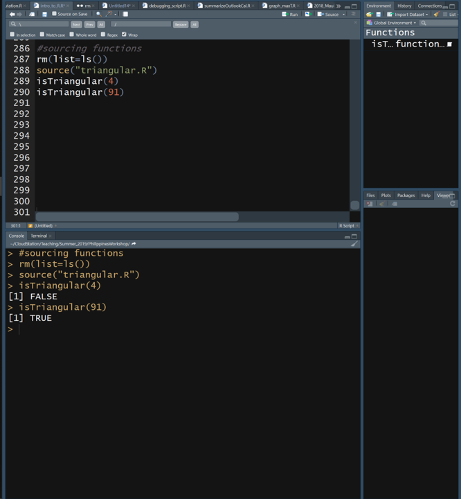
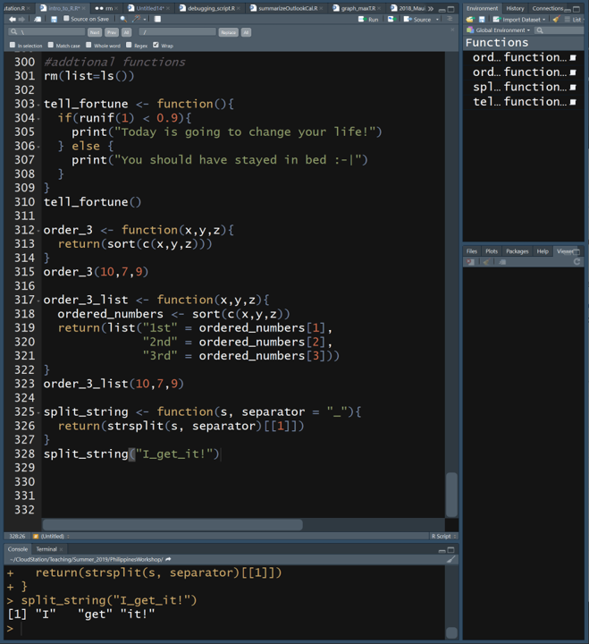
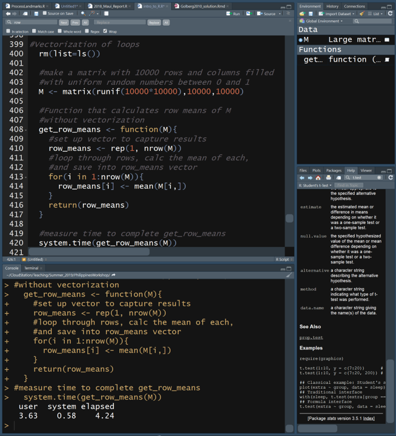
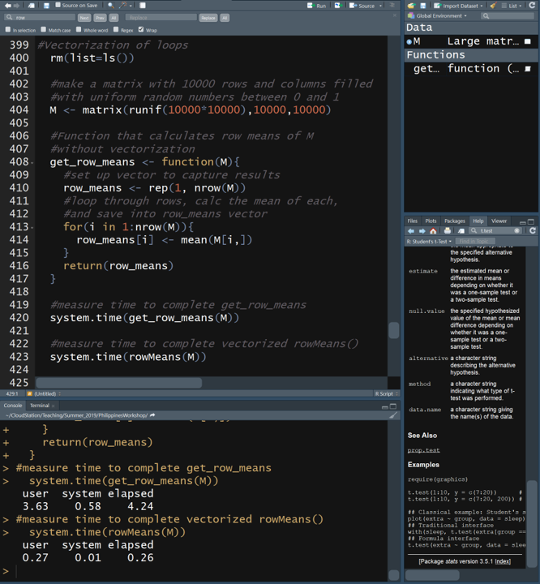
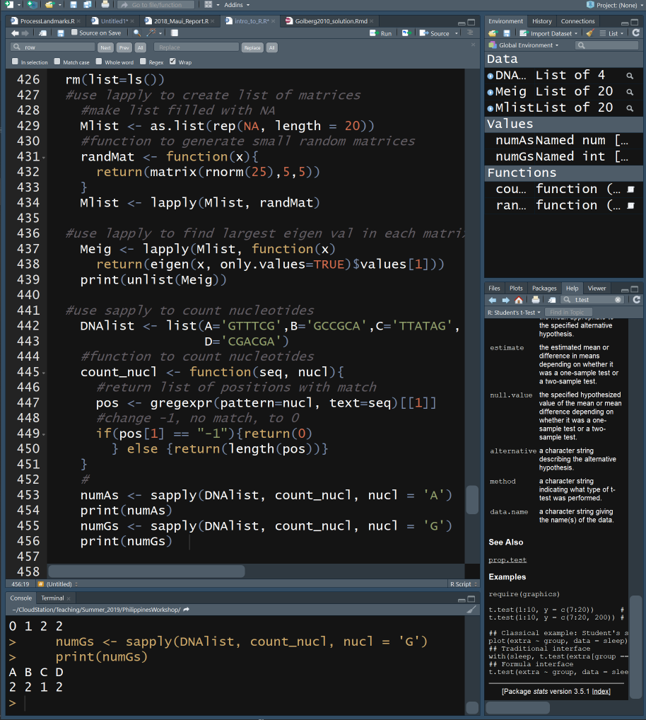
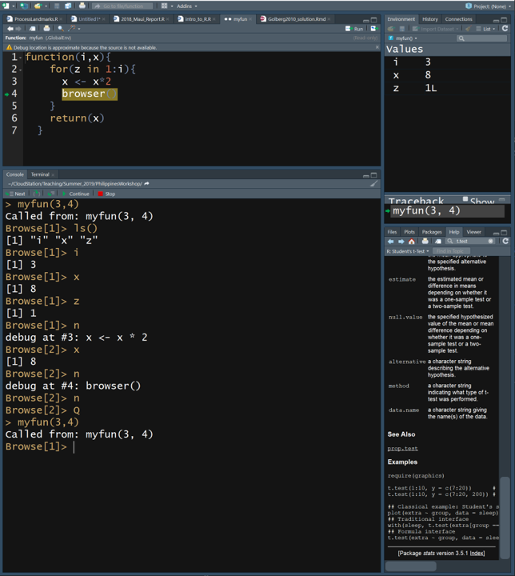
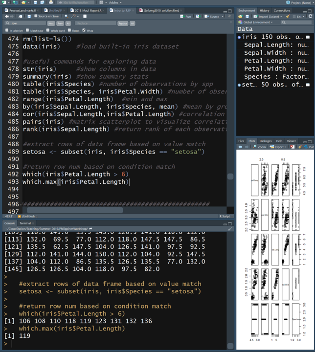
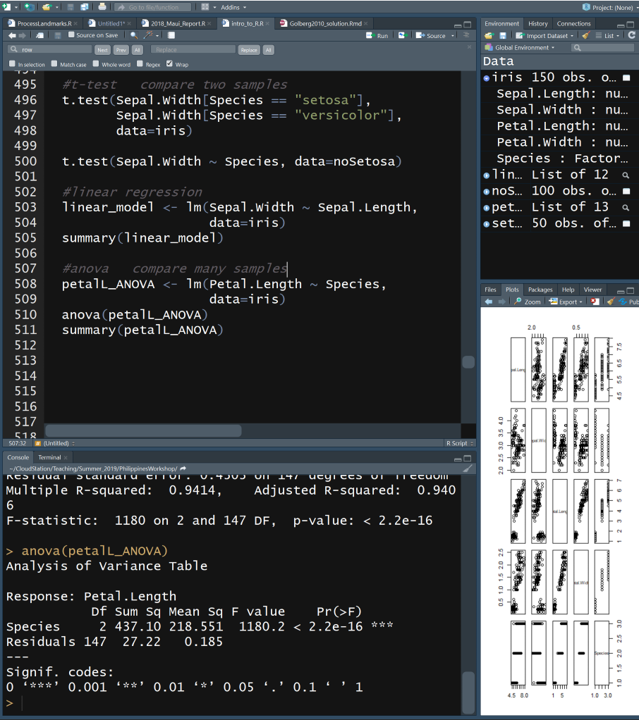
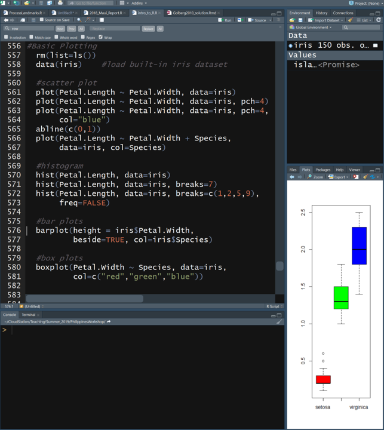
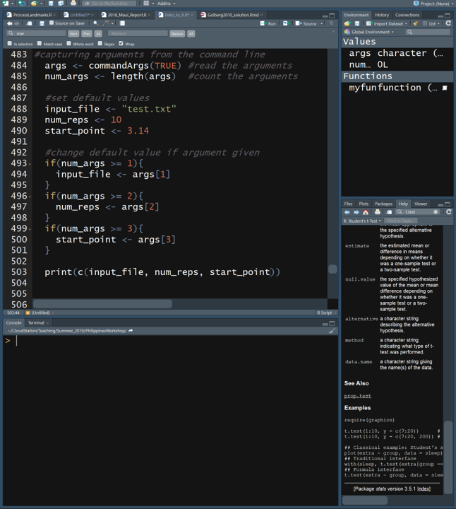

# Week06 R Boot Camp II: Statistical Computing Ch 8

###  Assignment 5 is due by beginning of class (complete Mind Expanders 8.2-8.5)

### [Lecture Stream](https://tamucc.webex.com/recordingservice/sites/tamucc/recording/playback/a0af1796542845cd88f3c07adb15cb1a)

___

## Computer Preparation

You are expected to start each lecture with your terminal window open and ready to go.

### *_Today, we are transitioning to R Studio, so the instructions have changed slightly.  Please make sure your computer is ready._* 

<details><summary>Win10</summary>
<p>

  * If the Ubuntu app is not installed, then follow [these instructions](https://github.com/cbirdlab/wlsUBUNTU_settings/blob/master/InstallLinuxOnWindows_Automated.pdf)
  
  * Log into your Ubuntu terminal.  _We will not use `gitbash` unless you can not get Ubuntu running._ After logging in, You are in your home directory. 
  
  * If you are using an Ubuntu terminal that has not been setup (you will know because it will ask you to create a new user name and password) or you notice odd cursor behavior when editing text in the terminal, then run the following code:
  
    ```bash
    git clone https://github.com/cbirdlab/wlsUBUNTU_settings.git
    . ./wlsUBUNTU_settings/updateSettings.bash
    rm -rf wlsUBUNTU_settings
    ```
    
  * If the `CSB` directory does not exist in your home directory (check with `ls`), then run the following code to clone the `CSB` repository into your home directory:
  
    ```bash
    git clone https://github.com/CSB-book/CSB.git
    ```

  * It is always a good idea to keep your apps in `Ubuntu` up to date. _The first time you do this, it could take a long time to finish. After that, if you do this when you log in, it should go quickly._
    ```bash
    sudo apt update
    sudo apt upgrade
    ```

### NEW INSTRUCTIONS FOR TODAY

#### Install `R` and `R Studio`

If you have a windows computer, you will need to separately install `R` in the windows environment even if you already installed it in Ubuntu.  Go to the following link below, download R for Windows and run the installer as you would for any other windows app.  

*If you installed R a while ago (more than a month ago), you should do it again or else problems will start to crop up*

1. [R Install](https://cran.revolutionanalytics.com/)

Regardless of your operating system, if you have not already installed R studio, you need to do that now.  On windows computers, install R studio in Windows.  

*If you installed R Studio a while ago, you should do it again to upate to the latest version.*

2. [RStudio Install](https://rstudio.com/products/rstudio/download/?utm_source=downloadrstudio&utm_medium=Site&utm_campaign=home-hero-cta#download)


#### Clone CSB Repo to Your Windows Home Dir

Just to make things a little more tricky, if you have windows, you cannot access the `CSB` repo that you cloned to your home directory in ubuntu with R Studio. So, we have to clone the repo again, but this time to your windows home dir (at least what R Studio recognizes as your windows home dir, `Documents`).

Open your ubuntu terminal and navigate to your windows `Documents` directory, then clone the CSB repo to there.

```bash
# make sure you are in ubuntu
cd /mnt/c/Users/YourWinUserName/Documents 
git clone https://github.com/CSB-book/CSB.git
```

</p>
</details>

<details><summary>MacOS</summary>
<p>
 
  * Open a terminal window
  
  * Consider installing [homebrew](https://brew.sh/).  You will be able to use homebrew to install linux software, such as `tree`, which is used in the slide show.
  
  * If the `CSB` directory does not exist in your home directory (check with `ls`), then run the following code to clone the `CSB` repository into your home directory:
  
    ```bash
    git clone https://github.com/CSB-book/CSB.git
    ```

### NEW FOR TODAY

#### Install `R` and `R Studio`

If you have a Mac and you already installed `R` for use in your terminal, you do not need to reinstall it.

*If you installed R a while ago (more than a month ago), you should do it again or else problems will start to crop up*

1. [R Install](https://cran.revolutionanalytics.com/)

Regardless of your operating system, if you have not already installed R studio, you need to do that now. 

*If you installed R Studio a while ago, you should do it again to upate to the latest version.*

2. [RStudio Install](https://rstudio.com/products/rstudio/download/?utm_source=downloadrstudio&utm_medium=Site&utm_campaign=home-hero-cta#download)


</p>
</details>

---


## [I. Lecture Slides](Week05new_files/Introduction%20to%20R%201.pptx)

I converted the lecture slides into this markdown document so you will not use them during class, but you can refer to them later as necessary. 

---

## II. Review Material Covered for Homework

### R Reading in Data from File

You will typically read in your data from a comma or tab delimited file.  It is read in as a data frame by default

Comma delimited files: 

	`read.csv(“MyFile.csv”)` 
	
	`read.csv(“MyFile.csv”, header=TRUE) #csv has col headers`
	
	`read.csv(“MyFile.csv”, sep=“;”) #separator is semicolon`
	
	`read.csv(“MyFile.csv”, skip=5)   #skip 1st 5 lines`
	

Tab delimited files: `read.table()`

See the help pages for both `read.csv` and `read.table` for complete functionality


```R
help(read.csv)
# to exit type 'q'
```

We will read  `H938_Euro_chr6.geno` into a variable called `ch6` in R. 

```R
#read in data
#make sure you use the correct path for your computer
ch6 <- read.table("../data/H938_Euro_chr6.geno", header=TRUE)
str(ch6)
dim(ch6)
head(ch6)
tail(ch6)

```

* This file contains 7 columns

 * CHR – chromosome
 
 * SNP – single nucleotide polym
 
 * A1 – allelic state 1
 
 * A2 – allelic state 2
 
 * nA1A1 - # homozyg A1
 
 * nA1A2 - # heterozyg
 
 * nA2A2 - # homozyg A2

___

### R Writing Data

You will typically write a dataframe to a csv or tab delimited file.

Comma delimited files (this is pseudo code, do not type in):

`write.csv(MyDF, “MyFile.csv”) `

#don’t overwrite

`write.csv(MyDF, “MyFile.csv”, append=TRUE) `	

#no header row

`write.csv(MyDF, “MyFile.csv”, col.names=FALSE)`

See documentation for write, write.csv, write.table for full functionality

Here we will save the file we just read into the variable `ch6` as a new comma delimited file named `H938_Euro_chr6.csv`

```R
write.csv(ch6, "H938_Euro_chr6.csv")

# view files in present working directory
list.files()
```

___


### R Working Directory

Before you start reading and writing files, it is important to know where the working directory is

`getwd(“path”)`

 * shows where you are

`setwd(“path”)`

 * changes where you are

Note, root in windows is C:/ rather than /.  

_Pro tip: "tab to autocomplete" works in both the `R` terminal and R Studio, just as in the the `bash` shell._


```R
rm(list=ls())

getwd()

#use your own path below
setwd("C:/Users/cbird/Documents/CloudStation/Teaching/Summer_2019/PhilippinesWorkshop/CSB/r/sandbox")

getwd()
```

___


### Read in `H938_Euro_chr6.geno`

This file contains 7 columns

* CHR – chromosome

* SNP – single nucleotide polym

* A1 – allelic state 1

* A2 – allelic state 2

* nA1A1 - # homozyg A1

* nA1A2 - # heterozyg

* nA2A2 - # homozyg A2

```R
#make sure you use the correct path for your computer
ch6 <- read.table("../data/H938_Euro_chr6.geno", 
                  header=TRUE)
dim(ch6)
head(ch6)
tail(ch6)
```

___

### [Mind Expander 8.3](https://forms.office.com/Pages/ResponsePage.aspx?id=8frLNKZngUepylFOslULZlFZdbyVx8RLiPt1GobhHnlUQTRGOTA5UDRZMzlPSjEwTUxCVzBIOEdKRi4u)

___


### R Scripts

Scripts are text files that contain the commands you give to R and have many advantages in biological research.  Your text editor (Notepad ++ or BBedit) is used to write scripts and has many functions built in to aid in code writing.  R Studio a special development environment for writing, testing, and running R scripts that we will cover shortly, but not yet.

* Recycling

  * similar analyses can be adapted quickly

* Automation

  * if you make a mistake, it’s easy to fix and redo analysis

* Documentation

  * analyses are precisely recorded for evaluation 

* Share

  * submit with your manuscript, review for errors

___


### Writing Good Code

Use descriptive names with [camelCase](https://en.wikipedia.org/wiki/Camel_case) or words_separated_by underscores

* Files 	– `model_fitting.R`   

* Variables 	– `body_mass`

* Functions 	– `calculate_cv`

Be consistent in use of spaces

```R
# poor formatting
X<-5*7

# good formatting
X <- 5*7
X <- 5 * 7
M <- matrix(25, 5, 5)
Z <- mean(m, na.rm == TRUE)
```

Use indenting to organize hierarchical code

```R
if (b == 5) {
	do(something)
} else {
	do(something_else)
}
```

Document your code so that it is easy to understand what you are trying to accomplish

* After a shebang!, the first line(s) of your R script should describe what the R script does and how to use it

* Provide descriptions of what your blocks of code do in the line(s) preceding the block of code

* Use tabs to align comments

Use empty lines to break up sections of code

Load libraries and set hard-coded variables at the beginning in one location, rather than scattering them throughout the script


###########################################################

Auto formatting in R Studio

The `Code` drop down menu contains functions specific to code formatting

* Code / Reformat Code

* Code  / Reindent Lines 


##########################################################

___


### R `for` and `while` Loops

Allows you to perform repetitive tasks in a few lines of code. A `for` loop has a predetermined number of cycles where as a `while` loop will cycle continuously until a condition is met.  Be careful with `while` loops because they could run infinitely if the condition is never met.

Anatomy of the `for` loop

```R
# pseudo code, do not type in
for(i in list_or_vector){
	Do something with i
}
```

Anatomy of  the `while` loop

```R
# pseudo code, do not type in
while(condition is TRUE){
	Execute commands
	Update condition
}
```

Exit a loop using `break`

```R
if(i >7){break}
```

Try out the code below that demonstrates how `for` and `while` loops work differently by performing the same task.

```R
rm(list=ls())
myvec <- 1:10     #make vector from 1 to 10
for(i in myvec){  #for each value in myvec
  a <- i^2        #square it
  print(a)        #and print the square
}                 #goto next value in myvec

i <- 1            #set i = 1
while(i <= 10){   #while i <= 10 
  a <- i^2        #square i
  print(a)        #print the square
  i <- i + 1      #increase i by 1
}                 #goto while line

```

___


### [Mind Expander 8.4](https://forms.office.com/Pages/ResponsePage.aspx?id=8frLNKZngUepylFOslULZlFZdbyVx8RLiPt1GobhHnlUMlRGTE9aQVQ3QUtBQlBOUEtHN1g3QUVDOS4u)


___


### R `if`-`then` Logic Statements

Run code conditionally, only if something is true or false.

Anatomy of the if statement

```R
# this is pseudocode, do not type in
if(a condition is TRUE){    
	execute these commands
} 
```

```R
# this is pseudocode, do not type in
if(a condition is TRUE){    
	execute these commands
} else {
	execute these other commands
}
```

For multiple conditions, replace 

```R
# this is pseudocode, do not type in
if(a condition is TRUE){    
	execute these commands
} else if(2nd condition is TRUE){
	execute these other commands
}
else {
	execute these other commands
}
```

Try out this code to see how `if`-`then` statements work

```R
#if statements
rm(list=ls())
x <- seq(1,50,3)
y <- sample(x, size=1, replace = TRUE) #randomly sample 1 value from vector x

if(y%%2 == 0){
  print(paste(y, "is even"))
} else {
  print(paste(y, "is odd"))
}

# copy this code and paste it into R terminal a few times.  What is happening?
y <- sample(x, size=1, replace = TRUE) #randomly sample 1 value from vector x
if(y%%2 == 0){
  print(paste(y, "is even"))
} else if(y%%2 != 0) {
  print(paste(y, "is odd"))
}
```

___


### [Mind Expander 8.5](https://forms.office.com/Pages/ResponsePage.aspx?id=8frLNKZngUepylFOslULZlFZdbyVx8RLiPt1GobhHnlUMlIwMFNWME1IUVJCWktXWkZYSk1RV0pONC4u)


---


## III. New Material Not Previously Covered: R Studio

### [R Studio](https://rstudio.com/) is a [GUI](https://en.wikipedia.org/wiki/Graphical_user_interface) Integrated Development Environment ([IDE](https://en.wikipedia.org/wiki/RStudio)) for `R` 

`R Studio` was completely free, but it has become a "dot com" when it was acquired by Microsoft (I think).  It is still free for academic use.  If/When they charge for it, academics will stop using it.  It is still open source and could be forked, just as R was forked from [S](https://en.wikipedia.org/wiki/S_%28programming_language%29).  

Connections: the Chief Engineer of R Studio is [Hadley Wickham](https://en.wikipedia.org/wiki/Hadley_Wickham), who coined and codified "tidy data". He will come up again when we get into "the tidyverse", which essentially replaces almost all basic R functionality with a different philosophy. I think of it as essentially R 2.0. Realize, however, you do NOT need R Studio to use the "tidyverse".


___


### Installing `R Studio`

_If you already did this when following the instructions to prep your computer at the top of this doc, then you do not have to do this again._

If you have a Mac and you already installed `R` for use in your terminal, you do not need to reinstall it.

If you have a windows computer, you will need to separately install `R` in the windows environment even if you already installed it in Ubuntu.  Go to the following link, download R for Windows and run the installer as you would for any other windows app.  

*If you installed R a while ago (more than a month ago), you should do it again or else problems will start to crop up*

1. [R Install](https://cran.revolutionanalytics.com/)

Regardless of your operating system, if you have not already installed R studio, you need to do that now.  On windows computers, install R studio in Windows.  

*If you installed R Studio a while ago, you should do it again to upate to the latest version.*

2. [RStudio Install](https://rstudio.com/products/rstudio/download/?utm_source=downloadrstudio&utm_medium=Site&utm_campaign=home-hero-cta#download)

___


### `R Studio` Layout

R Studio is organized, by default, into 4 panels:

* A text editor (upper left)

  * this is where you view and edit your scripts

* The `console`/`terminal` (lower left)

  * this gives you access to the R or bash command line, just as we have been using in our terminal windows
  
    * the `console` is the `R` command line

    *  the `terminal` is a rudimentary `bash` command line

* The `global environment` (upper right)

  * here you can view your data containers (i.e. variables) and their attributes

* The `plots`/`help` windows (lower right)

  * here you can view plots or search for help

Note that there can be several tabs in the panels, allowing you to toggle between different screens of information.


___


### Acclimating to the `R Studio` IDE

Follow the instructions in the following image to see the difference between the `text editor` panel and the `console` pane.


Text Editor (upper left)

* Place to craft your code

  * To identify code to run, either highlight with mouse or place cursor anywhere on that line
  
  * To run code on line, use the following keystrokes: `Ctrl` + `Enter`
  
  * To run code on all lines: `Ctrl` + `Shift` + `S`
  
  * try it

Console (lower left)

* Native `R` interface

  * Without R Studio, this is how you would interface with R

  * this work exactly like R did when run in your terminals

  * the difference between the `console` and the `terminal` is 

    * the `console` is the `R` command line

    *  the `terminal` is a rudimentary `bash` command line (try using `ls` in the `terminal` tab in the lower left panel)


Type in the following code in your text editor to save values into variables `x` and `y`, then run it.  _Note that your line numbers in the text editor will not be exactly the same as in the image._


Global Environment (upper right)

* Note that when you ran your code, not only did it show up in the `console` (make sure you select the `console` tab, but the values for `x` and `y` showed up in the `global environment`

  * this is where you can see all variables that have been defined
  
  * you can also see information about the variables that is equivalent to the `str(variable)` command
  
    * for example, now you can see that `x` is a "value", and not a "vector", "matrix", "array", "list", or "data frame"

___


## IV. New Material Not Previously Covered: More R, but now in R Studio

From here forward, I request that you please work in R Studio, unless otherwise specified, to reduce minor issues that might crop up between platforms. However, it is important to realize that everything we are learning will also work in the basic R terminal from the linux/unix command line and with minor exceptions, allmost nothing we cover will be only usable in R Studio.

You should type commands into the R Studio `text editor` (upper left panel) and then execute them from there using your mouse or arrow keys and `ctrl` + `enter`.  You can save your work as you would in other GUI apps.

___


### Required Housekeeping for Win10 Only, Clone CSB Dir Into Your Windows Home Dir

_If you already did this when following the instructions to prep your computer at the top of this doc, then you do not have to do this again._

For now, we should all be in the `sandbox` for the `r` chapter in `CSB`. An just to make things a little more tricky, if you have windows, you cannot access the `CSB` repo that you cloned to your home directory in ubuntu. So, we have to clone it again, but this time to your windows home dir (at least what R Studio recognizes as your windows home dir, `Documents`).

Open your ubuntu terminal (mac folks can take a break) and navigate to your windows `Documents` directory, then clone the CSB repo to there.

```bash
# make sure you are in ubuntu
cd /mnt/c/Users/YourWinUserName/Documents 
git clone https://github.com/CSB-book/CSB.git
```

You can now leave ubuntu. 

___


### R Working Directories

*Never has specifying the present working directory been more critical than in R Studio.*  This is one achilles heels of R Studio where the linux terminal is actually more convenient and intuitive. 

*_You will need to be vigilent in setting your present working directory each time you open `R Studio` and every time you switch between scripts that are found in different directories._* 

When you open R Studio, you will generally be in your home directory for the operating system you are running R Studio in.  It cannot hurt to check:

```R
# view the present working dir
getwd()
```

If you are not in your home directory, you can easily navigate there:

```R
# set the present working dir to home
setwd(~)

# view the present working dir
getwd()
```

Now let us move to the `sandbox` for the `r` chapter in `CSB`

```R
# Make sure your CSB repo has been cloned by viewing the dirs 
list.dirs(recursive=FALSE)

# change working directory to CSB/r/sandbox
setwd("~/CSB/r/sandbox")

# view the present working dir
getwd()
```

___

### R Functions

Thus far we have used several built-in functions of R

`seq`, `for`, `if`, `while`, `print`, `sample`, `dim`, `head`, `tail`, `getwd`, `setwd`, …

It is also possible to define your own functions

```R
# this is pseudo code, do not type in
MyFunction <- function (optional arguments){
	Execute commands
	return(data)   # optional
}
```

* You specify the name of the function by replaceing `MyFunction` with a name of your choosing

* Replace `optional arguments` with a comma delimited list of variables (you choose the their names) that will store values you specify when running the function.  

  * this is how you pass data into the function
  
  * variables defined outside of the function are not available inside of the function unless they are passed in as arguments
  
* A function is usually meant to return information, the `stdout`, that is availble outside of the function

  * you can specify the `stdout` with the `return` command 

Remember, functions must be read into the environment before you can use them.  Like Las Vegas, what happens in a function, stays in a function... except for the data you `return`

Let us make our first R function:

```R
# enter the following line of code and function into your text editor (upper left panel), which should be empty
rm(list=ls())

# function to check whether number is triangular
isTriangular <- function(y){
  #triangular numbers (T) defined by n(n+1)/2, thus
  #y is triangular if the following is an integer
  n <- (sqrt((8*y)+1) - 1) / 2
  if(as.integer(n) == n){
    return(TRUE) # function will end here in n is integer
  }
  #if n is not integer, return FALSE
  return(FALSE)
}
```

Make sure that after you enter your function into the editor that you execute it to load it into the environment and make it available for use.

* either highlight the whole function or place the cursor on the first or last line of the function and `ctrl`+`enter` 

This function identifies numbers that are triangular.


After the function is loaded into the enviroment, it can be used.  Try it out:

```R
isTriangular(4)
isTriangular(91)
```


___


### Sourcing R Functions

If there are functions that you use frequently across different projects, you can save them into their own script and `source()` them in a different script.

You can open a new R script (use mouse), copy and paste the `isTriangular` function into new blank script, save it to `~/CSB/r/sandbox/` with the name `triangular.R`, and close it.

Once you have done that, we can use the `source()` command to read in the `isTriangular` function from the `triangular.R` script.  When you "source" a script, its entire contents are executed.

```R
# clear environment
rm(list=ls())

# now isTriangular is gone and will not work
isTriangular(4)  #should return an Error

# source the triangular.R script to load the isTriangular() function
source("triangular.R") # note that file names have to be quotfied to distinguish from variables
isTriangular(4)
isTriangular(91)
```



___


### More Function Sourcing

We are going to add another function to the `triangular.R` script (open it).  

The function will be called `findTriangular` and will accept an argument that sets the upper limit on the numbers to search for triangular numbers (between 1 and `max_number`) and will pass it into the function under the variable name `max_number`. Copy and paste it into `triangular.R`

```R
# function to find and store triangular numbers
findTriangular <- function(max_number){
  to_test <- 1:max_number
  triangular_numbers <- numeric(0)
  for(i in to_test){
    if(isTriangular(i)){
      triangular_numbers <- c(triangular_numbers, i)
    }
  }
  print(paste("There are", 
              length(triangular_numbers), 
              "triangular numbers between 1 and ", 
              max_number))
  return(triangular_numbers)
}
```

Then save and close the `triangular.R` script. Now, you can source the script to load the function and use it.

```R
rm(list=ls())
source("triangular.R")
isTriangular(91)
findTriangular(1000)
```

___


### Even More Functions

Can have no arguments

* `myFunc <- function(){commands}`

Can have multiple arguments. Variables outside of the function must be read into the function

* `myFunc <- function(a,b,c){commands}`

Can have default arguments. When run, a will be 2 unless another value is specified

* `myFunc <- function(a=2){commands}`

Do not have to return values

Variables outside of the function are only available by passing them into the function, and vice versa

You can explore these features by trying the following code (do not modify the `triangular.R` script)

```R
#addtional functions
rm(list=ls())

tell_fortune <- function(){
  if(runif(1) < 0.9){
    print("Today is going to change your life!")
  } else {
    print("You should have stayed in bed :-|")
  }
}
tell_fortune()

order_3 <- function(x,y,z){
  return(sort(c(x,y,z)))
}
order_3(10,7,9)

order_3_list <- function(x,y,z){
  ordered_numbers <- sort(c(x,y,z))
  return(list("1st" = ordered_numbers[1],
              "2nd" = ordered_numbers[2],
              "3rd" = ordered_numbers[3]))
}
order_3_list(10,7,9)

split_string <- function(s, separator = "_"){
  return(strsplit(s, separator)[[1]])
}
split_string("I_get_it!")
```



___


### R Packages & Libraries

A package is a collection of R code, data, and functions that have been made publicly available

* There are over 14,000 R packages

* Packages must be installed

  * `install.packages(“name_of_pkg”)`

* Once installed, packages must be loaded

  * `library(name_of_pkg)`

*Note that packages that are being installed need to be quotified, but after they are installed, the should not be quotified.  Why do you think that is?*

Where to find packages specialized for your research questions

* https://cran.r-project.org/web/views/

* https://github.com/ 

* https://www.bioconductor.org/ 


Making packages

* [R Studio](https://support.rstudio.com/hc/en-us/articles/200486488-Developing-Packages-with-RStudio)

* http://r-pkgs.had.co.nz/ 

When you add a package, you are adding commands and functionality.  Once installed, packages must be called to be available to you using `library()`. 

```R
# Search for Packages
RSiteSearch("AMOVA")

# install all packages related to a particular field
install.packages("ctv")

# load the ctv package commands
library(ctv)

```

You can learn more about `ctv` [here](https://cran.r-project.org/web/packages/ctv/index.html). Click on the pdf for the manual. This was an example given by the book, so do not read too much into this.

___


### R Random Numbers

Random numbers are useful for simulations and customized tests for statistical significance

* Random number from [uniform distribution](https://en.wikipedia.org/wiki/Uniform_distribution_(continuous))

  * `runif(number_of_random_nums)`

* Random number from [normal distribution](https://en.wikipedia.org/wiki/Normal_distribution)

  * `rnorm(num_rands, mean=x, sd=y)`

* Random number from [binomial distribution](https://en.wikipedia.org/wiki/Binomial_distribution), aka coin flipping

  * `rbinom(num_rands, num_trials, 	probabilty)`

* Random number from [Poisson distribution](https://en.wikipedia.org/wiki/Poisson_distribution)

  * `rpois(num_rands, lambda=x)`

* Permute 

  * `sample(vector_or_list, 	num_samps)`

* [Bootstrapping](https://en.wikipedia.org/wiki/Bootstrapping_%28statistics%29)

  * `sample(vector_or_list, 	num_samps, replace = 	TRUE)`


```R
rm(list=ls())

runif(3)            #random numbers from uniform distribution

rnorm(5, 15, 5)     #random numbers from normal distribution, simulate quantitative phenotypes
rbinom(1, 10, 0.5)  #random numbers from binomial distribution, simulate coin flipping, genetic drift, genotypes
rpois(6, 10)        #random numbers from Poisson distribution, simulate count data

x <- 1:10
sample(x,10)              #permutation test, randomly assign individuals to treatments
sample(x,10,replace=TRUE) #bootstrapping

```


___


### Mind Expander 6


___


### R Loops are Slow

For and while loops in R are easy to use but are very slow because R runs commands 1 by 1 and does not know what is coming next.  

In faster languages, like `C`, code is compiled and all commands are known before running, allowing for optimization.

Here we use a for loop to calculate the mean of each row in a very large matrix filled with random numbers and record the length of time to complete the task


```R
rm(list=ls())

#make a matrix with 10000 rows and columns filled with uniform random numbers between 0 and 1
M <- matrix(runif(10000*10000),10000,10000)

#Function that calculates row means of M without vectorization
get_row_means <- function(M){
	#set up vector to capture results
	row_means <- rep(1, nrow(M))
	
	#loop through rows, calc the mean of each, and save into row_means vector
	for(i in 1:nrow(M)){
		row_means[i] <- mean(M[i,])
	}
return(row_means)
}

#measure time to complete get_row_means
system.time(get_row_means(M))
```



___


### Vectorized R Loops are Fast

Vectorized functions can run loops much faster because R only has to figure out the flow for 1 element in the vector and the code runs much faster. 

The built-in command, `rowMeans()`, is vectorized and does the same thing as the function we defined previously.

Now we will vectorize the calculation of row means and measure how long it takes to complete the task

```R
#measure time to complete vectorized rowMeans()
system.time(rowMeans(M))
```



___


### DIY Vectorization of Loops with `apply()`

`lapply(list_of_values, function)`

* applies a function to each element in list and returns a list of results

* note that `unlist(list_of_vals)` changes the list into a vector

`sapply(list_of_values, function)`

* Just like lapply, but returns a vector

Let us try it out.  

In the example below, the user-defined function `count_nucl` accepts 2 arguments `(seq, nucl)`. The list `DNAlist` populates `seq`, the second argument is explicitly specified  in the `sapply` statement: , `nucl =  ‘A’`

```R
rm(list=ls())

#use lapply to create list of matrices and make list filled with NA
Mlist <- as.list(rep(NA, length = 20))

#function to generate small random matrices
randMat <- function(x){
  return(matrix(rnorm(25),5,5))
}
Mlist <- lapply(Mlist, randMat)


#use lapply to find largest eigen val in each matrix
Meig <- lapply(Mlist, function(x) return(eigen(x, only.values=TRUE)$values[1]))
print(unlist(Meig))


#use sapply to count nucleotides
DNAlist <- list(A='GTTTCG',
                B='GCCGCA',
                C='TTATAG', 
                D='CGACGA')


#function to count nucleotides
count_nucl <- function(seq, nucl){

  #return list of positions with match
  pos <- gregexpr(pattern=nucl, text=seq)[[1]]
  
  #change -1, no match, to 0
  if(pos[1] == "-1"){
    return(0)
  } else {
    return(length(pos))
  }
}

numAs <- sapply(DNAlist, count_nucl, nucl = 'A')
print(numAs)

numGs <- sapply(DNAlist, count_nucl, nucl = 'G')
print(numGs)  

```




___


### R Debugging

Errors in the code (bugs) are common

* Some errors elicit warning messages or cause code to stop

* Silent errors can be hard to detect, thus it is important to test your code 

  * Use test data with known answer
  
  * Check values in data structures (in the global environment, upper right panel)
  
* You can also pause your code using `browser()`


```R
#Debugging
rm(list=ls())

myfun <- function(i,x){
	for(z in 1:i){
		x <- x*2
		browser()
}
return(x)
}
myfun(3,4)
```


After you run the code, you enter debugging mode at the line of `browser()` command in your script

* View local variables with `ls()`

* Check values of variables

* Press n to execute next statement

* Check value of `x` again

* Press Q to exit browser and function

* Press c to continue function and exit browser




___


### Basic R Statistics

R is a stats language and has many statistical functions built-in


```R
rm(list=ls())
data(iris)    #load built-in iris dataset

#useful commands for exploring data
str(iris)     #show columns in data
summary(iris) #show summary stats
table(iris$Species) #number of observations by spp
table(iris$Species, iris$Petal.Width) #number of observations by species and petal width
range(iris$Petal.Length)  #min and max
by(iris$Sepal.Length, iris$Species, mean) #mean by group
cor(iris$Sepal.Length,iris$Petal.Length) #correlation
pairs(iris) #matrix scatterplot to visualize correlations
rank(iris$Sepal.Length) #return rank of each observation from smallest to largest

#extract rows of data frame based on value match
noSetosa <- subset(iris, iris$Species != "setosa")

#return row num based on condition match
which(iris$Petal.Length > 6)
which.max(iris$Petal.Length)

```




t-test:  compare two samples

* `t.test(vector1, vector2)`

* `t.test(dataVector ~ groupVector)`

Linear regression

* `lm(responseVector ~ predictorVector)`

ANOVA

* `lm(responseVector ~ predictorVector)`

* `anova()`

let us try some of these:

```R
#t-test   compare two samples
t.test(Sepal.Width[Species == "setosa"], 
	 Sepal.Width[Species == "versicolor"],
	 data=iris)

t.test(Sepal.Width ~ Species, data=noSetosa)

#linear regression
linear_model <- lm(Sepal.Width ~ Sepal.Length, data=iris)
summary(linear_model)

#anova   compare many samples
petalL_ANOVA <- lm(Petal.Length ~ Species, data=iris)
anova(petalL_ANOVA)
summary(petalL_ANOVA)

```



___


### Mind Expander 8.7

___


### R Basic Plotting

R also has built in commands for plotting results

* [Scatter Plots](https://en.wikipedia.org/wiki/Scatter_plot)

  * `plot(responseVctr ~ predictorVctr)`

* Draw line on plot

  * `abline(c(y-intercept,slope))`

* [Histograms](https://en.wikipedia.org/wiki/Histogram)

  * `hist(vector)`

* [Bar plots](https://en.wikipedia.org/wiki/Bar_chart)

  * barplot(vector)

* [Box plots](https://en.wikipedia.org/wiki/Box_plot)

  * `boxplot(responseVctr ~ predictorVctr)`


```R
rm(list=ls())
data(iris)    #load built-in iris dataset

#scatter plot
plot(Petal.Length ~ Petal.Width, data=iris)
plot(Petal.Length ~ Petal.Width, data=iris, pch=4)
plot(Petal.Length ~ Petal.Width, data=iris, pch=4,
   col="blue")
abline(c(0,1))
plot(Petal.Length ~ Petal.Width + Species, 
   data=iris, col=Species)

#histogram
hist(Petal.Length, data=iris)
hist(Petal.Length, data=iris, breaks=7)
hist(Petal.Length, data=iris, breaks=c(1,2,5,9),
   freq=FALSE)

#bar plots
barplot(height = iris$Petal.Width, 
	  beside=TRUE, col=iris$Species)

#box plots
boxplot(Petal.Width ~ Species, data=iris,
	  col=c("red","green","blue"))
```



___


### Running R Script from Linux Command Line

You may want to run your r script on a super computer or use it in a bash script

* `Rscript my_script.R`

You can pass arguments from bash into R

* `Rscript my_script.R arg1 arg2`

In your rscript you must pass the arguments into a variable

* `args <- commandArgs(TRUE)`

It is a best practice to define default values and order the arguments so the optional follow the required

Print the variable values to document what settings were used


```R
#capturing arguments from the command line in an r script 
args <- commandArgs(TRUE) #read the arguments
num_args <- length(args)  #count the arguments

#set default values
input_file <- "test.txt"
num_reps <- 10
start_point <- 3.14

#change default value if argument given 
if(num_args >= 1){
input_file <- args[1]
}
if(num_args >= 2){
num_reps <- args[2]
}
if(num_args >= 3){
start_point <- args[3]
}

print(c(input_file, num_reps, start_point))
```



___


## V. Homework

[Complete exercise 8.23.3 in the text - I will link a github repo for this assignment](https://classroom.github.com/a/ATshIvd8)


