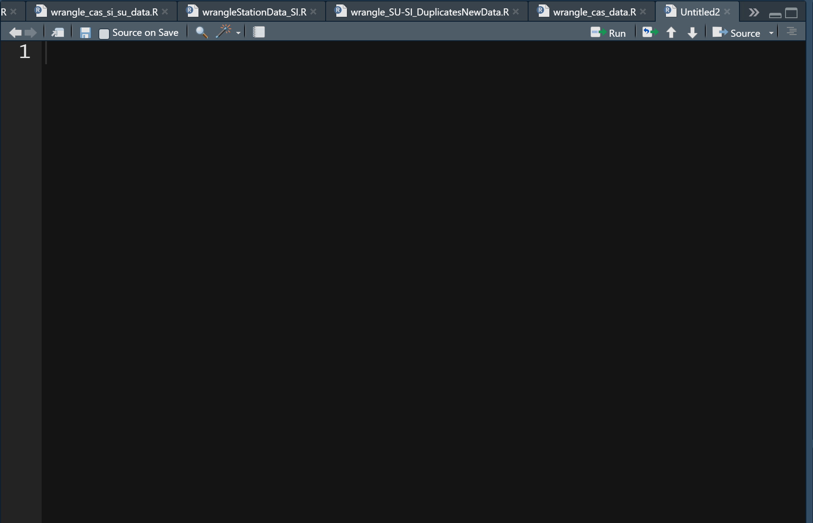
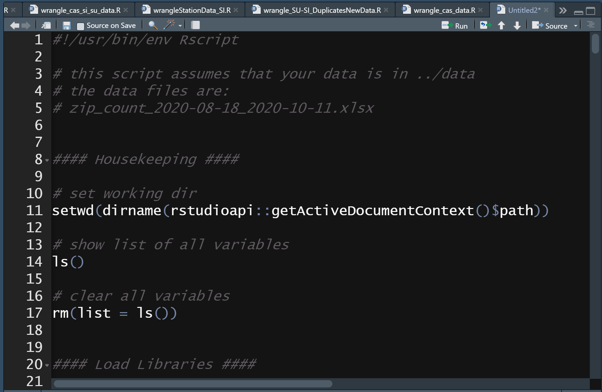
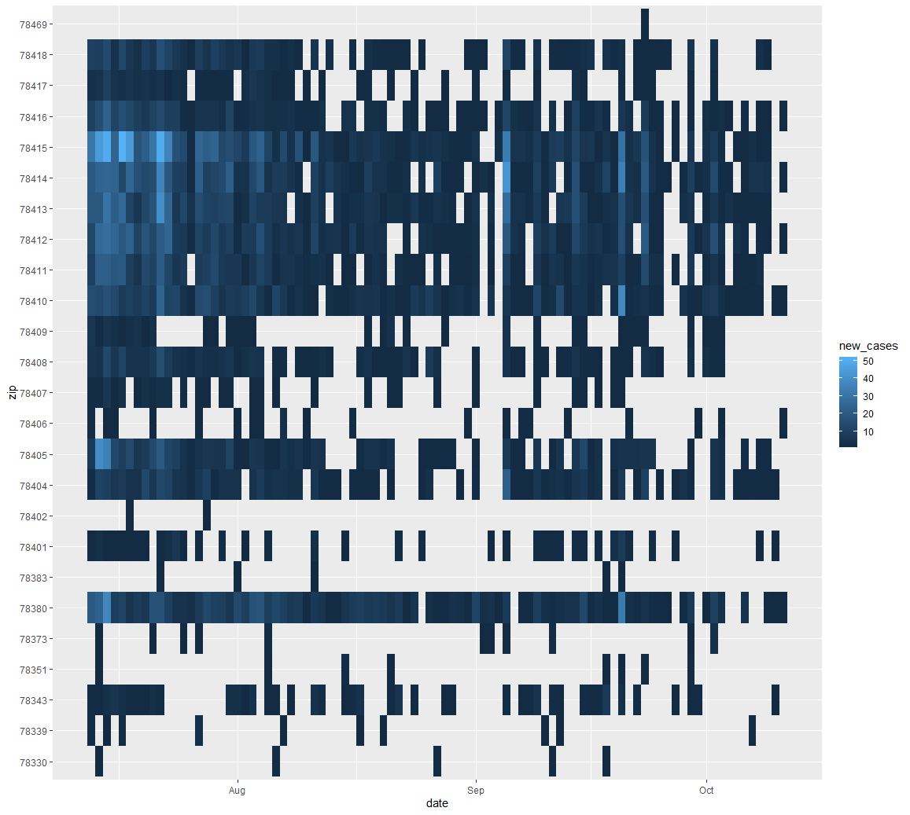
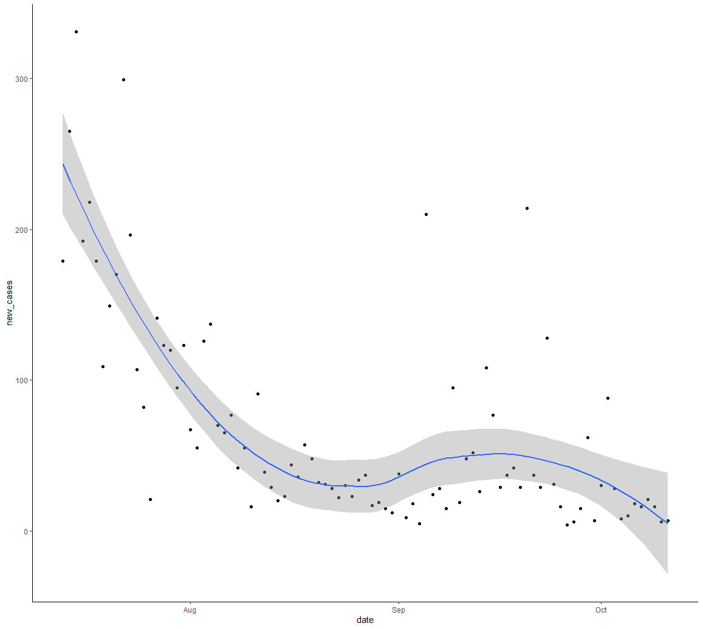
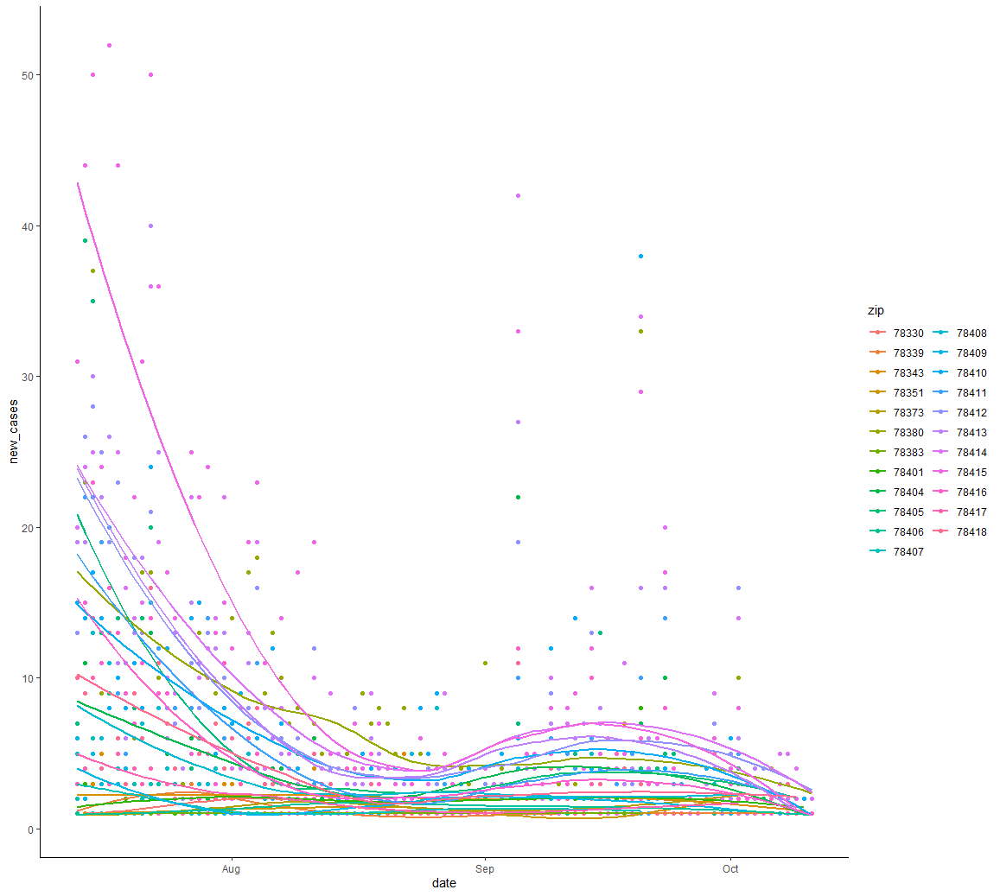
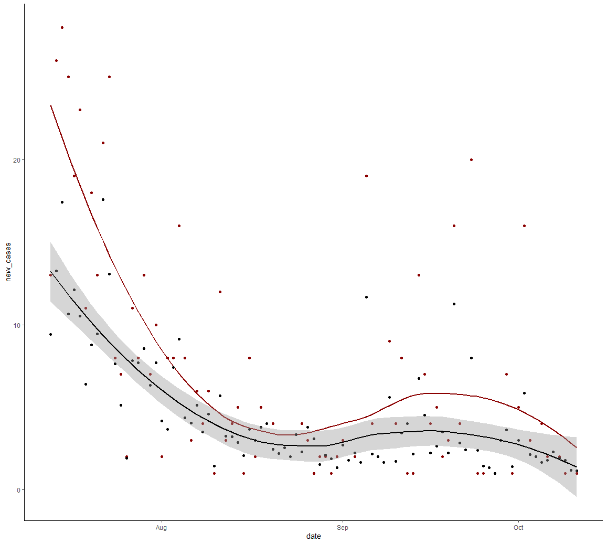
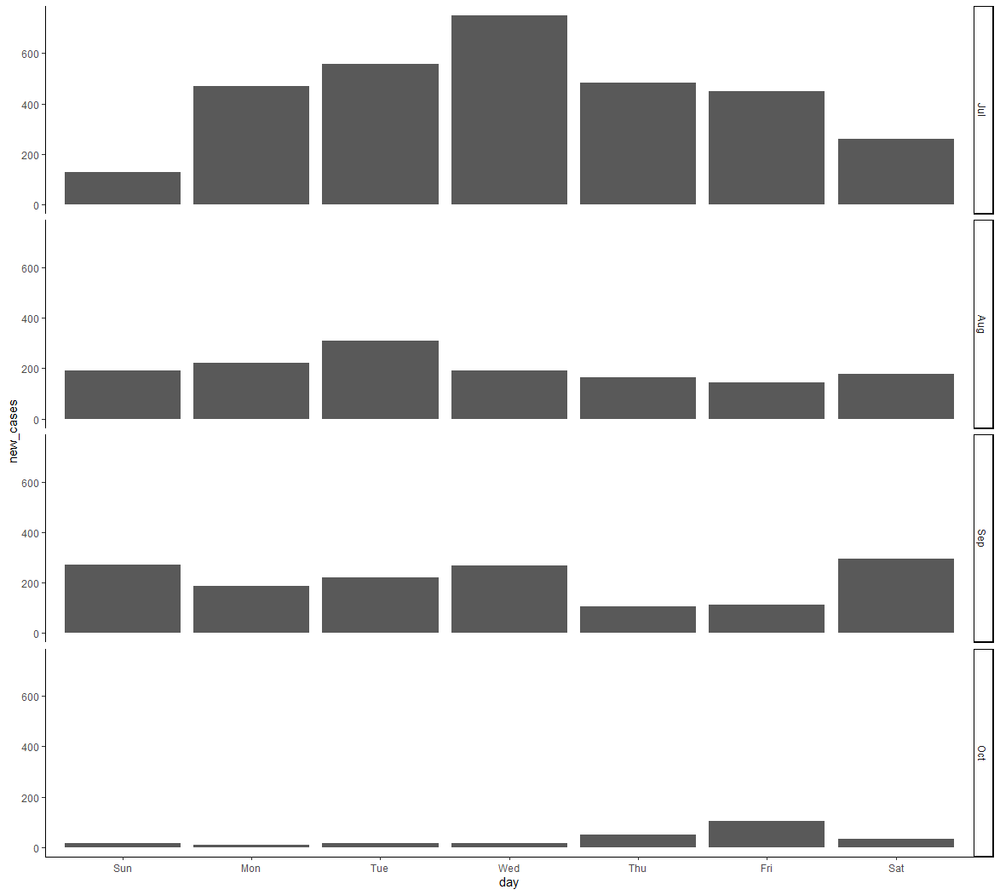
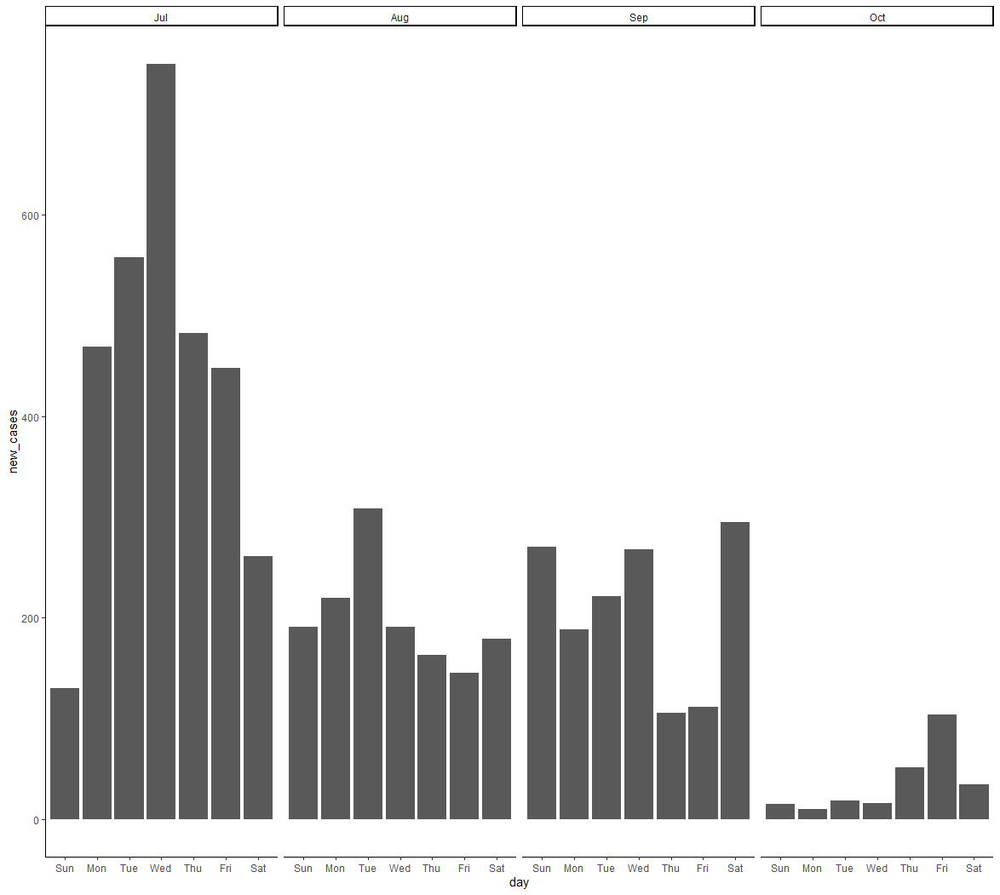
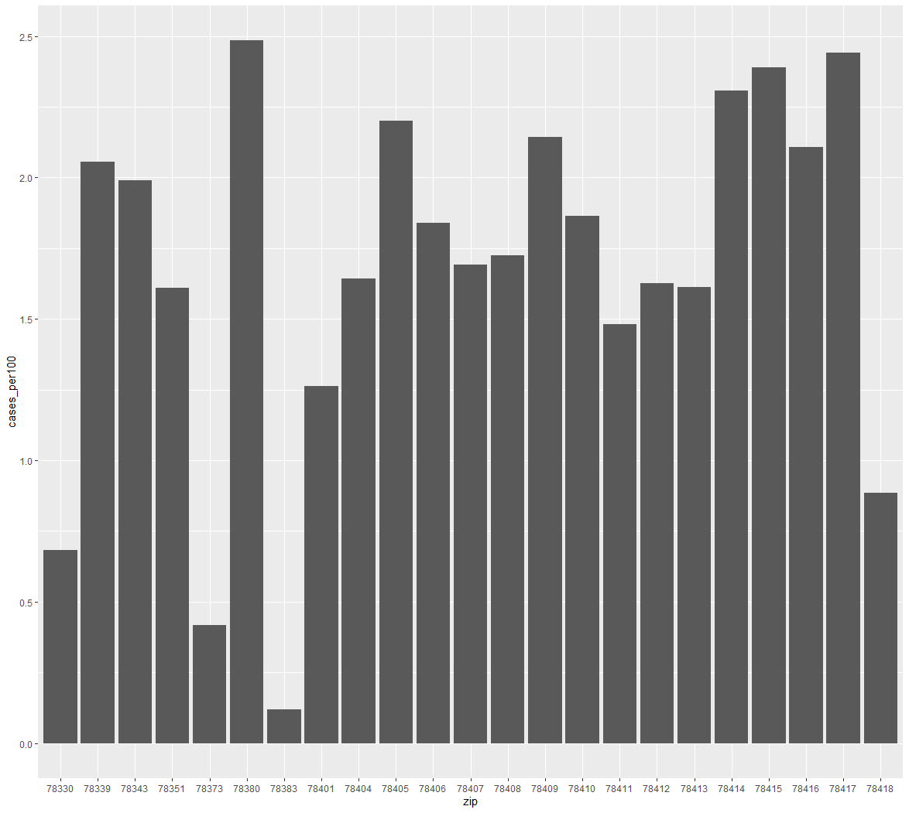
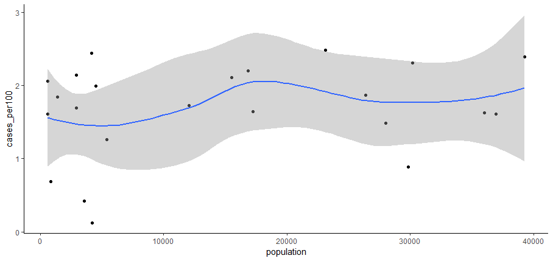

# Week08 R Data Wrangling w/ Tidyverse R Package 


CSB Ch 9
R for Data Science Chapters Covered:

* Explore: Data transformation
* Explore: Exploratory Data Analysis
* Wrangle: Intro
* Wrangle: Data import
* Wrangle: Tidy data
* Wrangle: Relational data
* Wrangle: Factors
* Wrangle: Dates & times
* Program: Pipes
	
	

R for Data Science Prerequisite Chapters:

* Explore: Intro
* Explore: Data visualization
* Explore: Workflow: basics
* Explore: Workflow: scripts
* Explore: Workflow: projects
* Wrangle: Tibbles
* Wrangle: Factors
* Program: Pipes
* Program: Vectors
	

###  Assignment 7 is due by beginning of class (complete Mind Expanders 9.5-9.6)

### [Lecture Stream](https://tamucc.webex.com/recordingservice/sites/tamucc/recording/playback/38a16a8943df40739f8ddf009d363997)

___

## Computer Preparation

You are expected to start this lecture with R Studio open with a fresh and empty text document in the upper left panel and a clean environment.

### *_GENERAL COMPUTER SETUP (SHOULD ALREADY BE DONE)_* 

<details><summary>Ubuntu on Windows</summary>
<p>

  * If the Windows Terminal or Ubuntu app are not installed, then follow [these instructions](https://github.com/cbirdlab/wlsUBUNTU_settings/blob/master/README.md)

  * Open an Ubuntu window in Windows Terminal.  _We will not use `gitbash` unless you can't get Ubuntu running._ After logging in, You are in your home directory.

  * It's always a good idea to keep your apps in `Ubuntu` up to date. _The first time you do this, it could take a long time to finish. After that, if you do this when you log in, it should go quickly._
    ```bash
    sudo apt update
    sudo apt upgrade
    ```

</p>
</details>

<details><summary>MacOS</summary>
<p>

  * Open a terminal window

  * If you haven't already, install [homebrew](https://brew.sh/).  You will be able to use homebrew to install linux software, such as `tree`, which is used in the slide show.


</p>
</details>


<details><summary>If it's not already there, clone the CSB repository to your home dir</summary>
<p>

We will use the [open source files that accompany the CSB text book](https://github.com/tamucc-comp-bio-2022/CSB) in lectures and assignments.

If the `CSB` directory does not exist in your home directory (check with `ls`), then run the following code to clone the [`CSB` repository](https://github.com/tamucc-comp-bio-2022/CSB) into your home directory:

1. Open a terminal window
	* For Win laptops, use `Windows Terminal` to open Ubunutu.  
	* For Mac laptops, open your `Terminal`.

2. Run the code line by line in the code block below

```bash
# check that you're in home dir, you should be there when you log in
pwd

# if you are not in your home dir, then move there
cd ~

# if pwd does not return `/home/yourusername` then let Dr. Bird know
pwd

# clone the CSB repository to your home dir
git clone git@github.com:tamucc-comp-bio-2022/CSB.git
```

The repository is named CSB, and it contains all of the example files and directories necessary to conduct the exercises in the text book.

</p>
</details>

[If you have not already, install R](../resources/install_r.md)

[If you have not already, install RStudio](../resources/install_rstudio.md)


<details><summary>Tidyverse Install</summary>
<p>

```r
# clear all variables from environment
rm(list = ls())
```

```r
# RUN THE FOLLOWING LINE IN THE CONSOLE (LOWER LEFT PANEL)
install.packages("tidyverse")

# ADD THE FOLLOWING LINE TO YOUR TEXT DOCUMENT (UPPER LEFT PANEL), THEN EXECUTE IT (CTRL-ENTER)
library(tidyverse)
```

</p>
</details>


---

## I. [Quiz](https://forms.office.com/r/AcUvr7y74K)

---

## II. Review Material Covered for Homework

[Mind Expander 9.5](https://forms.office.com/Pages/ResponsePage.aspx?id=8frLNKZngUepylFOslULZlFZdbyVx8RLiPt1GobhHnlUOE9LM0ZWOUZWVlZTUzBKQkZaUkcwRVg4Qy4u), [Solutions](Week07_files/mind_expander_9.5_answers.R)

[Mind Expander 9.6](https://forms.office.com/Pages/ResponsePage.aspx?id=8frLNKZngUepylFOslULZlFZdbyVx8RLiPt1GobhHnlURDFBNlc2UFFEOVJVMEpaWVZJWkJJNEc1US4u), [Solutions](Week07_files/mind_expander_9.6_answers.R)

[Assignment 7 Solutions](../assignments/assignment_7_answers.R)

---

## III. Getting the RScript & Data for Today 


<details><summary>Getting Today's RScript & Data Set: Commmand Line Method</summary>
<p>

Today, we are going to process COVID-19 data from the Coastal Bend of Texas. You will need to grab some data and save it to your `CSB/data_wrangling/data` dir.

Open your terminal and move to `CSB/data_wrangling/sandbox` then download the Rscript. For those using windows, make sure you are in your windows dir

```bash
#win path (mac users, use the same CSB dir path you have been, probably ~/CSB/data_wrangling/sandbox)
cd /mnt/c/Users/YourUserName/Downloads/CSB/data_wrangling/sandbox

wget https://raw.githubusercontent.com/tamucc-comp-bio-2022/classroom_repo/master/lectures/Week08_files/zipCovidSummary_lecture.R
```

Now download the data files as follows:

```bash
# do not change directories, this assumes you are in CSB/data_wrangling/sandbox
wget --directory-prefix=../data https://github.com/tamucc-comp-bio-2022/classroom_repo/raw/master/lectures/Week08_files/zip_count_2020-08-18_2020-10-11.xlsx https://github.com/tamucc-comp-bio-2022/classroom_repo/raw/master/lectures/Week08_files/zip_2010census-pop.xlsx https://github.com/tamucc-comp-bio-2022/classroom_repo/raw/master/lectures/Week08_files/age_count_2020-07-13_2020-10-11.xlsx

```

  
  * open `zipCovidSummary_lecture.R` in R Studio, and execute the lines as we go in the ppt.

---

</p>
</details>


<details><summary>Getting Today's RScript & Data Set: GUI Method</summary>
<p>

Today, we are going to process COVID-19 data from the Coastal Bend of Texas. You will need to grab some data and save it to your `CSB/data_wrangling/data` dir.

* copy the [`zipCovidSummary_lecture.R`](Week08_files/zipCovidSummary_lecture.R) script into a new blank Rscript in RStudio

New Blank RScript               |  zipCovidSummary_lecture.R pasted
:------------------------------:|:-------------------------:
  |  

  * save the script as `zipCovidSummary_lecture.R` into your `CSB/data_wrangling/sandbox` dir
  
  * open `zipCovidSummary_lecture.R` in R Studio, and execute the lines as we go in the ppt.

* additionally download these additional data files for the lecture and move them to `CSB/data_wrangling/data`: 

  * [zip_count_2020-08-18_2020-10-11.xlsx](Week08_files/zip_count_2020-08-18_2020-10-11.xlsx)
  
  * [zip_2010census-pop.xlsx](Week08_files/zip_2010census-pop.xlsx)
  
  * [age_count_2020-07-13_2020-10-11.xlsx](Week08_files/age_count_2020-07-13_2020-10-11.xlsx)

_Phew! It's much harder to communicate GUI instructions than CL_

</p>
</details>

---


## IV. Organizing and Formatting an R Script

<details><summary> Line 1: Shebang! </summary>
<p>

Make sure `CSB/data_wrangling/sandbox/zipCovidSummary.R` is open in R Studio. We will review how and why the file is formatted and organized as it is.

Always add a shebang! to the first line of your script. This will make it executable on a linux computer.  Below is one common location for the `Rscript` command to be located, but it may vary depending upon machine.

```r
#!/usr/bin/env Rscript
```

---

</p>
</details>

<details><summary> Set the Working Directory </summary>
<p>

Make sure that you also set your working directory, clear out your environment (upper right), and clear the plots from your R Studio plot panel (lower right). 

```r
# set working dir
setwd(dirname(rstudioapi::getActiveDocumentContext()$path))

# show list of all variables
ls()

# clear all variables
rm(list = ls())

# because the plot panel is a R Studio convention, and not part of R, you have to click the broom icon to clear it. 
```

Realize that clearing out the environment does not clear packages that have been loaded.  Consequently, to avoid annoying package conflicts, always restart RStudio before working on a new data set or RScript.

---

</p>
</details>

<details><summary> Making Code Collapsable in R Studio </summary>
<p>

It is very convenient to be able to collapse and expand sections of code in your R Studio text editor.  Any comment with 4 trailing hashtags `####` will create a collapsable code section.

Beside the "Housekeeping" line you will see a small grey arrow beside the line number. Click it and see what happens.

```
#!/usr/bin/env Rscript 

#### Housekeeping ####

# set working dir
setwd(dirname(rstudioapi::getActiveDocumentContext()$path))

# show list of all variables
ls()

# clear all variables
rm(list = ls())
```

`alt-o` will collapse all sections, try it!


---

</p>
</details>

<details><summary> Installing Required Packages and Loading Libraries </summary>
<p>


The next step is to install and load the packages you will use. In the interest of organization and usability, you should load all packages/libraries in one place near the beginning of the script.  If you realize later on that you need more packages, add them here.

```r
#### Load Libraries ####

# show all libraries that are loaded
search()

# load tidyverse
library(tidyverse)

# load readxl package, you will have to run the following line once if it is not installed
# install.packages("readxl")
library(readxl)
# install.packages("lubridate")
library(lubridate)
# install.packages("janitor")
library(janitor)

search()

```

Packages only need to be installed once, which is why those lines are commented out.  If you get errors, run the install package lines, then try again.

_Note that the `search()` command shows you the libraries that are presently loaded_


---

</p>
</details>

<details><summary> User Defined / Hard coded Variables </summary>
<p>

### User Defined, [Hard coded](https://en.wikipedia.org/wiki/Hard_coding) Variables

These are variables that limit the ability of the code to be applied universally.  Ideally, a script will have no hard coding.  An example of a hard coded variable is one that has a file path, thereby limiting the ability of the script to be used with directory structures and files.  Ideally, all hardcoding would be defined with command line arguments passed to the script, but when we are developing the script in RStudio, that is inconvenient.

The solution is to set all user-defined hard coded variables at the beginning of the script in one section.  This makes your script ready to be adapted to be executed with command line options and makes it easier to edit when you add or change variables.

```r
#### USER DEFINED VARIABLES ####

# date and zip code of every covid case
data_zip_count_file_path = "../data/zip_count_2020-08-18_2020-10-11.xlsx"

# population size in every zip code
data_zip_census_file_path = "../data/zip_2010census-pop.xlsx"

# date and age of every covid case
data_age_count_file_path = "../data/age_count_2020-07-13_2020-10-11.xlsx"

```

Examples of non hardcoded variables are those that are defined using other variables, rather than text.  


</p>
</details>

---


## V. [`Tidyverse`](https://www.tidyverse.org/) Data Wrangling 

<details><summary>What is the Tidyverse and what is Data Wrangling?</summary>
<p>


Flow chart of data processing (source: [R for Data Science](https://r4ds.had.co.nz/tidy-data.html))


Tidy Data Structure (Fig 12.1 in [R for Data Science](https://r4ds.had.co.nz/tidy-data.html))


---

</p>
</details>

<details><summary> Reading In Data </summary>
<p>

### Reading In Data

We have already covered reading in data with base R commands, but `tidyverse` has its own commands for reading in data.  

* `read_delim` - read in delimited text file
  * `read_csv` - specialized version of `read_delim`
  * `read_tsv` - specialized version of `read_delim`

You do not have to use the `tidyverse` commands for reading in files, but if you are committing to using the `tidyverse` philosophy, then you might as well use them.

Here, we are going to use `read_excel` which is from the `readxl` package that we installed and loaded above.  `readxl` is just one of several extended libraries in the tidyverse and is not included when you load `tidyverse`.  This is why we had to install and load it separately above.

```r
#### Read In Data ####
covid_cases_zip <- read_excel("../data/zip_count_2020-08-18_2020-10-11.xlsx")
```

As with all commands, there are many options available in `read_excel`, but the defaults worked well here.

_Note that `tidyverse` commands use `_` rather than the `.` used in base `R` commands._


---

</p>
</details>


<details><summary> Tibbles, A Dataframe by Any Other Name... </summary>
<p>

### Tibbles, A Dataframe by Any Other Name...

The `tidyverse` version of a dataframe (the most common data structure for working with data sets) is called a Tibble.  Again, when using `tidyverse` commands, a dataframe will work, but you should use a tibble to ensure full compatibility and functionality.

When we read in `zip_count_2020-08-18_2020-10-11.xlsx` it was saved into a tibble called `covid_cases_zip`.  Let us take a look at it:

```r
> covid_cases_zip
# A tibble: 6,202 x 2
   LABDATE               zip
   <dttm>              <dbl>
 1 2020-08-18 00:00:00 78413
 2 2020-08-18 00:00:00 78417
 3 2020-08-18 00:00:00 78405
 4 2020-08-18 00:00:00 78405
 5 2020-08-19 00:00:00 78413
 6 2020-08-19 00:00:00 78412
 7 2020-08-19 00:00:00 78408
 8 2020-08-22 00:00:00 78380
 9 2020-08-22 00:00:00 78411
10 2020-08-22 00:00:00 78380
# ... with 6,192 more rows

> str(covid_cases_zip)
tibble [6,202 x 2] (S3: tbl_df/tbl/data.frame)
 $ LABDATE: POSIXct[1:6202], format: "2020-08-18" "2020-08-18" "2020-08-18" "2020-08-18" ...
 $ zip    : num [1:6202] 78413 78417 78405 78405 78413 ...
```

---

</p>
</details>


<details><summary> Tidyverse Cheat Sheet </summary>
<p>

### [Tidyverse Cheat Sheet](../resources/CheatSheetTidyverse.pdf)

I had two students from the 2019 Computational Biology Course make a cheat sheet for tidyverse. In 2022, the Coastal Bend COVID Informatics & Modelling Team met to determine how to update this sheet, and it continues to be a work in progress. It translates english to tidyverse for the most commonly used commands.  You should be able to print this out on two sides of a single sheet of paper and keep as a desk reference.  Once you know the command you want to use, you can look it up in the R Studio help panel (lower right) for specific instructions on its application.   

Use the [Tidyverse Cheat Sheet](../resources/CheatSheetTidyverse.pdf) to find the command to clean up the column names in a tibble, then apply it to the `covid_cases_zip` tibble

```r
# clean up the column names in the covid_cases_zip tibble
>

```

Tidyverse also makes their own cheat sheets, but I find them to be too much.  Each package within the tidyverse has a cheat sheet attached to their main page.  One example is [dplyr](https://dplyr.tidyverse.org/).  Take a look for yourself by clicking the link and finding the cheat sheet for `dplyr`.

---

</p>
</details>


<details><summary> Pipelines </summary>
<p>

### Pipelines

Tidyverse commands are designed to be used in pipelines that generally follow the Unix Philosophy. This is not the case for all base R commands, so I generally use the pipelines to wrangle and manipulate data that is saved into a tibble (or appropriate data structure) for downstream statistical analysis.

The following code blocks show different ways of reading in data and cleaning up the column names in our `covid_cases_zip` tibble.

```r
# step by step (poor form, will cause problems in your code)
covid_cases_zip <- read_excel("../data/zip_count_2020-08-18_2020-10-11.xlsx")
covid_cases_zip <- clean_names(covid_cases_zip)
```

```r
# nested, the most common base R formatting type
covid_cases_zip <- clean_names(read_excel("../data/zip_count_2020-08-18_2020-10-11.xlsx"))
```

```r
# nested & formatted for human readability on a single screen
covid_cases_zip <- clean_names(
  read_excel("../data/zip_count_2020-08-18_2020-10-11.xlsx")
  )
```

```r
# pipelined in linux/bash style
read_excel("../data/zip_count_2020-08-18_2020-10-11.xlsx") %>% clean_names() -> covid_cases_zip 
```

```r
# pipelined in R style
covid_cases_zip <- read_excel("../data/zip_count_2020-08-18_2020-10-11.xlsx") %>% clean_names()
```

```r
# pipelined in R style and formatted for human readability on a single screen
covid_cases_zip <- 
  read_excel("../data/zip_count_2020-08-18_2020-10-11.xlsx") %>%
  clean_names()
```

All these work and accomplish the same task, but I will be teaching you the last option, pipelined and formatted in the `R` style for human readability.  So the variable where the output of the pipeline is saved is listed on the first line, regardless of how long the pipeline is.  

_Important syntax: every command name is followed by `(` and `)`. Arguments are given between the `()` and are separated by commas `,`. The command does not end until the `)`_

---

</p>
</details>


<details><summary> Advanced Pipelines </summary>
<p>

### Advanced Pipelines

We are going to start teaching you data wrangling with a real data set.  The following is the pipeline required to make our first complete tibble for analysis.  Let's compare how the tibble changes 

```r
# check previous data format
> view(covid_cases_zip)

# read in data, count up occurences of each zip code on each day, make each row a unique combination of date and zip code
> covid_cases_zip <- 
+   read_excel("../data/zip_count_2020-08-18_2020-10-11.xlsx") %>%
+   clean_names() %>%
+   mutate(zip = as_factor(zip),
+          date = ymd(labdate)) %>%
+   select(-labdate) %>%
+   group_by(date, zip) %>%
+   summarize(new_cases = n())

# check data format again
> view(covid_cases_zip)

```


---

</p>
</details>


<details><summary> Adding and Modifying Tibble Columns with `mutate` </summary>
<p>


### Adding and Modifying Tibble Columns with `mutate`

Let us break down what happened in the pipeline above, starting from the line that begins with `mutate`. Note that the `lubridate` package from the extended tidyverse is required for the manipulation of the date.  We already loaded it above.

```r
# tibble before mutate
> read_excel("../data/zip_count_2020-08-18_2020-10-11.xlsx") %>%
+   clean_names() 
# A tibble: 6,202 x 2
   labdate               zip
   <dttm>              <dbl>
 1 2020-08-18 00:00:00 78413
 2 2020-08-18 00:00:00 78417
 3 2020-08-18 00:00:00 78405
 4 2020-08-18 00:00:00 78405
 5 2020-08-19 00:00:00 78413
 6 2020-08-19 00:00:00 78412
 7 2020-08-19 00:00:00 78408
 8 2020-08-22 00:00:00 78380
 9 2020-08-22 00:00:00 78411
10 2020-08-22 00:00:00 78380
# ... with 6,192 more rows

# convert the zip column to a factor using mutate and as_factor
> read_excel("../data/zip_count_2020-08-18_2020-10-11.xlsx") %>%
+   clean_names() %>%
+   mutate(zip = as_factor(zip))
# A tibble: 6,202 x 2
   labdate             zip  
   <dttm>              <fct>
 1 2020-08-18 00:00:00 78413
 2 2020-08-18 00:00:00 78417
 3 2020-08-18 00:00:00 78405
 4 2020-08-18 00:00:00 78405
 5 2020-08-19 00:00:00 78413
 6 2020-08-19 00:00:00 78412
 7 2020-08-19 00:00:00 78408
 8 2020-08-22 00:00:00 78380
 9 2020-08-22 00:00:00 78411
10 2020-08-22 00:00:00 78380
# ... with 6,192 more rows

# additionally make a date column that is formatted as a tidyverse date using mutate and ymd
> read_excel("../data/zip_count_2020-08-18_2020-10-11.xlsx") %>%
+   clean_names() %>%
+   mutate(zip = as_factor(zip),
+          date = ymd(labdate))
# A tibble: 6,202 x 3
   labdate             zip   date      
   <dttm>              <fct> <date>    
 1 2020-08-18 00:00:00 78413 2020-08-18
 2 2020-08-18 00:00:00 78417 2020-08-18
 3 2020-08-18 00:00:00 78405 2020-08-18
 4 2020-08-18 00:00:00 78405 2020-08-18
 5 2020-08-19 00:00:00 78413 2020-08-19
 6 2020-08-19 00:00:00 78412 2020-08-19
 7 2020-08-19 00:00:00 78408 2020-08-19
 8 2020-08-22 00:00:00 78380 2020-08-22
 9 2020-08-22 00:00:00 78411 2020-08-22
10 2020-08-22 00:00:00 78380 2020-08-22
# ... with 6,192 more rows
```

_Note that a factor is a categorical data type that allows you to control the order of the categories in downstream figures and tables. There are several functions dedicated to creating factors and ordering their categories.  Here, we are satisfied with the the default numerical sorting of the zip codes._

---

</p>
</details>


<details><summary> Remove and Reorder Columns with `select` </summary>
<p>


### Remove and Reorder Columns with `select`

```r
# remove the labdate column
> read_excel("../data/zip_count_2020-08-18_2020-10-11.xlsx") %>%
+   clean_names() %>%
+   mutate(zip = as_factor(zip),
+          date = ymd(labdate)) %>%
+   select(-labdate)
# A tibble: 6,202 x 2
   zip   date      
   <fct> <date>    
 1 78413 2020-08-18
 2 78417 2020-08-18
 3 78405 2020-08-18
 4 78405 2020-08-18
 5 78413 2020-08-19
 6 78412 2020-08-19
 7 78408 2020-08-19
 8 78380 2020-08-22
 9 78411 2020-08-22
10 78380 2020-08-22
# ... with 6,192 more rows
```

---

</p>
</details>


<details><summary> Group Tibble Rows by Column Values with `group_by` </summary>
<p>


### Group Tibble Rows by Column Values with `group_by`

The first step in combining rows and/or performing calculations on groups of rows is defining the grouping using `group_by`.  Note the line beginning with `# Groups:` below in the output. 

```r
# group rows by both date and zip code
> read_excel("../data/zip_count_2020-08-18_2020-10-11.xlsx") %>%
+   clean_names() %>%
+   mutate(zip = as_factor(zip),
+          date = ymd(labdate)) %>%
+   select(-labdate) %>%
+   group_by(date, 
+            zip)
# A tibble: 6,202 x 2
# Groups:   date, zip [1,142]
   zip   date      
   <fct> <date>    
 1 78413 2020-08-18
 2 78417 2020-08-18
 3 78405 2020-08-18
 4 78405 2020-08-18
 5 78413 2020-08-19
 6 78412 2020-08-19
 7 78408 2020-08-19
 8 78380 2020-08-22
 9 78411 2020-08-22
10 78380 2020-08-22
# ... with 6,192 more rows
```

---

</p>
</details>


<details><summary> Performing Row-wise Calculations Based Upon the Groupings with `summarize` </summary>
<p>


### Performing Row-wise Calculations Based Upon the Groupings with `summarize`

Using the `summarize` command after grouping, we can perform row-wise calculations based upon the groupings. 

We effectively are changing the smallest unit of observation with this command, and thus it will produce a tibble with fewer rows.  Before this command, the smallest unit of observation was a single person who tested postitive for COVID in a particular zip code on a particular date.  After this, the unit of observation will be the number of people that tested positive for COVID in a particular zip code on a particular date.

```r
# count the number of COVID cases by the groupings (cate x zip) using summarize() and n()
> read_excel("../data/zip_count_2020-08-18_2020-10-11.xlsx") %>%
+   clean_names() %>%
+   mutate(zip = as_factor(zip),
+          date = ymd(labdate)) %>%
+   select(-labdate) %>%
+   group_by(date, 
+            zip) %>%
+   summarize(new_cases = n())
`summarize()` regrouping output by 'date' (override with `.groups` argument)
# A tibble: 1,142 x 3
# Groups:   date [91]
   date       zip   new_cases
   <date>     <fct>     <int>
 1 2020-07-13 78339         2
 2 2020-07-13 78343         2
 3 2020-07-13 78380        20
 4 2020-07-13 78401         1
 5 2020-07-13 78404         2
 6 2020-07-13 78405         7
 7 2020-07-13 78406         1
 8 2020-07-13 78407         2
 9 2020-07-13 78408         5
10 2020-07-13 78409         6
# ... with 1,132 more rows
```

---

</p>
</details>


<details><summary> Explore the Data Visually With a Heat Map </summary>
<p>


### Explore the Data Visually With a Heat Map

Above, we watched the tibble as it changed, pipe by pipe.  We were confirming that our code did what we were trying to do, but we cannot see the whole data set.  It is always a good idea to explore the data set visually.

As we do this we will use pipes to feed the data to `ggplot` and manipulate it without changing the tibble `covid_cases_zip`

```r
# this should already be done, but just in case, save the tibble into covid_cases_zip
covid_cases_zip <- read_excel("../data/zip_count_2020-08-18_2020-10-11.xlsx") %>%
  clean_names() %>%
  mutate(zip = as_factor(zip),
         date = ymd(labdate)) %>%
  select(-labdate) %>%
  group_by(date, zip) %>%
  summarize(new_cases = n())
```

```r
#### Plot covid_cases_zip Data ####

# HEATMAP: new cases per day by zip code
covid_cases_zip %>%
  ggplot() +
  aes(x = date, y = zip, fill = new_cases) +
  geom_tile() +
  geom_smooth(se = FALSE)
```



The empty tiles represent zip code x date combinations where nobody tested positive for COVID.  Note that some zip codes have very view data points. We will remove some of these for some of the figure that follow because they break they cause the `ggplot` code to break otherwise.

---

</p>
</details>


<details><summary> More Visual Exploration With a Scatterplot </summary>
<p>


### More Visual Exploration With a Scatterplot 


Let us make a scatter plot of the total number of new cases per day across all zip codes. Note that we take advantage of the grouping we applied to the tibble previously and use `summarize` to sum up all new cases on each date.

```r 
> covid_cases_zip %>%
+   summarize(new_cases = sum(new_cases))
`summarize()` ungrouping output (override with `.groups` argument)
# A tibble: 91 x 2
   date       new_cases
   <date>         <int>
 1 2020-07-13       179
 2 2020-07-14       265
 3 2020-07-15       331
 4 2020-07-16       192
 5 2020-07-17       218
 6 2020-07-18       179
 7 2020-07-19       109
 8 2020-07-20       149
 9 2020-07-21       170
10 2020-07-22       299
# ... with 81 more rows

# SCATTERPLOT: new cases per day
covid_cases_zip %>%
   summarize(new_cases = sum(new_cases)) %>%
   ggplot() +
   aes(x = date, 
       y = new_cases) +
   geom_point() +
   geom_smooth() +
   theme_classic()
```



_Note that the high numbers of cases between Sep and Oct are backlogged cases from over the summer that were newly reported in Sep and Oct._

---

</p>
</details>


<details><summary> Use `filter` To Remove Rows then Create Scatterplot </summary>
<p>


### Use `filter` To Remove Rows then Create Scatterplot for All But Two Zip Codes

The `filter` command allows you to remove rows from the tibble.  Filters can be defined using typical equalities `filter(zip == 78412)`  or  `filter(zip >= 78412)`.  You can also use "and" `&` and "or" `|`: `filter(zip == 78411 | zip == 78412)`. Another way is displayed below, using `!` for "not" and `%in%` which compares the values in the column to the values in the provided vector. See the filter manual for all of the ways that filters can be constructed and applied.

```r
# SCATTERPLOT: new cases per day by zip code
# here we remove the zip codes with too little data to make this figure
covid_cases_zip %>%
   filter(!zip %in% c("78469", 
                      "78402")) %>%
   ggplot() +
   aes(x = date, 
       y = new_cases, 
       color = zip) +
   geom_point() +
   geom_smooth(se = FALSE)  +
   theme_classic()
```

This will yield several warning messages. They occur because there are too few data points in some of the zip codes.  Warning messages generally are ok, it's the ERROR messages that you have be very mindful of because they mean something didn't work.



---

</p>
</details>


<details><summary> Plot Two Different Tibbles in 1 Scatterplot </summary>
<p>


### Plot Two Different Tibbles in 1 Scatterplot

Here we make a scatter plot of a single zip code compared to the mean of all zip codes in the same plot.  To do this, we need to provide two different sets of aesthetics `aes()`.  There are several ways to accomplish this.  Here we define the `aes()` as we normally would, but then we define both a new data tibble and `aes()` for the second `geom_point()` and `geom_smooth()` geometries. If you want to get technical, this used three tibbles, but two of them were identical.

```r
# SCATTERPLOT: new cases per day by zip code, compare to mean
covid_cases_zip %>%
  filter(zip == "78412") %>%
  ggplot() +
  aes(x = date, 
      y = new_cases) +
  geom_point(color="red4") +
  geom_smooth(se = FALSE, 
              color="red4") +
  geom_point(data = covid_cases_zip %>%
               summarize(mean_new_cases = mean(new_cases)), 
             aes(x = date, 
                 y = mean_new_cases), 
             color="black") +
  geom_smooth(data = covid_cases_zip %>%
               summarize(mean_new_cases = mean(new_cases)), 
             aes(x = date, 
                 y = mean_new_cases), 
             color="black") +
  theme_classic()
```



Is red associated with the cases from a single zip code or the mean of all zip codes?

---

</p>
</details>


<details><summary> `lubridate` - The Extended Tidyverse Package for Date-Time Data Types </summary>
<p>


### `lubridate` - The Extended Tidyverse Package for Date Data Types

We already used the `lubridate` package when we used the `labdate` column to create the new column called `date` when creating the `covid_cases_zip` tibble. We specifically made the `date` column a "date" data type with `ymd()`, a `lubridate` command.  

There are many other `lubridate` commands for conveniently handling date data.  Here we demonstrate converting yyyy-mm-dd dates to the names of the days of the week with `wday()` and months with `month()`.

```r 
# add columns for the day of the week and month, then 
# change unit of observation (rows) to the number of covid cases by day of week and month
> covid_cases_zip %>%
+   mutate(day = wday(date, label=TRUE, abbr=TRUE),
+          month = month(date, label=TRUE, abbr=TRUE)) %>%
+   group_by(day, month) %>%
+   summarize(new_cases = sum(new_cases))
`summarize()` regrouping output by 'day' (override with `.groups` argument)
# A tibble: 28 x 3
# Groups:   day [7]
   day   month new_cases
   <ord> <ord>     <int>
 1 Sun   Jul         130
 2 Sun   Aug         191
 3 Sun   Sep         270
 4 Sun   Oct          15
 5 Mon   Jul         469
 6 Mon   Aug         220
 7 Mon   Sep         188
 8 Mon   Oct          10
 9 Tue   Jul         558
10 Tue   Aug         308
# ... with 18 more rows
```

Then we use this information to make a plot that shows the number of cases by the day of the week and month.

```r
# COLUMNPLOT: total new cases per day of week with facet rows for each month
covid_cases_zip %>%
  mutate(day = wday(date, 
                    label=TRUE, 
                    abbr=TRUE),
         month = month(date, 
                       label=TRUE, 
                       abbr=TRUE)) %>%
  group_by(day, 
           month) %>%
  summarize(new_cases = sum(new_cases)) %>%
  ggplot() +
  aes(x = day, 
      y = new_cases) +
  geom_col() +
  geom_smooth() +
  theme_classic() +
  facet_grid(month ~ .)
```




In the last line, `facet_grid(month ~ .)`, we control the panel faceting.  To facet by columns instead of rows: 

```r 
# COLUMNPLOT: total new cases per day of week with facet columns for each month
covid_cases_zip %>%
  mutate(day = wday(date, label=TRUE, abbr=TRUE),
         month = month(date, label=TRUE, abbr=TRUE)) %>%
  group_by(day, month) %>%
  summarize(new_cases = sum(new_cases)) %>%
  ggplot(aes(x = day, y = new_cases)) +
  geom_col() +
  geom_smooth() +
  theme_classic() +
  facet_grid(. ~ month)
```




---

</p>
</details>


<details><summary> Read In Population Data by Zip Code </summary>
<p>


### Read In Population Data by Zip Code

Given that different zip codes have different popualtion sizes, we are interested in how many COVID cases there are given the population size for a zip code.  We will read in data that I found on the internet from the 2010 censu

```r 
#### read in census data by zip code####
> pop_zip <- read_excel("../data/zip_2010census-pop.xlsx") 
> str(pop_zip)  
tibble [38 x 6] (S3: tbl_df/tbl/data.frame)
 $ ZIP Code      : chr [1:38] "ZIP Code 78330" "ZIP Code 78339" "ZIP Code 78343" "ZIP Code 78347" ...
 $ Classification: chr [1:38] "General" "P.O. Box" "General" "P.O. Box" ...
 $ City          : chr [1:38] "Agua Dulce" "Banquete" "Bishop" "Chapman Ranch" ...
 $ Population    : num [1:38] 878 632 4525 0 621 ...
 $ Timezone      : chr [1:38] "Central" "Central" "Central" "Central" ...
 $ Area Code(s)  : num [1:38] 361 361 361 361 361 361 361 361 361 361 ...
```

---

</p>
</details>


<details><summary> Isolate Numeric Zip Code Using `separate()` </summary>
<p>


### Isolate Numeric Zip Code Using `separate()`

As you can probably see, the data needs a little bit of massaging before we can join it with our `covid_cases_zip` tibble. For example, the `ZIP Code` column has the words "ZIP Code" and the numerical zip code. Let us isolate the numeric zip code and save it into a column named "zip" so that it has same name the`zip` column in `covid_cases_zip`. We will use `separate()` to divide the original column into three columns named "x1", "x2", and "zip".  I plan to get rid of the columns beginning with "x" later.

```r 
# isolate numeric zip code
> read_excel("../data/zip_2010census-pop.xlsx") %>%
+   clean_names() %>%
+   separate(col=zip_code, 
+   into=c('x1', 
+          'x2', 
+          'zip'))
# A tibble: 38 x 8
   x1    x2    zip   classification city           population timezone area_code_s
   <chr> <chr> <chr> <chr>          <chr>               <dbl> <chr>          <dbl>
 1 ZIP   Code  78330 General        Agua Dulce            878 Central          361
 2 ZIP   Code  78339 P.O. Box       Banquete              632 Central          361
 3 ZIP   Code  78343 General        Bishop               4525 Central          361
 4 ZIP   Code  78347 P.O. Box       Chapman Ranch           0 Central          361
 5 ZIP   Code  78351 P.O. Box       Driscoll              621 Central          361
 6 ZIP   Code  78373 General        Port Aransas         3585 Central          361
 7 ZIP   Code  78380 General        Robstown            23141 Central          361
 8 ZIP   Code  78383 General        Sandia               4211 Central          361
 9 ZIP   Code  78401 General        Corpus Christi       5391 Central          361
10 ZIP   Code  78402 General        Corpus Christi        536 Central          361
# ... with 28 more rows
```

---

</p>
</details>


<details><summary> Clean Up the `pop_zip` Tibble and Save It </summary>
<p>


### Clean Up the `pop_zip` Tibble and Save It

Now we can finish polishing the `pop_zip` tibble

```r 
# isolate numeric zip code & polish tibble
pop_zip <- 
  read_excel("../data/zip_2010census-pop.xlsx") %>%
  clean_names() %>%
  separate(col=zip_code, 
           into=c('x1', 
                  'x2', 
                  'zip')) %>%
  select(zip, 
         city, 
         population)
```

---

</p>
</details>


<details><summary> Join Two Data Files With Different Columns using `join` </summary>
<p>

### Join Two Data Files With Different Columns using `join`

Now we can join the `covid_cases_zip` and `pop_zip` files together.  There are 4 different join commands depending upon your situation. 

* `inner_join()`: includes all rows in x and y.

* `left_join()`: includes all rows in x.

* `right_join()`: includes all rows in y.

* `full_join()`: includes all rows in x or y.

In this situation, I want to keep all data in `covid_cases_zip` and add the city and population information from `pop_zip` using only the zip codes found in `covid_cases_zip`.  This is a `left_join()`, where `covid_cases_zip` is the "left" tibble, refered to as `x` above.  That makes `pop_zip` "y".  

```r 
# left join covid_cases_zip and pop_zip, creating new tibble
covid_cases_zip_pop <- 
  covid_cases_zip %>%
  left_join(pop_zip, 
            by = "zip")

covid_cases_zip_pop
```

```r
# A tibble: 1,142 × 5
# Groups:   date [91]
   date       zip   new_cases city           population
   <date>     <chr>     <int> <chr>               <dbl>
 1 2020-07-13 78339         2 Banquete              632
 2 2020-07-13 78343         2 Bishop               4525
 3 2020-07-13 78380        20 Robstown            23141
 4 2020-07-13 78401         1 Corpus Christi       5391
 5 2020-07-13 78404         2 Corpus Christi      17236
 6 2020-07-13 78405         7 Corpus Christi      16867
 7 2020-07-13 78406         1 Corpus Christi       1413
 8 2020-07-13 78407         2 Corpus Christi       2955
 9 2020-07-13 78408         5 Corpus Christi      12061
10 2020-07-13 78409         6 Corpus Christi       2939
# … with 1,132 more rows
# ℹ Use `print(n = ...)` to see more rows

```

Let's add a column to the new tibble

```r
# create column with number of new_cases per 100 individuals to standarize across zip codes
covid_cases_zip_pop <- 
  covid_cases_zip %>%
  left_join(pop_zip, 
            by = "zip") %>%
  mutate(new_cases_per100 = 100 * new_cases / population)
```


---

</p>
</details>


<details><summary> How Much Variation is There in Cases by Zipcode & Pop Size? </summary>
<p>

### COLUMNPLOT: Total Cases Per Capita by Zip Code

Now we can see if some zip codes have more cases than others.  We will use the `covid_cases_zip_pop` tibble, group by both "zip" and "population" (if we do not include population, summarize will remove that column).  I will remove the zip codes that had only 1 or 2 days of data, as we did previously.  I will also remove any zip codes with a population size of zero. Our standardized case metric will be number of cases in 100 individuals and we will create this using the `mutate()` command.

```r 
# COLUMNPLOT: Total Cases Per Capita by Zip Code
covid_cases_zip_pop %>%
  filter(!zip %in% c("78469", "78402"),
         population > 0) %>%
  group_by(zip, population) %>%
  summarize(total_cases = sum(new_cases)) %>%
  mutate(cases_per100 = 100 * total_cases / population) %>%
  ggplot(aes(x=zip, y=cases_per100)) +
  geom_col()
```




### Scatter Plot: cases per capita x pop size

```r
covid_cases_zip_pop %>%
  filter(!zip %in% c("78469", 
                     "78402"),
         population > 0) %>%
  group_by(zip, 
           population) %>%
  summarize(total_cases = sum(new_cases)) %>%
  mutate(cases_per100 = 100 * total_cases / population) %>%
  ggplot() +
  aes(x=population, 
      y=cases_per100) +
  geom_point() + 
  geom_smooth() +
  theme_classic()
```




---

</p>
</details>


<details><summary> Mega Pipeline Combining the Zip Count and Zip Census Data </summary>
<p>


### Mega Pipeline Combining the Zip Count and Zip Census Data 

We could have created the `covid_cases_zip_pop` tibble with 1 pipeline.  Here is what it looks like:

```r 
#### Read In Data ####
covid_cases_zip_pop <- 
  read_excel("../data/zip_count_2020-08-18_2020-10-11.xlsx") %>%
  clean_names() %>%
  mutate(zip = as_factor(zip),
         date = ymd(labdate)) %>%
  select(-labdate) %>%
  group_by(date, 
           zip) %>%
  summarize(new_cases = n()) %>%
  left_join(read_excel("../data/zip_2010census-pop.xlsx") %>%
              clean_names() %>%
              separate(col=zip_code, 
                       into=c('x1', 
                              'x2', 
                              'zip')) %>%
              select(zip, 
                     city, 
                     population), 
            by = "zip")
```

Formatting is critical to human-readability when you pipe and nest this many commands together.  

---

</p>
</details>


<details><summary> Concatenate Two or More Identically Formatted Data Files with `bind_rows` </summary>
<p>


### Concatenate Two or More Identically Formatted Data Files with `bind_rows`

There are other ways to read in multiple files besides join.  If the files have the same columns and the same "smallest unit of observation" in the rows, then `bind_rows` can be used. `bind_rows` works very similarly to the `bash` command `cat`.  

Also note that we are using the `sheet` option in `read_excel` to read different worksheets from the same excel file.

```r 
#### Read In Demographic Data ####
> bind_rows(read_excel('../data/age_count_2020-07-13_2020-10-11.xlsx', 
+                      sheet = "Jul"),
+           read_excel('../data/age_count_2020-07-13_2020-10-11.xlsx', 
+                      sheet = "Aug"),
+           read_excel('../data/age_count_2020-07-13_2020-10-11.xlsx', 
+                      sheet = "Sep"),
+           read_excel('../data/age_count_2020-07-13_2020-10-11.xlsx', 
+                      sheet = "Oct"))
# A tibble: 14,577 x 2
   LABDATE             AGE_YEARS
   <dttm>                  <dbl>
 1 2020-07-13 00:00:00        10
 2 2020-07-13 00:00:00        17
 3 2020-07-13 00:00:00         0
 4 2020-07-13 00:00:00         4
 5 2020-07-13 00:00:00         1
 6 2020-07-13 00:00:00        17
 7 2020-07-13 00:00:00        58
 8 2020-07-13 00:00:00         1
 9 2020-07-13 00:00:00        12
10 2020-07-13 00:00:00        13
# ... with 14,567 more rows
```

---

</p>
</details>


<details><summary> Recode Ages into Age Classes using `mutate()` and `case_when()` </summary>
<p>


### Recode Ages into Age Classes using `mutate()` and `case_when()`

At this point, you have seen most of the functionality you need to get started manipulating tibbles.  Here, we want to convert the ages of the people testing positive for COVID into 20 yr age classes. We also polish the tibble.

```r 
#### Read In Demographic Data ####
covid_cases_age <- 
  bind_rows(read_excel('../data/age_count_2020-07-13_2020-10-11.xlsx', 
                       sheet = "Jul"),
            read_excel('../data/age_count_2020-07-13_2020-10-11.xlsx', 
                       sheet = "Aug"),
            read_excel('../data/age_count_2020-07-13_2020-10-11.xlsx', 
                       sheet = "Sep"),
            read_excel('../data/age_count_2020-07-13_2020-10-11.xlsx', 
                       sheet = "Oct")) %>%
  clean_names() %>%
  mutate(date = ymd(labdate)) %>%
  select(-labdate) %>%
  mutate(age_class = case_when(
    age_years < 20 ~ "0-19",
    age_years >= 20 & age_years < 40 ~ "20-39",
    age_years >= 40 & age_years < 60 ~ "40-59",
    age_years >= 60 & age_years < 80 ~ "60-79",
    age_years >= 80 ~ "80+")) %>%
  group_by(date, 
           age_class) %>%
  summarize(new_cases = n())
```

---

</p>
</details>


<details><summary> Reshape a Tibble Using `pivot_longer` and `pivot_wider`  </summary>
<p>

### Reshape a Tibble Using `pivot` (replaces `gather` and `spread` in CSB text)

Pivoting concept (Fig 12.2 in [R for Data Science](https://r4ds.had.co.nz/tidy-data.html))


The `covid_cases_age` tibble is [stacked](https://simple.wikipedia.org/wiki/Stack_(data_structure)) or long. It is impossible to collapse it to any fewer columns because every column has a different type and class of data. We can unstack it (`pivot_wider`) by making 1 column for each age class using `pivot_wider()`.  More columns make a wider tibble, which is where the name comes from.

Every unique name in `age_class` will become a column using the `names_from =` argument, and those columns will be filled with values from the `new_cases` column


```r 
# unstack data by age class
covid_cases_age %>%
  pivot_wider(names_from = "age_class", 
              values_from = "new_cases")
```

To go from unstacked to stacked, you can similarly use `pivot_longer()`.  More rows = longer tibble.


</p>
</details>

---

## V. HOMEWORK

TBA