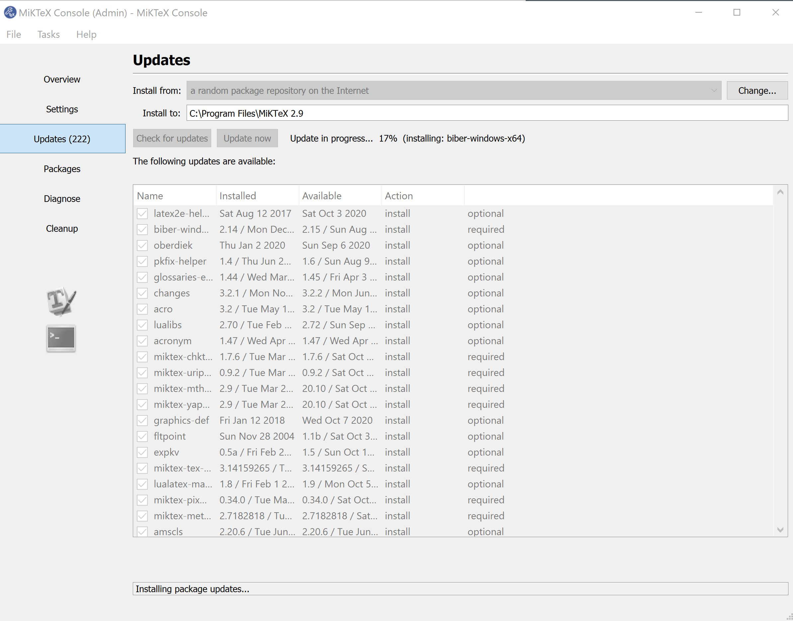
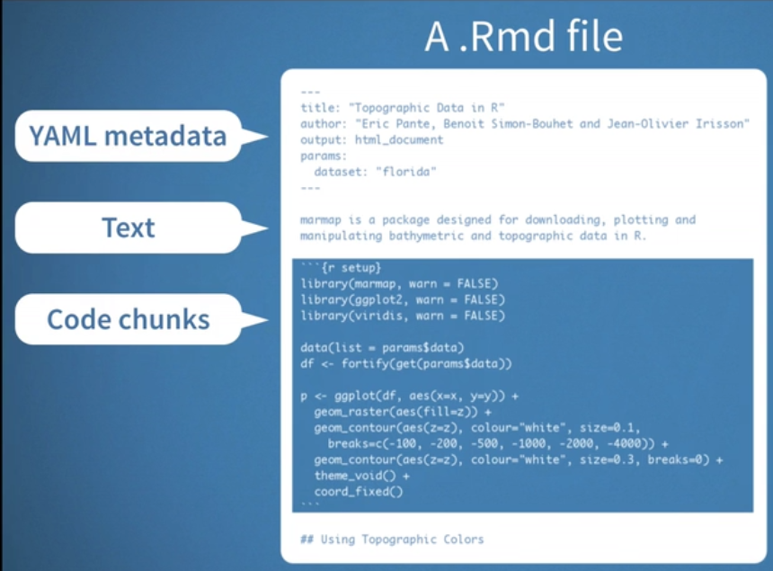

# Week12 R Markdown (Lite) & Data Wrangling Exercises  Ch 7,9

###  No assignments were due today

[Lecture Stream](https://tamucc.webex.com/recordingservice/sites/tamucc/recording/playback/2bc2f615b57e4e53a192cea5d0559af9)

___

## Computer Preparation

You are expected to start this lecture with R Studio open with a fresh and empty text document in the upper left panel and a clean environment.

### *_GENERAL COMPUTER SETUP (SHOULD ALREADY BE DONE)_* 

<details><summary>Ubuntu on Windows</summary>
<p>

  * If the Windows Terminal or Ubuntu app are not installed, then follow [these instructions](https://github.com/cbirdlab/wlsUBUNTU_settings/blob/master/README.md)

  * Open an Ubuntu window in Windows Terminal.  _We will not use `gitbash` unless you can't get Ubuntu running._ After logging in, You are in your home directory.

  * It's always a good idea to keep your apps in `Ubuntu` up to date. _The first time you do this, it could take a long time to finish. After that, if you do this when you log in, it should go quickly._
    ```bash
    sudo apt update
    sudo apt upgrade
    ```

</p>
</details>

<details><summary>MacOS</summary>
<p>

  * Open a terminal window

  * If you haven't already, install [homebrew](https://brew.sh/).  You will be able to use homebrew to install linux software, such as `tree`, which is used in the slide show.


</p>
</details>


<details><summary>If it's not already there, clone the CSB repository to your home dir</summary>
<p>

We will use the [open source files that accompany the CSB text book](https://github.com/tamucc-comp-bio-2022/CSB) in lectures and assignments.

If the `CSB` directory does not exist in your home directory (check with `ls`), then run the following code to clone the [`CSB` repository](https://github.com/tamucc-comp-bio-2022/CSB) into your home directory:

1. Open a terminal window
	* For Win laptops, use `Windows Terminal` to open Ubunutu.  
	* For Mac laptops, open your `Terminal`.

2. Run the code line by line in the code block below

```bash
# check that you're in home dir, you should be there when you log in
pwd

# if you are not in your home dir, then move there
cd ~

# if pwd does not return `/home/yourusername` then let Dr. Bird know
pwd

# clone the CSB repository to your home dir
git clone git@github.com:tamucc-comp-bio-2022/CSB.git
```

The repository is named CSB, and it contains all of the example files and directories necessary to conduct the exercises in the text book.

</p>
</details>

[If you have not already, install R](../resources/install_r.md)

[If you have not already, install RStudio](../resources/install_rstudio.md)


<details><summary>Tidyverse Install</summary>
<p>

```r
# clear all variables from environment
rm(list = ls())
```

```r
# RUN THE FOLLOWING LINE IN THE CONSOLE (LOWER LEFT PANEL)
install.packages("tidyverse")

# ADD THE FOLLOWING LINE TO YOUR TEXT DOCUMENT (UPPER LEFT PANEL), THEN EXECUTE IT (CTRL-ENTER)
library(tidyverse)
```

</p>
</details>

### *_ADDITIONAL COMPUTER SETUP (NEW FOR TODAY)_* 

R Markdown is a typesetting language that allows you to also incorporate R code chunks.  If you did not notice yet, the solutions for the Data Wrangling chapter of CSB are written in R Markdown.  There are a variety of applications of R Markdown.  The one I have used the most is making a report where the data changes through time, but the layout of figures and text does not change.

1. For R Markdown to work properly, you need some additional packages installed in R Studio. Realize that R can also process R Markdown scripts from terminal without R Studio.

```r 
install.packages("rmarkdown")
install.packages("knitr", dependencies=TRUE)
library(rmarkdown)
library(knitr)
```

2. You should also install `pandoc` on your computer following the instructions [here](https://pandoc.org/installing.html).  Windows people, do the windows install because we are using windows to run RStudio.

3. Finally, you should install scientific typesetting software `LaTeX` that operates independently of R and RStudio. Like `Linux`, there are several flavors of `LaTeX`.  Follow the instructions [here](http://computingskillsforbiologists.com/setup/scientific-typesetting/).  Windows people, follow the instructions below

<details><summary>Win LaTeX install instructions *IMPORTANT* </summary>
<p>

> Follow this exactly as written. Download the `protex.zip` file as directed above. Next, extract/unzip the files first, before running `setup.exe`. Right click `setup.exe` and `run as administrator`. After running the setup.exe file, you have to click install on the `MiKTeX` and `TeXstudio` buttons. Install for all users  The install takes a while, just let it run in the background and check on it periodically until it is done. After that, `MiKTeX` will have to be exited and restarted so you can run it as a `MiKTeX` administrator.  Search for `MiKTeX` in your windows search (magnifying glass next to start button).  Then expand your "system tray" (the > and collection of icons on the right side of your task bar), right click and exit `MiKTeX`.  Then search for `MiKTeX` again, right click it, run as administrator, make sure that you are a `MiKTeX` administrator by selecting the option in the window, and search for updates. Click the `updates page` link after search is done and click `update now`. My updates errored out once. So make sure to recheck for updates and restart the updates as necessary. If you cannot get it to update completely, it should not inhibit your ability to complete most everything that follows.



> If you are successful, you will be prompted to restart `MiKTex`

</p>
</details>

<details><summary>MacOS</summary>
<p>

May the force be with you.  Let me know if I should add anything here.

</p>
</details>

---


## I. R Markdown

R Markdown is a flavor of the markdown typesetting language that works specifically with R.  You can use R markdown to create web pages, pdfs, slide shows, and other types of documents.

There is an [R Markdown Chapter in R for Data Science](https://r4ds.had.co.nz/r-markdown.html) that will cover more details than we will here. 


<details><summary>Creating an R Markdown Document</summary>
<p>

### Creating an R Markdown Document

In R Studio, make a new R Markdown document using the `File` pulldown menu

* name it `lesson-0`

* use default settings

If you were successful, your document will already be populated with several lines of text and code that fall into three categories.



Make sure you save the file as lesson-0 into your `CSB/data_wrangling/sandbox` and make sure that you use `setwd()` to set your present working directory to `CSB/data_wrangling/sandbox`.

___

</p>
</details>

<details><summary>Run `lesson-0.rmd` With `knitr`</summary>
<p>

## Run `lesson-0.rmd` With `knitr`

As is our custom in Computational Biology, jump in head first and click the `knit` button above the upper left panel. It will run the Rmd and create an `html` report in a new window.

Next, we will cover the primary sections of the Rmd file.

___

</p>
</details>

<details><summary>YAML Header</summary>
<p>

### YAML Header

YAML stands for YAML Aint Markup Language.

Lines 1-4 in the Rmd are the YAML header, which contains the title of the document and the default output format.  `html` is hyper text markup language, i.e. web pages.  The YAML header is always at the beginning of an Rmd.

Several other characteristics of the Rmd document can be set in the YAML header.  This [tutorial](https://zsmith27.github.io/rmarkdown_crash-course/lesson-4-yaml-headers.html) is pretty good.

---

</p>
</details>

<details><summary>Code Chunks</summary>
<p>


### Code Chunks

Lines 6-8, 16-18, and 24-26 are code chunks.  They start with three tick marks (the key in the upper left of you keyboard) and you can specify the language (r and other languages like python are possible), as well as basic settings of how the output from the code should be handled. For example, you can suppress warnings, error messages, etc.

The output of the code chunks are included in the resulting document.

---

</p>
</details>

<details><summary>Markdown Text</summary>
<p>


### Markdown Text 

Everything else in the Rmd is markdown text if it is not code or YAML.  

For example, line 12 is the first line of text.  The `##` indicates that the text `R Markdown` should be a secondary heading.

Markdown is a class of typesetting languages.  There are broad similarities across markdown languages but there can also be small differences.  This lecture is written in markdown and I make sure it works on GitHub.  The markdown in an Rmd can be slightly different. 

You can consult the 

#### [R Markdown Reference Guide](https://www.rstudio.com/wp-content/uploads/2015/03/rmarkdown-reference.pdf) 

and 

[R Markdown Cheatsheet](https://posit.co/wp-content/uploads/2022/10/rmarkdown-1.pdf) 

for all of the formatting options.

---

</p>
</details>

<details><summary>R Markdown Resources</summary>
<p>

[Official RMarkdown Tutorial](https://rmarkdown.rstudio.com/lesson-1.html)

[Official R Markdown Reference Guide](https://www.rstudio.com/wp-content/uploads/2015/03/rmarkdown-reference.pdf) 

[Official R Markdown Cheatsheet](https://posit.co/wp-content/uploads/2022/10/rmarkdown-1.pdf)

[Zachary Smith's R Markdown Crash Course](https://zsmith27.github.io/rmarkdown_crash-course/index.html)

[R for Data Science: R Markdown Chapter](https://r4ds.had.co.nz/r-markdown.html)

[R Markdown Cookbook - most comprehensive](https://bookdown.org/yihui/rmarkdown-cookbook/)

---

</p>
</details>


<details><summary>R Markdown Tutorial</summary>
<p>

### [Lesson 1](https://rmarkdown.rstudio.com/lesson-1.html)

R Markdown has a very nice lesson plan that we will use to review its features.  We will link to the lesson below and then work within the R Markdown website. There is also the very thorough [R Markdown Crash Course](https://zsmith27.github.io/rmarkdown_crash-course/index.html) by Zachary M. Smith (I love `open source`) which goes beyond the scope of this class.

Files needed for R Markdown lesson:

* [all *.Rmd` files here](Week09new_files/)

---

</p>
</details>

---

## II. [Data Wrangling Exercises](https://classroom.github.com/a/fpunalz0)

Complete these exercises and push your changes to the repo before the end of class.

## HOME WORK

Exam 2
